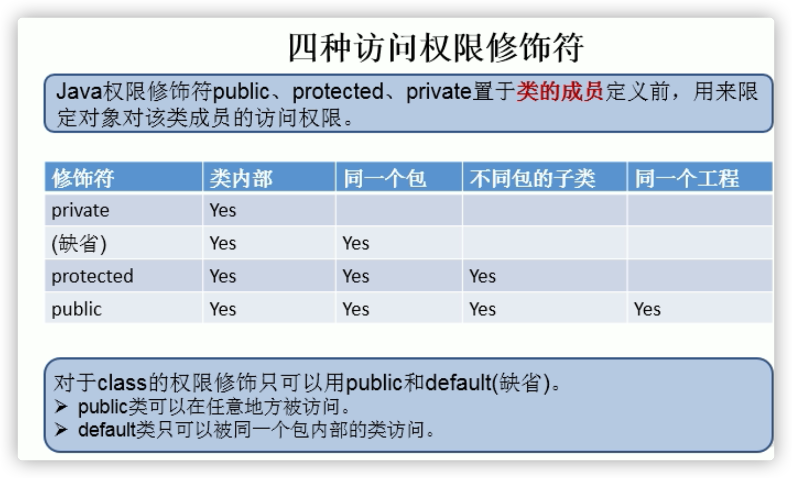

```xml
*  一、Java面向对象学习的三条主线：（第4-6章）
* 1.Java类及类的成员：属性、方法、构造器；代码块、内部类
* 
* 2.面向对象的三大特征：封装性、继承性、多态性、(抽象性)
* 
* 3.其它关键字：this、super、static、final、abstract、interface、package、import等
```

# 面向过程(POP)与面向对象(OOP)

- 二者都是一种思想，面向对象是相对于面向过程而言的。
- 面向过程，强调的是功能行为，以**函数为最小单位**，考虑怎么做。面向对象，将功能封装进对象，强调具备了功能的对象，以**类/对象为最小单位**，考虑谁来做。
- 面向对象的三大特征
  - 封装 (Encapsulation)
  - 继承 (Inheritance)
  - 多态 (Polymorphism)


- 属性 = 成员变量 = field = 域、字段
  方法 = 成员方法 = 函数 = method
- 通过“对象.属性”或“对象.方法”调用对象的结构

# 对象的内存解析

我们使用JVM中的类的加载器和解释器对生成的字节码文件进行解释运行。意味着，需要将字节码文件对应的类加载到内存中，涉及到内存解析。


- 栈：先进后出
- 引用类型的变量，只可能存储两类值：u11或地址值（含变量的类型）
- 理解“万事万物皆对象”
  1.在Java语言范畴中，我们都将功能、结构等封装到类中，通过类的实例化，来调用具体的功能结构
       >Scanner,String等
       >文件：File
       >网络资源：URL
   2.涉及到Java语言与前端Html、后端的数据库交互时，前后端的结构在Java层面交互时，都体现为类、对象。


# 属性（成员变量）vs局部变量

```java
/*
 * 类中属性的使用
 * 
 * 属性（成员变量）   vs  局部变量
 * 1.相同点：
 *        1.1  定义变量的格式：数据类型  变量名 = 变量值
 *        1.2 先声明，后使用
 *        1.3 变量都有其对应的作用域 
 * 
 * 
 * 2.不同点：
 *        2.1 在类中声明的位置的不同
 *        属性：直接定义在类的一对{}内
 *        局部变量：声明在方法内、方法形参、代码块内、构造器形参、构造器内部的变量
 *        
 *        2.2 关于权限修饰符的不同
 *        属性：可以在声明属性时，指明其权限，使用权限修饰符。
 *           常用的权限修饰符：private、public、缺省、protected  --->封装性
 *        目前，大家声明属性时，都使用缺省就可以了。
 *        局部变量：不可以使用权限修饰符。
 * 
 *        2.3 默认初始化值的情况：
 *        属性：类的属性，根据其类型，都有默认初始化值。
 *           整型（byte、short、int、long）：0
 *           浮点型（float、double）：0.0
 *           字符型（char）：0  （或'\u0000'）
 *           布尔型（boolean）：false
 * 
 *           引用数据类型（类、数组、接口）：null
 * 
 *        局部变量：没有默认初始化值。
 *        意味着，我们在调用局部变量之前，一定要显式赋值。
 *           特别地：形参在调用时，我们赋值即可。
 * 
 *        2.4 在内存中加载的位置：
 *        属性：加载到堆空间中   （非static）
 *        局部变量：加载到栈空间
 * 
 */

class User{
	//属性（或成员变量）
	String name;
	public int age = 1;
	boolean isMale;
	}

public static void main(String[] args) {
		User u1 = new User();
		System.out.println(u1.name);
	}
```

# 类中方法的声明和使用

```java
/*
 * 类中方法的声明和使用
 * 
 * 方法：描述类应该具有的功能。
 * 
 * 1.举例：
 * public void eat(){}		cust1.eat();
 * public void sleep(int hour){}		cust1.sleep(8);
 * public String getName(){}
 * public String getNation(String nation){}
 * 
 * 2. 方法的声明：权限修饰符  返回值类型  方法名(形参列表){
 *                 方法体
 *             }
 *   注意：static、final、abstract 来修饰的方法，后面再讲。
 *   
 * 3. 说明：
 *        3.1 关于权限修饰符：默认方法的权限修饰符先都使用public
 *           Java规定的4种权限修饰符：private、public、缺省、protected  -->封装性再细说
 * 
 *        3.2 返回值类型： 有返回值  vs 没有返回值
 *           3.2.1  如果方法有返回值，则必须在方法声明时，指定返回值的类型。同时，方法中，需要使用
 *                return关键字来返回指定类型的变量或常量：“return 数据”。
 *                如果方法没有返回值，则方法声明时，使用void来表示。通常，没有返回值的方法中，就不需要
 *               使用return.但是，如果使用的话，只能“return;”表示结束此方法的意思。
 * 
 *           3.2.2 我们定义方法该不该有返回值？
 *              ① 题目要求
 *              ② 凭经验：具体问题具体分析
 * 
 *      3.3 方法名：属于标识符，遵循标识符的规则和规范，“见名知意”
 *      
 *      3.4 形参列表： 方法可以声明0个，1个，或多个形参。
 *         3.4.1 格式：数据类型1 形参1,数据类型2 形参2,...
 *         
 *         3.4.2 我们定义方法时，该不该定义形参？
 *                ① 题目要求
 *                ② 凭经验：具体问题具体分析
 *      
 *      3.5 方法体：方法功能的体现。      
 * 
 *  4.return关键字的使用：
 *     1.使用范围：使用在方法体中
 *     2.作用：① 结束方法
 *            ② 针对于有返回值类型的方法，使用"return 数据"方法返回所要的数据。
 *      3.注意点：return关键字后面不可以声明执行语句。
 *      
 *  5. 方法的使用中，可以调用当前类的属性或方法
 *        特殊的：方法A中又调用了方法A:递归方法。
 *     方法中，不可以定义方法。
 */

class Circle{
	
	//属性,方法中可直接用
	double radius;
	
	//方式二：
	public void findArea(){
		double area = Math.PI * radius * radius;
		System.out.println("面积为：" + area);
	}
}
```

# 方法的重载（overload）

```java
/*
* 1.定义：在同一个类中，允许存在一个以上的同名方法，只要它们的参数个数或者参数类型不同即可。
*  
* 2. "两同一不同":同一个类、相同方法名
*            参数列表不同：参数个数不同，参数类型不同(参数顺序不同，参数类型一样也算重载）
* 
* 3.判断是否是重载：
*    跟方法的权限修饰符、返回值类型、形参变量名、方法体都没有关系！
*    
* 4. 在通过对象调用方法时，如何确定某一个指定的方法：
*      方法名 ---> 参数列表
*/
//下面两个方法构成重载关系
	public void show(String s){
		System.out.println("show(String)");
	}
	
	public void show(String ... strs){
		System.out.println("show(String ... strs)");
		for(int i = 0;i < strs.length;i++){
			System.out.println(strs[i]);
		}
	}
```

# 可变个数形参

```Java
具体使用：
2.1 可变个数形参的格式：数据类型 ... 变量名
2.2 当调用可变个数形参的方法时，传入的参数个数可以是：0个，1个,2个，。。。
2.3 可变个数形参的方法与本类中方法名相同，形参不同的方法之间构成重载
2.4 可变个数形参的方法与本类中方法名相同，形参类型也相同的数组之间不构成重载。换句话说，二者不能共存。
2.5 可变个数形参在方法的形参中，必须声明在末尾
2.6  可变个数形参在方法的形参中,最多只能声明一个可变形参。
  
  //下面两种调用都可以
  test.show("aa","bb","cc");
	test.show(new String {"aa","bb","cc"});

  public void show(String ... strs){
		System.out.println("show(String ... strs)");
		
		for(int i = 0;i < strs.length;i++){
			System.out.println(strs[i]);
		}
	}
	//不能与上一个方法同时存在
//	public void show(String[] strs){
//
//	}
```

# 变量的赋值

- 如果变量是基本数据类型，此时赋值的是变量所保存的数据值。
- 如果变量是引用数据类型，此时赋值的是变量所保存的数据的地址值。

```java
Order o2 = o1;//赋值以后，o1和o2的地址值相同，都指向了堆空间中同一个对象实体。
```

- 方法的形参的传递机制：**值传递**

 	1.形参：方法定义时，声明的小括号内的参数
   	实参：方法调用时，实际传递给形参的数据

 	2.值传递机制：（普通赋值&&参数传递 都一样）
	 如果参数是**基本数据类型**，此时实参赋给形参的是实参**真实存储的数据值**。
 	如果参数是**引用数据类型**，此时实参赋给形参的是实参存储数据的**地址值**。

# 递归

- 递归方法：一个方法体内调用它自身。
- 方法递归包含了一种隐式的循环，它会重复执行某段代码，但这种重复执行无须循环控制。
  递归一定要向已知方向递归，否则这种递归就变成了无穷递归，类似于死循环。

```java
// 例1：计算1-n之间所有自然数的和
public int getSum(int n) {// 3
   if (n == 1) {
      return 1;//拐点
   } else {
      return n + getSum(n - 1);//一定比N小
   }
}
```

```java
//例3：已知有一个数列：f(0) = 1,f(1) = 4,f(n+2)=2*f(n+1) + f(n),
   //其中n是大于0的整数，求f(10)的值。
   public int f(int n){
      if(n == 0){
         return 1;
      }else if(n == 1){
         return 4;
      }else{
         return 2*f(n - 1) + f(n - 2);
      }
   }
```

# 面向对象特征之一：封装和隐藏

- 我们程序设计追求“高内聚，低耦合”。
  - 高内聚 ：类的内部数据操作细节自己完成，不允许外部干涉；（自己的事自己干）
  - 低耦合 ：仅对外暴露少量的方法用于使用。 
- 隐藏对象内部的复杂性，只对外公开简单的接口。便于外界调用，从而提高系统的可扩展性、可维护性。通俗的说，把该隐藏的隐藏起来，该暴露的暴露出来。这就是封装性的设计思想。

```java
/*
 * 面向对象的特征一：封装与隐藏     3W:what? why? how?
 * 一、问题的引入：
 *  当我们创建一个类的对象以后，我们可以通过"对象.属性"的方式，对对象的属性进行赋值。这里，赋值操作要受到
 *  属性的数据类型和存储范围的制约。除此之外，没有其他制约条件。但是，在实际问题中，我们往往需要给属性赋值
 *  加入额外的限制条件。这个条件就不能在属性声明时体现，我们只能通过方法进行限制条件的添加。（比如：setLegs()）
 *  同时，我们需要避免用户再使用"对象.属性"的方式对属性进行赋值。则需要将属性声明为私有的(private).
 *  -->此时，针对于属性就体现了封装性。
 getter setter
 * 
 * 二、封装性的体现：
 * 我们将类的属性xxx私有化(private),同时，提供公共的(public)方法来获取(getXxx)和设置(setXxx)此属性的值
 * 
 *  拓展：封装性的体现：① 如上  ② 不对外暴露的私有的方法  ③ 单例模式   ...
 *  
```

## getter&setter

```java
public class AnimalTest {
   public static void main(String[] args) {
      
      Animal a = new Animal();
//    a.legs = 4;//The field Animal.legs is not visible   
     //被private修饰的属性不能点出来（读写）
      a.setLegs(-6);
   }
}

class Animal{
   private int legs;//腿的个数
   
   //对属性的设置
   public void setLegs(int l){
      if(l >= 0 && l % 2 == 0){
         legs = l;
      }else{
         legs = 0;
//       抛出一个异常（暂时没有讲）
      }
   }
   
   //对属性的获取
   public int getLegs(){
      return legs;
   }
}
```

## 四种访问权限修饰符（可见性）



- 封装性的体现，需要权限修饰符来配合。
   * 1.Java规定的4种权限（从小到大排列）：private、缺省、protected 、public 
   * 2.4种权限可以用来修饰类及类的内部结构：属性、方法、构造器、内部类
   * 3.**具体的，4种权限都可以用来修饰类的内部结构：属性、方法、构造器、内部类**
   *        **修饰类的话，只能使用：缺省、public**
   * 总结封装性：Java提供了4种权限修饰符来修饰类及类的内部结构，体现类及类的内部结构在被调用时的可见性的大小。
   * 体现（涉及权限修饰符的都是封装的体现）
     * 属性私有，外界用getter，setter
     * 私有方法
     * 单例（构造器私有化）
     * 如果不希望类在包外被调用，可以将类设置为缺省的。
- 不同包，不知道protected,三个中只有public能用
- 权限修饰符在最前面

# 构造器

```java
*类的结构之三：构造器（或构造方法、constructor）的使用 
* 一、构造器的作用：
* 1.创建对象
* 2.初始化对象的信息
* 
* 二、说明：
* 1.如果没有显式的定义类的构造器的话，则系统默认提供一个空参的构造器（权限和类的权限一样）
* 2.定义构造器的格式：权限修饰符  类名(形参列表){}
* 3.一个类中定义的多个构造器，彼此构成重载
* 4.一旦我们显式的定义了类的构造器（无论有没有参数）之后，系统就不再提供默认的空参构造器
* 5.一个类中，至少会有一个构造器。
```

```java
public class PersonTest {
   public static void main(String[] args) {
      //创建类的对象:new + 构造器
      Person p = new Person();
      Person p1 = new Person("Tom");
   }
}

class Person{
   //属性
   String name;
   int age;
   
   //构造器，一个类的构造器构成重载关系
   public Person(){
      System.out.println("Person().....");
   }
   
   public Person(String n){
      name = n;
   }

   public Person(String n,int a){
      name = n;
      age = a;
   }
}
```

- 构造器和方法是两个（构造器是特殊的方法❌）--->官方文档是并列的结构


# 属性赋值的先后顺序

```java
* ① 默认初始化
* ② 显式初始化
* ③ 构造器中初始化
* ④ 通过"对象.方法" 或 "对象.属性"的方式，赋值
* 
* 以上操作的先后顺序：① - ② - ③ - ④  
```


# JavaBean

JavaBean是一种Java语言写成的可重用组件。  经常用

所谓JavaBean，是指符合如下标准的Java类：
   >类是公共的
   >有一个无参的公共的构造器
   >有属性，且有对应的get、set方法

```java
public class Customer {
   
   private int id;
   private String name;
   public Customer(){
   }
   
   public void setId(int i){
      id = i;
   }
   public int getId(){
      return id;
   }
   public void setName(String n){
      name = n;
   }
   public String getName(){
      return name;
   }
   
}
```

# UML类图


- Banking：包名

# 关键字：this的使用

```java
this关键字的使用：
* 1.this可以用来修饰、调用：属性、方法、构造器
* 
* 2.this修饰属性和方法：
*   this理解为：当前对象  或 当前正在创建的对象
* 
*  2.1  在类的方法中，我们可以使用"this.属性"或"this.方法"的方式，调用当前对象属性或方法。但是，
*   通常情况下，我们都选择省略"this."。特殊情况下，如果方法的形参和类的属性同名时，我们必须显式
*   的使用"this.变量"的方式，表明此变量是属性，而非形参。
* 
*  2.2 在类的构造器中，我们可以使用"this.属性"或"this.方法"的方式，调用当前正在创建的对象属性或方法。
*  但是，通常情况下，我们都选择省略"this."。特殊情况下，如果构造器的形参和类的属性同名时，我们必须显式
*   的使用"this.变量"的方式，表明此变量是属性，而非形参。
* 
* 3. this调用构造器
*    ① 我们在类的构造器中，可以显式的使用"this(形参列表)"方式，调用本类中指定的其他构造器
*    ② 构造器中不能通过"this(形参列表)"方式调用自己 否则就无限了
*    ③ 如果一个类中有n个构造器，则最多有 n - 1构造器中使用了"this(形参列表)"
*    ④ 规定："this(形参列表)"必须声明在当前构造器的首行
*    ⑤ 构造器内部，最多只能声明一个"this(形参列表)"，用来调用其他的构造器 依据第四条
```

```java
public class PersonTest {
   public static void main(String[] args) {
      Person p2 = new Person("Jerry",20);
   }
}

class Person{
   private String name;
   private int age;
   
   public Person(){
   }
   
   public Person(int age){
     //调用上面的构造器 
     this();
      //这里this必须
      this.age = age;
   }

   public Person(String name, int age){
      this(age);
      //这里this必须
      this.name = name;
   }

   public void eat(){
      System.out.println("人吃饭");
      this.study();
      //省去this study(); 也行，原来的写法
   }
   public void study(){
      System.out.println("人学习");
   }

   public String getName() {
      return name;
   }

   public void setName(String name) {
      //这里this必须
      this.name = name;
   }

   public int getAge() {
      return age;
   }

   public void setAge(int age) {
      //这里this必须
      this.age = age;
   }
}
```

# package关键字

```java
* 1.为了更好的实现项目中类的管理，提供包的概念
* 2.使用package声明类或接口所属的包，声明在源文件的首行
* 3.包，属于标识符，遵循标识符的命名规则、规范(xxxyyyzzz)、“见名知意”
* 4.每"."一次，就代表一层文件目录。
* 
* 补充：同一个包下，不能命名同名的接口、类。
*     不同的包下，可以命名同名的接口、类。
```

```java
package com.atguigu.java2;
```

# import关键字

```java
* import:导入
* 1. 在源文件中显式的使用import结构导入指定包下的类、接口
* 2. 声明在包的声明和类的声明之间
* 3. 如果需要导入多个结构，则并列写出即可
* 4. 可以使用"xxx.*"的方式，表示可以导入xxx包下的所有结构
* 5. 如果使用的类或接口是java.lang包下定义的，则可以省略import结构
* 6. 如果使用的类或接口是本包下定义的，则可以省略import结构
* 7. 如果在源文件中，使用了不同包下的同名的类，则必须至少有一个类需要以全类名的方式显示。
* 8. 使用"xxx.*"方式表明可以调用xxx包下的所有结构。但是如果使用的是xxx子包下的结构，则仍需要显式导入
* 
* 9. import static:导入指定类或接口中的静态结构:属性或方法。 
```