# 枚举类

```java
/**
 * 一、枚举类的使用
 * 1.枚举类的理解：类的对象只有有限个，确定的。我们称此类为枚举类
 * 2.当需要定义一组常量时，强烈建议使用枚举类
 * 3.如果枚举类中只有一个对象，则可以作为单例模式的实现方式。
 *
 * 二、如何定义枚举类
 * 方式一：jdk5.0之前，自定义枚举类
 * 方式二：jdk5.0，可以使用enum关键字定义枚举类
 *
 * 三、Enum类中的常用方法：
 *    values()方法：返回枚举类型的对象数组。该方法可以很方便地遍历所有的枚举值。
 *    valueOf(String str)：可以把一个字符串转为对应的枚举类对象。要求字符串必须是枚举类对象的“名字”。
 *    如不是，会有运行时异常：IllegalArgumentException。
 *    toString()：返回当前枚举类对象常量的名称(枚举类的父类会重写toString())
 *
 * 四、使用enum关键字定义的枚举类实现接口的情况
 *   情况一：实现接口，在enum类中实现抽象方法
 *   情况二：让枚举类的对象分别实现接口中的抽象方法
 */
```

## 自定义枚举类

```java
public class SeasonTest {
    public static void main(String[] args) {
        Season spring = Season.SPRING;
        System.out.println(spring);
    }
}
//自定义枚举类
class Season{
    //1.声明Season对象的属性:private final修饰
    private final String seasonName;
    private final String seasonDesc;

    //2.私有化类的构造器,并给对象属性赋值
    private Season(String seasonName,String seasonDesc){
        this.seasonName = seasonName;
        this.seasonDesc = seasonDesc;
    }

    //3.提供当前枚举类的多个对象：public static final的
    public static final Season SPRING = new Season("春天","春暖花开");
    public static final Season SUMMER = new Season("夏天","夏日炎炎");
    public static final Season AUTUMN = new Season("秋天","秋高气爽");
    public static final Season WINTER = new Season("冬天","冰天雪地");

    //4.其他诉求1：获取枚举类对象的属性
    public String getSeasonName() {
        return seasonName;
    }
    public String getSeasonDesc() {
        return seasonDesc;
    }
    
    //4.其他诉求1：提供toString()
    @Override
    public String toString() {
        return "Season{" +
                "seasonName='" + seasonName + '\'' +
                ", seasonDesc='" + seasonDesc + '\'' +
                '}';
    }
}
```

## enum

> enum定义枚举类
>
> enum主要方法
>
> 实现接口的枚举类（正常的实现方式；让每个枚举对象实现接口）

- 与switch case使用

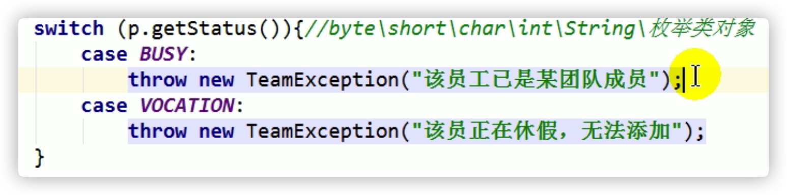

- 枚举类

```java
//使用enum关键字枚举类
enum Season1 implements Info{
    //1.提供当前枚举类的对象，多个对象之间用","隔开，末尾对象";"结束
    SPRING("春天","春暖花开"){
        @Override
        public void show() {
            System.out.println("春天在哪里？");
        }
    },
    SUMMER("夏天","夏日炎炎"){
        @Override
        public void show() {
            System.out.println("宁夏");
        }
    },
    AUTUMN("秋天","秋高气爽"){
        @Override
        public void show() {
            System.out.println("秋天不回来");
        }
    },
    WINTER("冬天","冰天雪地"){
        @Override
        public void show() {
            System.out.println("大约在冬季");
        }
    };

    //2.声明Season对象的属性:private final修饰
    private final String seasonName;
    private final String seasonDesc;

    //2.私有化类的构造器,并给对象属性赋值
    private Season1(String seasonName,String seasonDesc){
        this.seasonName = seasonName;
        this.seasonDesc = seasonDesc;
    }
    //4.其他诉求1：获取枚举类对象的属性
    public String getSeasonName() {
        return seasonName;
    }

    public String getSeasonDesc() {
        return seasonDesc;
    }
//    //4.其他诉求1：提供toString()
//    @Override
//    public String toString() {
//        return "Season1{" +
//                "seasonName='" + seasonName + '\'' +
//                ", seasonDesc='" + seasonDesc + '\'' +
//                '}';
//    }

//    @Override
//    public void show() {
//        System.out.println("这是一个季节");
//    }
}
```

- main和接口

```java
/**
 * 使用enum关键字定义枚举类
 * 说明：定义的枚举类默认继承于java.lang.Enum类
 */
public class SeasonTest1 {
    public static void main(String[] args) {
        Season1 summer = Season1.SUMMER;
        //toString():返回枚举类对象的名称
        System.out.println(summer.toString());//SUMMER

        System.out.println(Season1.class.getSuperclass());
        //class java.lang.Enum

        System.out.println("****************");
        //values():返回所有的枚举类对象构成的数组
        Season1[] values = Season1.values();
        for(int i = 0;i < values.length;i++){
            System.out.println(values[i]);
            values[i].show();
        }

        System.out.println("****************");
        //valueOf(String objName):返回枚举类中对象名是objName的对象。
        Season1 winter = Season1.valueOf("WINTER");
        //如果没有objName的枚举类对象，则抛异常：IllegalArgumentException
        System.out.println(winter);
        winter.show();
    }
}

interface Info{
    void show();
}
```

# Annotation注解

框架理解 = +反射+设计模式


```JAVA
/**
 * 注解的使用
 * 1. 理解Annotation:
 * ① jdk 5.0 新增的功能
 *
 * ② Annotation 其实就是代码里的特殊标记, 这些标记可以在编译, 类加载, 运行时被读取, 并执行相应的处理。通过使用 Annotation,
 * 程序员可以在不改变原有逻辑的情况下, 在源文件中嵌入一些补充信息。
 *
 * ③在JavaSE中，注解的使用目的比较简单，例如标记过时的功能，忽略警告等。在JavaEE/Android
 * 中注解占据了更重要的角色，例如用来配置应用程序的任何切面，代替JavaEE旧版中所遗留的繁冗
 * 代码和XML配置等。
 /
```

## 常见的Annotation

```java
/**2. Annocation的使用示例
* 示例一：生成文档相关的注解
* 示例二：在编译时进行格式检查(JDK内置的三个基本注解)
    @Override: 限定重写父类方法/实现接口方法, 该注解只能用于方法
    @Deprecated: 用于表示所修饰的元素(类, 方法等)已过时。通常是因为所修饰的结构危险或存在更好的选择
    @SuppressWarnings: 抑制编译器警告

    @SuppressWarnings("unused")
    int num = 10;

 * 示例三：跟踪代码依赖性，实现替代配置文件功能
 /
```

## 自定义Annotation

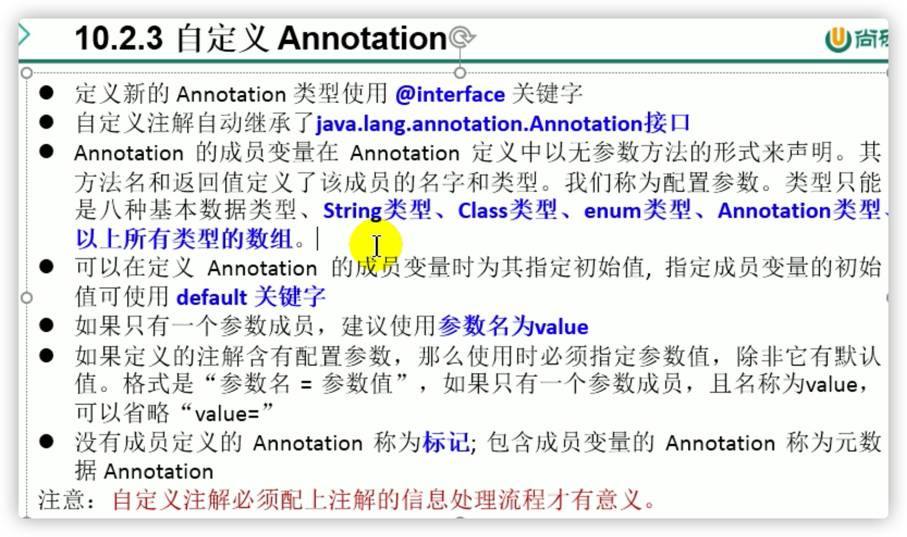

```java
/* 3. 如何自定义注解：参照@SuppressWarnings定义
    * ① 注解声明为：@interface
    * ② 内部定义成员，通常使用value表示
    * ③ 可以指定成员的默认值，使用default定义（有默认值就可以不在使用注解的时候指明成员的值）
    * ④ 如果自定义注解没有成员，表明是一个标识作用。

   如果注解有成员，在使用注解时，需要指明成员的值。
   自定义注解必须配上注解的信息处理流程(使用反射)才有意义。
   自定义注解通过都会指明两个元注解：Retention、Target
   /
```

```java
@Inherited
@Repeatable(MyAnnotations.class)
@Retention(RetentionPolicy.RUNTIME)
@Target({TYPE, FIELD, METHOD, PARAMETER, CONSTRUCTOR, LOCAL_VARIABLE,TYPE_PARAMETER,TYPE_USE})
public @interface MyAnnotation {
    String value() default "hello";
}
```

```java
//@MyAnnotation(value="hi")
//@MyAnnotation("abc")//只有一个参数成员且名字是value可以省略value=
//@MyAnnotation//有默认值就可以不在使用注解的时候指明成员的值
class Person{
    private String name;
    private int age;

    public Person() {
    }
    @MyAnnotation
    public Person(String name, int age) {
        this.name = name;
        this.age = age;
    }
    @MyAnnotation(value="abc")
    public void walk(){
        System.out.println("人走路");
    }
    public void eat(){
        System.out.println("人吃饭");
    }
}
```

## 元注解


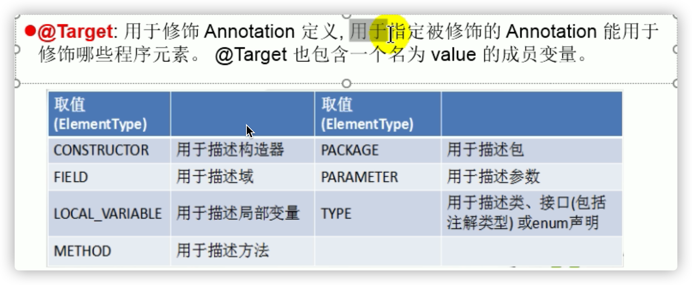

- 没有指定哪里都能用


```java
/*4. jdk 提供的4种元注解
  元注解：对现有的注解进行解释说明的注解
Retention：指定所修饰的 Annotation 的生命周期：SOURCE\CLASS（默认行为）\RUNTIME
       只有声明为RUNTIME生命周期的注解，才能通过反射获取。
Target:用于指定被修饰的 Annotation 能用于修饰哪些程序元素
*******出现的频率较低*******
Documented:表示所修饰的注解在被javadoc解析时，保留下来。
Inherited:被它修饰的 Annotation 将具有继承性。
/
```

```java
@Inherited
@Repeatable(MyAnnotations.class)
@Retention(RetentionPolicy.RUNTIME)
@Target({TYPE, FIELD, METHOD, PARAMETER, CONSTRUCTOR, LOCAL_VARIABLE,TYPE_PARAMETER,TYPE_USE})
public @interface MyAnnotation {
    String value() default "hello";
}
```

## 利用反射获取注解信息

```
5,如何获取注解信息：通过发射来进行获取、调用。
前提：要求此注解的元注解Retention中声明的生命周期状态为：RUNTIME.
```

## JDK8新特性


### 可重复注解

```java
6.1 可重复注解：① 在MyAnnotation上声明@Repeatable，成员值为MyAnnotations.class
              ② MyAnnotation的Target和Retention,@Inherited等元注解与MyAnnotations相同。
```

```java
//jdk 8之前的写法：
//@MyAnnotations({@MyAnnotation(value="hi"),@MyAnnotation(value="hi")})
@MyAnnotation(value="hi")
@MyAnnotation(value="abc")
class Person{}
```

```java
@Inherited
@Retention(RetentionPolicy.RUNTIME)
@Target({TYPE, FIELD, METHOD, PARAMETER, CONSTRUCTOR, LOCAL_VARIABLE})
public @interface MyAnnotations {
    MyAnnotation[] value();
}
```

```java
@Inherited
@Repeatable(MyAnnotations.class)
@Retention(RetentionPolicy.RUNTIME)
@Target({TYPE, FIELD, METHOD, PARAMETER, CONSTRUCTOR, LOCAL_VARIABLE,TYPE_PARAMETER,TYPE_USE})
public @interface MyAnnotation {
    String value() default "hello";
}
```

### 类型注解

```java
6.2 类型注解：
ElementType.TYPE_PARAMETER 表示该注解能写在类型变量的声明语句中（如：泛型声明）。
ElementType.TYPE_USE 表示该注解能写在使用类型的任何语句中。
```

```java
class Generic<@MyAnnotation T>{
    public void show() throws @MyAnnotation RuntimeException{
        ArrayList<@MyAnnotation String> list = new ArrayList<>();
        int num = (@MyAnnotation int) 10L;
    }
}
```

# 集合框架

**能用集合就不用数组**

一个集合里面可以放各种类型的数据（对象）

```java
/**
 * 一、集合框架的概述
 *
 * 1.集合、数组都是对多个数据进行存储操作的结构，简称Java容器。
 *  说明：此时的存储，主要指的是内存层面的存储，不涉及到持久化的存储（.txt,.jpg,.avi，数据库中）
 *
 * 2.1 数组在存储多个数据方面的特点：
 *      > 一旦初始化以后，其长度就确定了。
 *      > 数组一旦定义好，其元素的类型也就确定了。我们也就只能操作指定类型的数据了。
 *       比如：String[] arr;int[] arr1;Object[] arr2;
 * 2.2 数组在存储多个数据方面的缺点：
 *      > 一旦初始化以后，其长度就不可修改。
 *      > 数组中提供的方法非常有限，对于添加、删除、插入数据等操作，非常不便，同时效率不高。
 *      > 获取数组中实际元素的个数的需求，数组没有现成的属性或方法可用
 *      > 数组存储数据的特点：有序、可重复。对于无序、不可重复的需求，不能满足。
 *
 * 二、集合框架
 *      |----Collection接口：单列集合，用来存储一个一个的对象
 *          |----List接口：存储有序的、可重复的数据。  -->“动态”数组
 *              |----ArrayList、LinkedList、Vector
 *
 *          |----Set接口：存储无序的、不可重复的数据   -->高中讲的“集合”
 *              |----HashSet、LinkedHashSet、TreeSet
 *
 *      |----Map接口：双列集合，用来存储一对(key - value)一对的数据   -->高中函数：y = f(x)
 *              |----HashMap、LinkedHashMap、TreeMap、Hashtable、Properties
 /
```


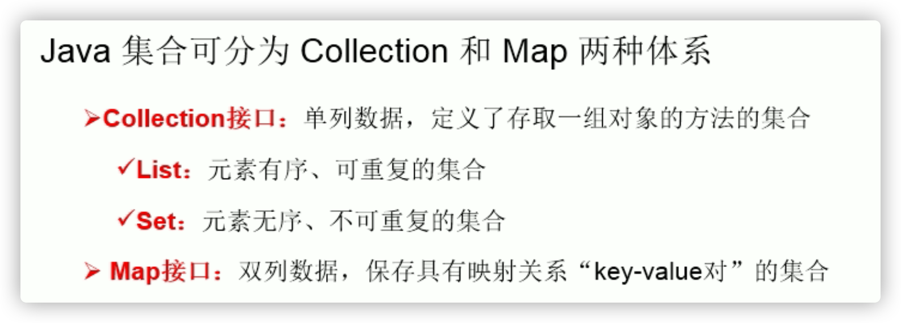

- List Set是Collection接口的子接口

## Collection接口方法

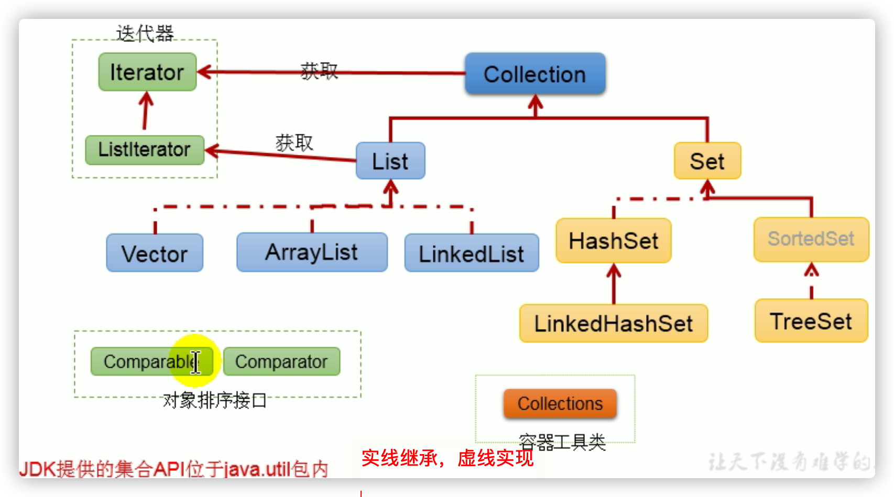

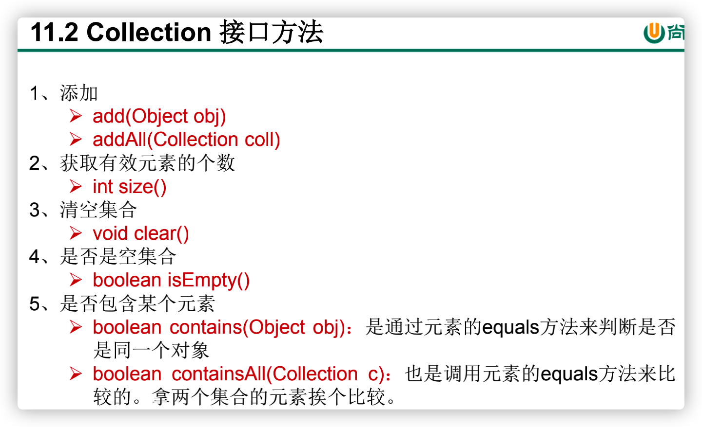

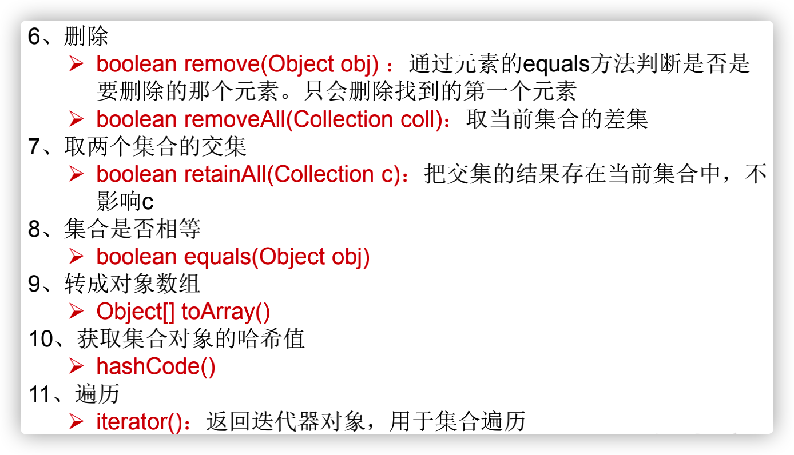

**向Collection接口的实现类的对象中添加数据obj时，要求obj所在类要重写equals().**

- 基本方法

```java
public class CollectionTest {
    @Test
    public void test1(){
        //Collection常用抽象方法
        Collection coll = new ArrayList();

        //add(Object e):将元素e添加到集合coll中
        coll.add("AA");
        coll.add("BB");
        coll.add(123);//自动装箱Integer
        coll.add(new Date());

        //size():获取添加的元素的个数
        System.out.println(coll.size());//4

        //addAll(Collection coll1):将coll1集合中的元素添加到当前的集合中
        Collection coll1 = new ArrayList();
        coll1.add(456);
        coll1.add("CC");
        coll.addAll(coll1);

        System.out.println(coll.size());//6
        System.out.println(coll);
        //[AA, BB, 123, Sat May 07 19:22:24 CST 2022, 456, CC]

        //clear():清空集合元素，不是变成NULL
        coll.clear();

        //isEmpty():判断当前集合是否为空,是否有元素
        System.out.println(coll.isEmpty());
        //true
    }
}
```

- 是否包含obj

```java
@Test
public void test1(){
    Collection coll = new ArrayList();
    coll.add(123);
    coll.add(456);
    coll.add(new Person("Jerry",20));
    coll.add(new String("Tom"));
    coll.add(false);
    //1.contains(Object obj):判断当前集合中是否包含obj
    //我们在判断时会调用obj对象所在类的equals()。
    System.out.println(coll.contains(123));
    System.out.println(coll.contains(new String("Tom")));//true 比较内容
    ////false -->true 重写自定义类的equals()
    System.out.println(coll.contains(new Person("Jerry",20)));

    //2.containsAll(Collection coll1):判断形参coll1中的所有元素是否都存在于当前集合中。
    Collection coll1 = Arrays.asList(123,4567);
    System.out.println(coll.containsAll(coll1));
}
```

- 移除obj元素

```java
@Test
public void test2(){
    //3.remove(Object obj):从当前集合中移除obj元素。
    Collection coll = new ArrayList();
    coll.add(123);
    coll.add(456);
    coll.add(new Person("Jerry",20));
    coll.add(new String("Tom"));
    coll.add(false);

    coll.remove(1234);
    System.out.println(coll);

    coll.remove(new Person("Jerry",20));
    System.out.println(coll);

    //4. removeAll(Collection coll1):差集：从当前集合中移除coll1中所有的元素。
    Collection coll1 = Arrays.asList(123,456);
    coll.removeAll(coll1);
    System.out.println(coll);
}
```

- 获取当前集合和coll1集合的交集

```java
@Test
public void test3(){
    Collection coll = new ArrayList();
    coll.add(123);
    coll.add(456);
    coll.add(new Person("Jerry",20));
    coll.add(new String("Tom"));
    coll.add(false);

    //5.retainAll(Collection coll1):交集：获取当前集合和coll1集合的交集，并返回给当前集合(直接在当前集合修改)
    Collection coll1 = Arrays.asList(123,456,789);
    coll.retainAll(coll1);
    System.out.println(coll);
    //[123, 456]
    }
```

- equals(Object obj)

```java
@Test
public void test3(){
    Collection coll = new ArrayList();
    coll.add(123);
    coll.add(456);
    coll.add(new Person("Jerry",20));
    coll.add(new String("Tom"));
    coll.add(false);

    //6.equals(Object obj):要想返回true，需要当前集合和形参集合的元素都相同。
    //顺序是否需要相同取决于子类 -> 这里ArrayList要求顺序相同
    Collection coll1 = new ArrayList();
    coll1.add(456);
    coll1.add(123);
    coll1.add(new Person("Jerry",20));
    coll1.add(new String("Tom"));
    coll1.add(false);

    System.out.println(coll.equals(coll1));
}
```

- 数组集合相互转换

```java
@Test
public void test4(){
    Collection coll = new ArrayList();
    coll.add(123);
    coll.add(456);
    coll.add(new Person("Jerry",20));
    coll.add(new String("Tom"));
    coll.add(false);

    //7.hashCode():返回当前对象的哈希值
    System.out.println(coll.hashCode());

    //8.集合 --->数组：toArray()
    Object[] arr = coll.toArray();
    for(int i = 0;i < arr.length;i++){
        System.out.println(arr[i]);
    }

    //拓展：数组 --->集合:调用Arrays类的静态方法asList()
    List<String> list = Arrays.asList(new String[]{"AA", "BB", "CC"});
    System.out.println(list);

    //装入非对象数组，认为装入一个数组（作为集合的元素）
    //装入对象数组，数组包含几个对象，集合元素就是几个
    List arr1 = Arrays.asList(new int[]{123, 456});
    System.out.println(arr1.size());//1

    List arr2 = Arrays.asList(new Integer[]{123, 456});
    System.out.println(arr2.size());//2
}
```

## Iterator迭代器接口

**lterator仅用于遍历实现Collection接口的集合(Map不用)**


### 遍历输出集合

```java
@Test
public void test1(){
    Collection coll = new ArrayList();
    coll.add(123);
    coll.add(456);
    coll.add(new Person("Jerry",20));
    coll.add(new String("Tom"));
    coll.add(false);

    Iterator iterator = coll.iterator();
    //方式三：推荐
    ////hasNext():判断是否还有下一个元素
    while(iterator.hasNext()){//指针不变，看看下面又没有数据
        //next():①指针下移 ②将下移以后集合位置上的元素返回
        System.out.println(iterator.next());
    }
}
```

- 遍历错误方式

```java
@Test
    public void test2(){
        Collection coll = new ArrayList();
        coll.add(123);
        coll.add(456);
        coll.add(new Person("Jerry",20));
        coll.add(new String("Tom"));
        coll.add(false);

        //错误方式一：
        //出现越界
//        Iterator iterator = coll.iterator();
//        while((iterator.next()) != null){
//            System.out.println(iterator.next());
//        }

        //错误方式二：
        //集合对象每次调用iterator()方法都得到一个全新的迭代器对象，默认游标都在集合的第一个元素之前。
        //输出第一个元素，死循环
        while (coll.iterator().hasNext()){
            System.out.println(coll.iterator().next());
        }
    }
```

### remove()

```java
//测试Iterator中的remove()
//如果还未调用next(),再调用remove会报IllegalStateException。
//如果在上一次调用 next 方法之后已经调用了 remove 方法，再调用remove会报IllegalStateException。
@Test
public void test3(){
    Collection coll = new ArrayList();
    coll.add(123);
    coll.add(456);
    coll.add(new Person("Jerry",20));
    coll.add(new String("Tom"));
    coll.add(false);

    //删除集合中"Tom"
    Iterator iterator = coll.iterator();
    while (iterator.hasNext()){
        Object obj = iterator.next();
        if("Tom".equals(obj)){
            iterator.remove();
        }
    }
    //遍历集合
    iterator = coll.iterator();
    while (iterator.hasNext()){
        System.out.println(iterator.next());
    }
}
```

### foreach

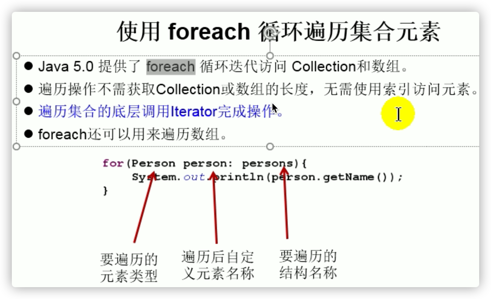

```java
@Test
//针对集合
public void test1(){
    Collection coll = new ArrayList();
    coll.add(123);
    coll.add(456);
    coll.add(new Person("Jerry",20));
    coll.add(new String("Tom"));
    coll.add(false);

    //for(集合元素的类型 局部变量 : 集合对象)
    //内部仍然调用了迭代器。
    for(Object obj : coll){
        System.out.println(obj);
    }
}
```

```java
@Test
//针对数组
public void test2(){
    int[] arr = new int[]{1,2,3,4,5,6};
    //for(数组元素的类型 局部变量 : 数组对象)
    //数组也是对象
    for(int i : arr){
        System.out.println(i);
    }
}
```

- 易错点

```java
//练习题
    @Test
    public void test3(){
        String[] arr = new String[]{"MM","MM","MM"};

//        //方式一：普通for赋值
//        for(int i = 0;i < arr.length;i++){
//            arr[i] = "GG";
//        }//变成GG

        //方式二：增强for循环
        for(String s : arr){
            s = "GG";//没有变成GG
        }

        for(int i = 0;i < arr.length;i++){
            System.out.println(arr[i]);
        }
    }
```

## Collection子接口一：List

```java
/**List接口框架
*
*    |----Collection接口：单列集合，用来存储一个一个的对象
*          |----List接口：存储有序的、可重复的数据。  -->“动态”数组,替换原有的数组
*              |----ArrayList：作为List接口的主要实现类；线程不安全的，效率高；底层使用Object[] elementData存储
*              |----LinkedList：对于频繁的插入、删除操作，使用此类效率比ArrayList高(一个改，移动一堆)；底层使用双向链表存储
*              |----Vector：作为List接口的古老实现类；线程安全的，效率低；底层使用Object[] elementData存储/
```

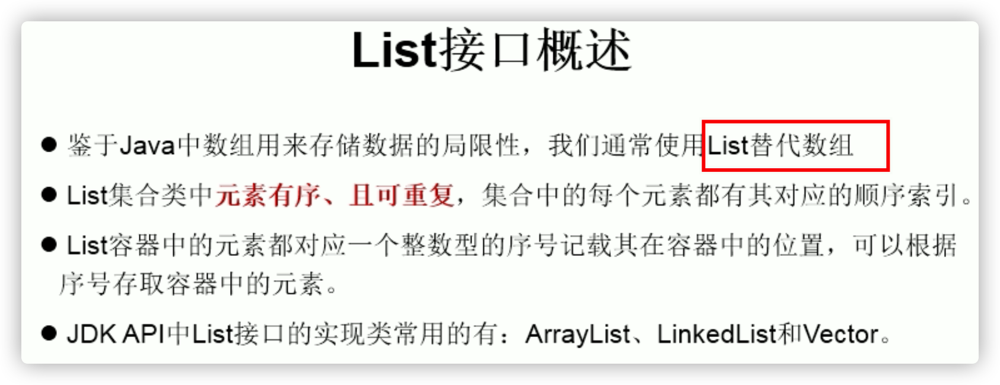

- List接口中的常用方法

```java
/*
void add(int index, Object ele):在index位置插入ele元素
boolean addAll(int index, Collection eles):从index位置开始将eles中的所有元素添加进来
Object get(int index):获取指定index位置的元素
int indexOf(Object obj):返回obj在集合中首次出现的位置
int lastIndexOf(Object obj):返回obj在当前集合中末次出现的位置
Object remove(int index):移除指定index位置的元素，并返回此元素
Object set(int index, Object ele):设置指定index位置的元素为ele
List subList(int fromIndex, int toIndex):返回从fromIndex到toIndex位置的子集合

总结：常用方法
增：add(Object obj)
删：remove(int index) / remove(Object obj)
改：set(int index, Object ele)
查：get(int index)
插：add(int index, Object ele)
长度：size()
遍历：① Iterator迭代器方式
     ② 增强for循环
     ③ 普通的循环
     */
```

```java
//遍历
@Test
public void test3(){
    ArrayList list = new ArrayList();
    list.add(123);
    list.add(456);
    list.add("AA");

    //方式一：Iterator迭代器方式
    Iterator iterator = list.iterator();
    while(iterator.hasNext()){
        System.out.println(iterator.next());
    }

    System.out.println("***************");

    //方式二：增强for循环
    for(Object obj : list){
        System.out.println(obj);
    }
}
```

```java
@Test
public void test2(){
    ArrayList list = new ArrayList();
    list.add(123);
    list.add(456);
    list.add("AA");
    list.add(new Person("Tom",12));
    list.add(456);
    //int indexOf(Object obj):返回obj在集合中首次出现的位置。如果不存在，返回-1.
    //找不到返回值一般都是负数
    int index = list.indexOf(4567);
    System.out.println(index);

    //int lastIndexOf(Object obj):返回obj在当前集合中末次出现的位置。如果不存在，返回-1.
    System.out.println(list.lastIndexOf(456));

    //Object remove(int index):移除指定index位置的元素，并返回此元素
    Object obj = list.remove(0);
    System.out.println(obj);
    System.out.println(list);

    //Object set(int index, Object ele):设置指定index位置的元素为ele
    list.set(1,"CC");
    System.out.println(list);

    //List subList(int fromIndex, int toIndex):返回从fromIndex到toIndex位置的左闭右开区间的子集合
    List subList = list.subList(2, 4);
    System.out.println(subList);
    //[Person{name='Tom', age=12}, 456]
    System.out.println(list);
    //[456, CC, Person{name='Tom', age=12}, 456]
}
```

### ArrayList(代替数组)

```java
2. ArrayList的源码分析：
*   2.1 jdk 7情况下
*      ArrayList list = new ArrayList();//底层创建了长度是10的Object[]数组elementData
*      list.add(123);//elementData[0] = new Integer(123);
*      ...
*      list.add(11);//如果此次的添加导致底层elementData数组容量不够，则扩容。
*      默认情况下，扩容为原来的容量的1.5倍，同时需要将原有数组中的数据复制到新的数组中。
*
*      结论：建议开发中使用带参的构造器：ArrayList list = new ArrayList(int capacity)
*
*   2.2 jdk 8中ArrayList的变化：
*      ArrayList list = new ArrayList();//底层Object[] elementData初始化为{}.并没有创建长度为10的数组
*
*      list.add(123);//第一次调用add()时，底层才创建了长度10的数组，并将数据123添加到elementData[0]
*      ...
*      后续的添加和扩容操作与jdk 7 无异。
*   2.3 小结：jdk7中的ArrayList的对象的创建类似于单例的饿汉式，而jdk8中的ArrayList的对象
*            的创建类似于单例的懒汉式，延迟了数组的创建，节省内存。
```


### LinkedList

```java
3. LinkedList的源码分析：
*      LinkedList list = new LinkedList(); 内部声明了Node类型的first和last属性，默认值为null
*      list.add(123);//将123封装到Node中，创建了Node对象。
*
*      其中，Node定义为：体现了LinkedList的双向链表的说法
*      private static class Node<E> {
            E item;
            Node<E> next;
            Node<E> prev;

            Node(Node<E> prev, E element, Node<E> next) {
            this.item = element;
            this.next = next;
            this.prev = prev;
            }
        }
```

- LinkedList双向链表：


### Vector(不太用)

```java
4. Vector的源码分析：jdk7和jdk8中通过Vector()构造器创建对象时，底层都创建了长度为10的数组。
*      在扩容方面，默认扩容为原来的数组长度的2倍。
```

## Collection-子接口二：Set

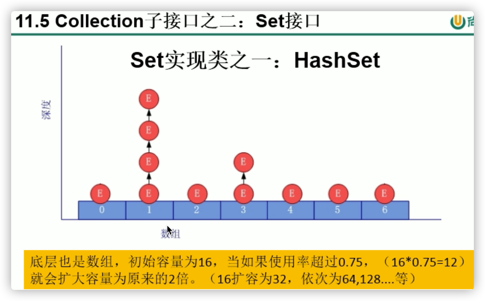


### HashSet

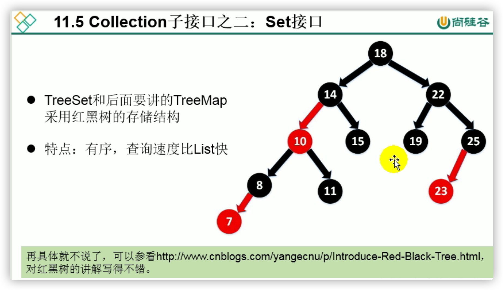

### LinkedHashSet


### TreeSet

## Map接口


## Collections工具类