# 泛型

- 标签，限制类型

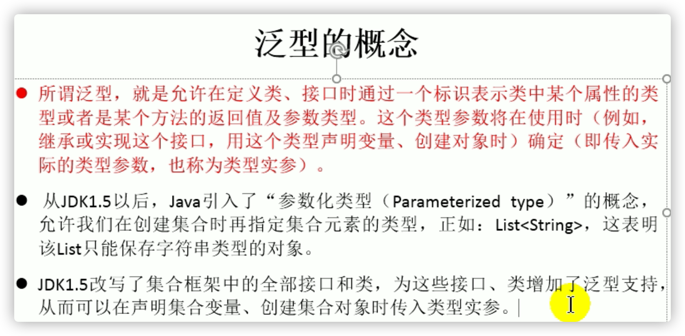

```java
/**
 * 泛型的使用
 * 1.jdk 5.0新增的特性
 *
 * 2.在集合中使用泛型：
 *  总结：
 *  ① 集合接口或集合类在jdk5.0时都修改为带泛型的结构。
 *  ② 在实例化集合类时，可以指明具体的泛型类型
 *  ③ 指明完以后，在集合类或接口中凡是定义类或接口时，内部结构（比如：方法、构造器、属性等）使用到类的泛型的位置，都指定为实例化的泛型类型。
 *    比如：add(E e)  --->实例化以后：add(Integer e)
 *  ④ 注意点：泛型的类型必须是类，不能是基本数据类型。需要用到基本数据类型的位置，拿包装类替换
 *  ⑤ 如果实例化时，没有指明泛型的类型。默认类型为java.lang.Object类型。
 *
 * 3.如何自定义泛型结构：泛型类、泛型接口；泛型方法。见 GenericTest1.java
 */
```

## 在集合中使用泛型

```java
//在集合中使用泛型的情况：以ArrayList为例
    @Test
    public void test2(){
       ArrayList<Integer> list =  new ArrayList<Integer>();

        list.add(78);
        list.add(87);
        list.add(99);
        list.add(65);
        //编译时，就会进行类型检查，保证数据的安全
//        list.add("Tom");

        //方式一：
//        for(Integer score : list){
//            //避免了强转操作
//            int stuScore = score;
//            System.out.println(stuScore);
//        }
        //方式二：
        Iterator<Integer> iterator = list.iterator();
        while(iterator.hasNext()){
            int stuScore = iterator.next();
            System.out.println(stuScore);
        }
    }
```

```java
//在集合中使用泛型的情况：以HashMap为例
    @Test
    public void test3(){
//        Map<String,Integer> map = new HashMap<String,Integer>();
        //jdk7新特性：类型推断
        Map<String,Integer> map = new HashMap<>();

        map.put("Tom",87);
        map.put("Jerry",87);
        map.put("Jack",67);

        //泛型的嵌套
        Set<Map.Entry<String,Integer>> entry = map.entrySet();
        Iterator<Map.Entry<String, Integer>> iterator = entry.iterator();

        while(iterator.hasNext()){
            Map.Entry<String, Integer> e = iterator.next();
            String key = e.getKey();
            Integer value = e.getValue();
            System.out.println(key + "----" + value);
        }
    }
```

## 自定义泛型结构

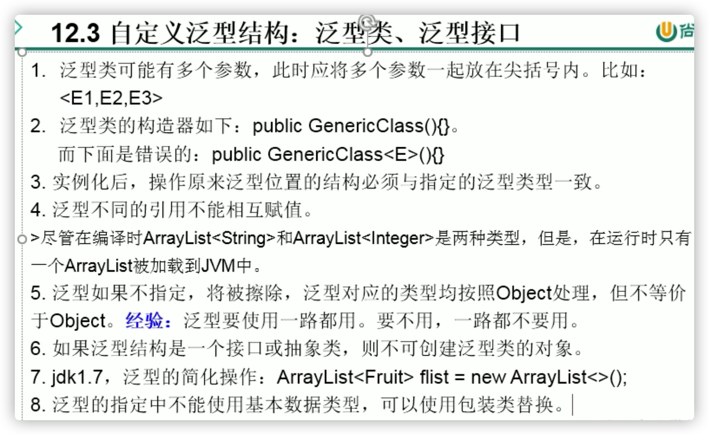


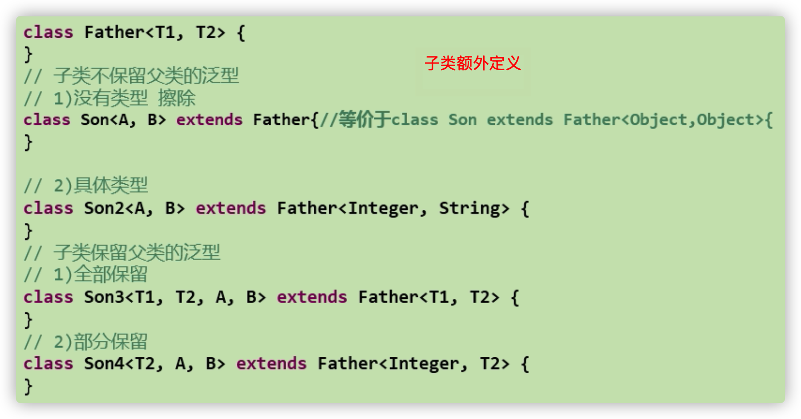

### 自定义泛型类,泛型方法

```java
public class Order<T> {
    String orderName;
    int orderId;

    //类的内部结构就可以使用类的泛型
    T orderT;

    public Order(){
        //编译不通过
//        T[] arr = new T[10];
        //编译通过
        T[] arr = (T[]) new Object[10];
    }

    public Order(String orderName,int orderId,T orderT){
        this.orderName = orderName;
        this.orderId = orderId;
        this.orderT = orderT;
    }

    //如下的三个方法都不是泛型方法
    public T getOrderT(){
        return orderT;
    }

    public void setOrderT(T orderT){
        this.orderT = orderT;
    }

    @Override
    public String toString() {
        return "Order{" +
                "orderName='" + orderName + '\'' +
                ", orderId=" + orderId +
                ", orderT=" + orderT +
                '}';
    }

    //静态方法中不能使用类的泛型。(静态方法中不能用对象，不能用类的属性)
//    public static void show(T orderT){
//        System.out.println(orderT);
//    }

    //泛型方法：在方法中出现了泛型的结构，泛型参数与类的泛型参数没有任何关系。
    //换句话说，泛型方法所属的类是不是泛型类都没有关系。
    //泛型方法，可以声明为静态的。原因：泛型参数是在调用方法时确定的。并非在实例化类时确定。
    public static <E>  List<E> copyFromArrayToList(E[] arr){
        ArrayList<E> list = new ArrayList<>();
        for(E e : arr){
            list.add(e);
        }
        return list;
    }
}
```

其子类：

```java
public class SubOrder extends Order<Integer> {//SubOrder:不是泛型类
    public static <E> List<E> copyFromArrayToList(E[] arr){
        ArrayList<E> list = new ArrayList<>();
        for(E e : arr){
            list.add(e);
        }
        return list;
    }
}

public class SubOrder1<T> extends Order<T> {//SubOrder1<T>:仍然是泛型类
}
```

使用:

```java
@Test
public void test1(){
    //如果定义了泛型类，实例化没有指明类的泛型，则认为此泛型类型为Object类型
    //要求：如果大家定义了类是带泛型的，建议在实例化时要指明类的泛型。
    Order order = new Order();
    order.setOrderT(123);
    order.setOrderT("ABC");

    //建议：实例化时指明类的泛型
    Order<String> order1 = new Order<String>("orderAA",1001,"order:AA");

    order1.setOrderT("AA:hello");
}
```

```java
@Test
public void test2(){
    SubOrder sub1 = new SubOrder();
    //由于子类在继承带泛型的父类时，指明了泛型类型。则实例化子类对象时，不再需要指明泛型。
    sub1.setOrderT(1122);

    SubOrder1<String> sub2 = new SubOrder1<>();
    sub2.setOrderT("order2...");
}
```

```java
@Test
    public void test3(){
        ArrayList<String> list1 = null;
        ArrayList<Integer> list2 = new ArrayList<Integer>();
        //泛型不同的引用不能相互赋值。
//        list1 = list2;
    }
```

```java
//测试泛型方法
@Test
public void test4(){
    Order<String> order = new Order<>();
    Integer[] arr = new Integer[]{1,2,3,4};
    //泛型方法在调用时，指明泛型参数的类型。
    List<Integer> list = order.copyFromArrayToList(arr);

    System.out.println(list);
}
```

## 泛型与异常

```java
//异常类不能声明为泛型类
//public class MyException<T> extends Exception{
//}
```

```java
 public void show(){
        //编译不通过
        //泛型不能与异常有关
//        try{
//        }catch(T t){
//        }
    }
```

## 泛型在继承上的表现

```java
/*
    1. 泛型在继承方面的体现
      虽然类A是类B的父类，但是G<A> 和G<B>二者不具备子父类关系，二者是并列关系。
       补充：类A是类B的父类，A<G> 是 B<G> 的父类
     */
    @Test
    public void test1(){
        Object[] arr1 = null;
        String[] arr2 = null;
        arr1 = arr2;
        
        List<Object> list1 = null;
        List<String> list2 = new ArrayList<String>();
        //此时的list1和list2的类型不具有子父类关系
        //编译不通过
//        list1 = list2;
    }

@Test
    public void test2(){
        AbstractList<String> list1 = null;
        List<String> list2 = null;
        ArrayList<String> list3 = null;

        list1 = list3;
        list2 = list3;
    }
```


## 通配符的使用

### 一般使用


```java
/*
    2. 通配符的使用
       通配符：?
       类A是类B的父类，G<A>和G<B>是没有关系的，二者共同的父类是：G<?>
     */
    @Test
    public void test3(){
        List<Object> list1 = null;
        List<String> list2 = null;

        List<?> list = null;

        list = list1;
        list = list2;

        List<String> list3 = new ArrayList<>();
        list3.add("AA");
        list3.add("BB");
        list = list3;
        //添加(写入)：对于List<?>就不能向其内部添加数据。
        //除了添加null之外。
//        list.add("DD");
//        list.add('?');

        list.add(null);

        //获取(读取)：允许读取数据，读取的数据类型为Object。
        Object o = list.get(0);
        System.out.println(o);
    }

public void print(List<?> list){
        Iterator<?> iterator = list.iterator();
        while(iterator.hasNext()){
            Object obj = iterator.next();
            System.out.println(obj);
        }
    }
```

### 有限制的通配符


```java
/*
    3.有限制条件的通配符的使用。
        ? extends A:
                G<? extends A> 可以作为G<A>和G<B>的父类，其中B是A的子类
        ? super A:
                G<? super A> 可以作为G<A>和G<B>的父类，其中B是A的父类
     */
    @Test
    public void test4(){
        List<? extends Person> list1 = null;
        List<? super Person> list2 = null;

        List<Student> list3 = new ArrayList<Student>();
        List<Person> list4 = new ArrayList<Person>();
        List<Object> list5 = new ArrayList<Object>();

        list1 = list3;
        list1 = list4;
//        list1 = list5;

//        list2 = list3;
        list2 = list4;
        list2 = list5;

        //读取数据：
        list1 = list3;
        Person p = list1.get(0);
        //编译不通过
        //Student s = list1.get(0);

        list2 = list4;
        Object obj = list2.get(0);
        ////编译不通过
//        Person obj = list2.get(0);

        //写入数据：
        //编译不通过
//        list1.add(new Student());

        //编译通过
        list2.add(new Person());
        //多态
        list2.add(new Student());
    }
```

## 泛型的应用

```java
public class DAO<T> {
    private Map<String,T> map = new HashMap<String,T>();
    
    //返回 map 中存放的所有 T 对象
    public List<T> list(){
        //错误的：
//        Collection<T> values = map.values();
//        return (List<T>) values;
        //正确的：
        ArrayList<T> list = new ArrayList<>();
        Collection<T> values = map.values();
        for(T t : values){
            list.add(t);
        }
        return list;
    }
}
```

### 比较

```java
public class Employee implements Comparable<Employee>{
  //省略代码
  ...............................
  //指明泛型时的写法
    @Override
    public int compareTo(Employee o) {
        return this.name.compareTo(o.name);
    }
}
```

```java
public class MyDate implements Comparable<MyDate>{
 @Override
    public int compareTo(MyDate m) {
        //比较年
        int minusYear = this.getYear() - m.getYear();
        if(minusYear != 0){
            return minusYear;
        }
        //比较月
        int minusMonth = this.getMonth() - m.getMonth();
        if(minusMonth != 0){
            return minusMonth;
        }
        //比较日
        return this.getDay() - m.getDay();
    } 
}
```

```java
TreeSet<Employee> set = new TreeSet<>(new Comparator<Employee>() {
    //使用泛型以后的写法
    @Override
    public int compare(Employee o1, Employee o2) {
        MyDate b1 = o1.getBirthday();
        MyDate b2 = o2.getBirthday();

        return b1.compareTo(b2);
    }
```

### 泛型嵌套

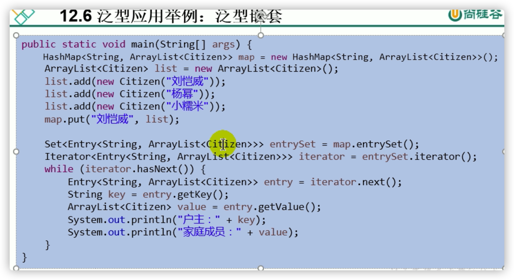

# IO流

## File类


```java
/**
 * File类的使用
 *
 * 1. File类的一个对象，代表一个文件或一个文件目录(俗称：文件夹)
 * 2. File类声明在java.io包下
 * 3. File类中涉及到关于文件或文件目录的创建、删除、重命名、修改时间、文件大小等方法，
 *    并未涉及到写入或读取文件内容的操作。如果需要读取或写入文件内容，必须使用IO流来完成。
 * 4. 后续File类的对象常会作为参数传递到流的构造器中，指明读取或写入的"终点".
 
DEA中：
如果大家开发使用几JUnit中的单元测试方法测试，相对路径即为当前module下。 如果大家使用main()测试，相对路径即为当前的Project下。
Eclipse中：
不管使用单元测试方法还是使用main()测试，相对路径都是当前的Project下。
 */
```

### 构造器

```java
/*
1.如何创建File类的实例
    File(String filePath)
    File(String parentPath,String childPath)
    File(File parentFile,String childPath)

2.
相对路径：相较于某个路径下，指明的路径。
绝对路径：包含盘符在内的文件或文件目录的路径

3.路径分隔符
 windows:\\
 unix:/
 */
```

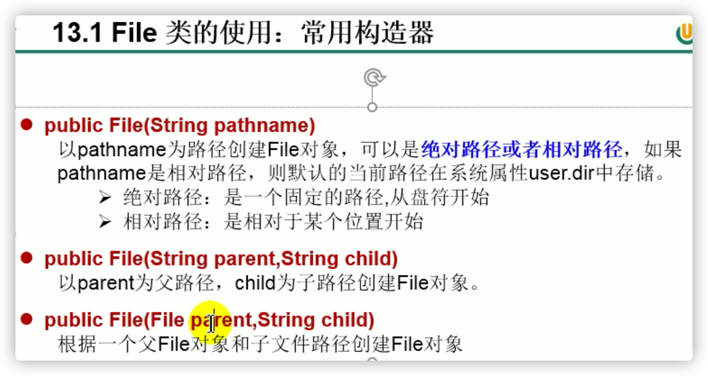

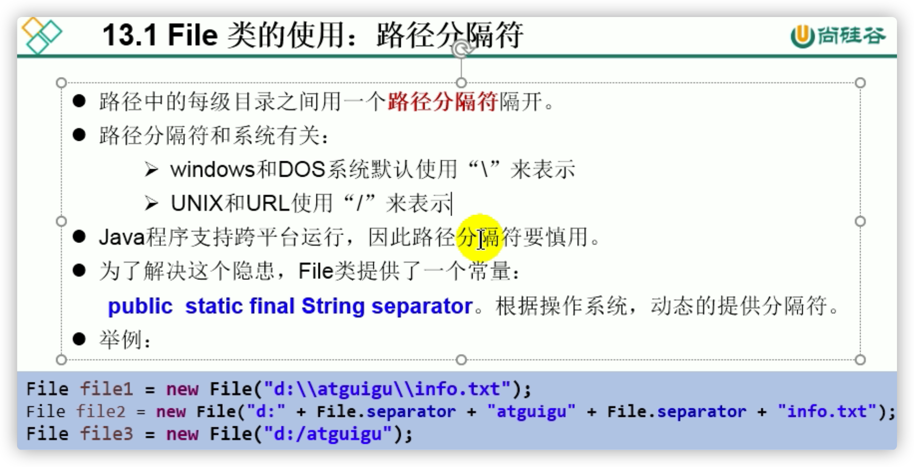

```java
@Test
public void test1(){
    //构造器1
    File file1 = new File("hello.txt");//相对于当前module
    File file2 =  new File("D:\\workspace_idea1\\JavaSenior\\day08\\he.txt");

    System.out.println(file1);//用相对路径构造，输出相对路径
    System.out.println(file2);

    //构造器2：
    File file3 = new File("D:\\workspace_idea1","JavaSenior");
    System.out.println(file3);

    //构造器3：
    File file4 = new File(file3,"hi.txt");
    System.out.println(file4);
}
```

### 使用

```java
/*
public String getAbsolutePath()：获取绝对路径
public String getPath() ：获取路径
public String getName() ：获取名称
public String getParent()：获取上层文件目录路径。若无，返回null
public long length() ：获取文件长度（即：字节数）。不能获取目录的长度。
public long lastModified() ：获取最后一次的修改时间，毫秒值

如下的两个方法适用于文件目录：
public String[] list() ：获取指定目录下的所有文件或者文件目录的名称数组
public File[] listFiles() ：获取指定目录下的所有文件或者文件目录的File数组
     */
    @Test
    //还不涉及硬盘，仅在内存中
    public void test2(){
        File file1 = new File("hello.txt");
        File file2 = new File("d:\\io\\hi.txt");

        System.out.println(file1.getAbsolutePath());//用相对路径构造，输出相对路径
        System.out.println(file1.getPath());//用相对路径构造，输出相对路径
        System.out.println(file1.getName());
        System.out.println(file1.getParent());//null
        System.out.println(file1.length());
        System.out.println(new Date(file1.lastModified()));

        System.out.println();

        System.out.println(file2.getAbsolutePath());//用绝对路径构造，输出绝对路径
        System.out.println(file2.getPath());//用绝对路径构造，输出绝对路径
        System.out.println(file2.getName());
        System.out.println(file2.getParent());//null
        System.out.println(file2.length());
        System.out.println(file2.lastModified());
    }
```

```java
@Test
public void test3(){
    File file = new File("/Users/kaixin/Downloads/尚硅谷宋红康Java核心基础_好评如潮（30天入门）/新建文件夹/4_代码/第2部分：Java高级编程/JavaSenior");

    String[] list = file.list();
    for(String s : list){
        System.out.println(s);
    }

    System.out.println();

    File[] files = file.listFiles();
    for(File f : files){
        System.out.println(f);
    }
```

```java
/*
public boolean renameTo(File dest):把文件重命名为指定的文件路径
 比如：file1.renameTo(file2)为例：
    要想保证返回true,需要file1在硬盘中是存在的，且file2不能在硬盘中存在。
    成功之后file1消失，转移到file2
 */
@Test
public void test4(){
    File file1 = new File("hello.txt");
    File file2 = new File("D:\\io\\hi.txt");

    boolean renameTo = file2.renameTo(file1);
    System.out.println(renameTo);
}
```

```java
/*
public boolean isDirectory()：判断是否是文件目录
public boolean isFile() ：判断是否是文件
public boolean exists() ：判断是否存在
public boolean canRead() ：判断是否可读
public boolean canWrite() ：判断是否可写
public boolean isHidden() ：判断是否隐藏
     */
    @Test
    public void test5(){
        File file1 = new File("hello.txt");
        file1 = new File("hello1.txt");

        //先判断存在与否
        System.out.println(file1.isDirectory());
        System.out.println(file1.isFile());
        System.out.println(file1.exists());
        System.out.println(file1.canRead());
        System.out.println(file1.canWrite());
        System.out.println(file1.isHidden());

        System.out.println();

        File file2 = new File("d:\\io");
        file2 = new File("d:\\io1");
        System.out.println(file2.isDirectory());
        System.out.println(file2.isFile());
        System.out.println(file2.exists());
        System.out.println(file2.canRead());
        System.out.println(file2.canWrite());
        System.out.println(file2.isHidden());
    }
```

### 创建删除

- 在硬盘中创建文件/文件夹

```java
/*
    创建硬盘中对应的文件或文件目录
public boolean createNewFile() ：创建文件。若文件存在，则不创建，返回false
public boolean mkdir() ：创建文件目录。如果此文件目录存在，就不创建了。如果此文件目录的上层目录不存在，也不创建。
public boolean mkdirs() ：创建文件目录。如果此文件目录存在，就不创建了。如果上层文件目录不存在，一并创建

    删除磁盘中的文件或文件目录
public boolean delete()：删除文件或者文件夹
    删除注意事项：Java中的删除不走回收站。
     */
```

```java
@Test
public void test6() throws IOException {
    File file1 = new File("hi.txt");
    if(!file1.exists()){
        //文件的创建
        file1.createNewFile();
        System.out.println("创建成功");
    }else{//文件存在
        file1.delete();
        System.out.println("删除成功");
    }
}
```

```java
@Test
public void test7(){
    //文件目录的创建
    File file1 = new File("d:\\io\\io1\\io3");

    boolean mkdir = file1.mkdir();
    if(mkdir){
        System.out.println("创建成功1");
    }

    File file2 = new File("d:\\io\\io1\\io4");

    boolean mkdir1 = file2.mkdirs();
    if(mkdir1){
        System.out.println("创建成功2");
    }
    //要想删除成功，io4文件目录下不能有子目录或文件
    File file3 = new File("D:\\io\\io1\\io4");
    file3 = new File("D:\\io\\io1");
    System.out.println(file3.delete());
}
```

## IO流原理及流的分类

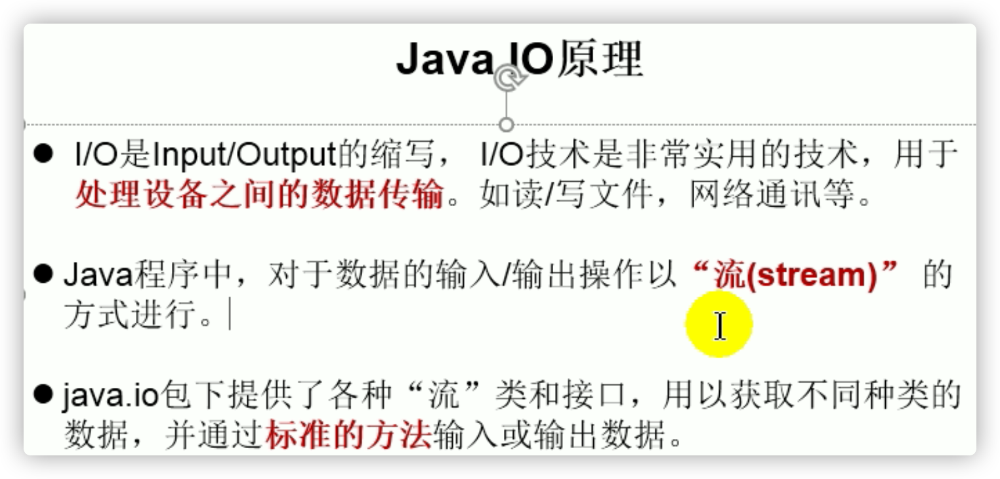

- 站在内存角度看输入输出

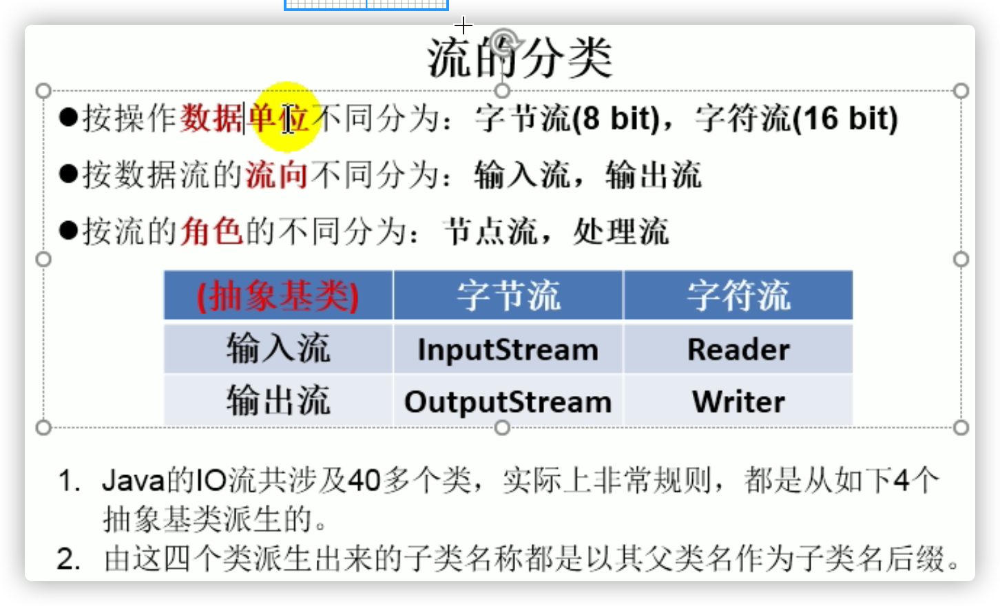

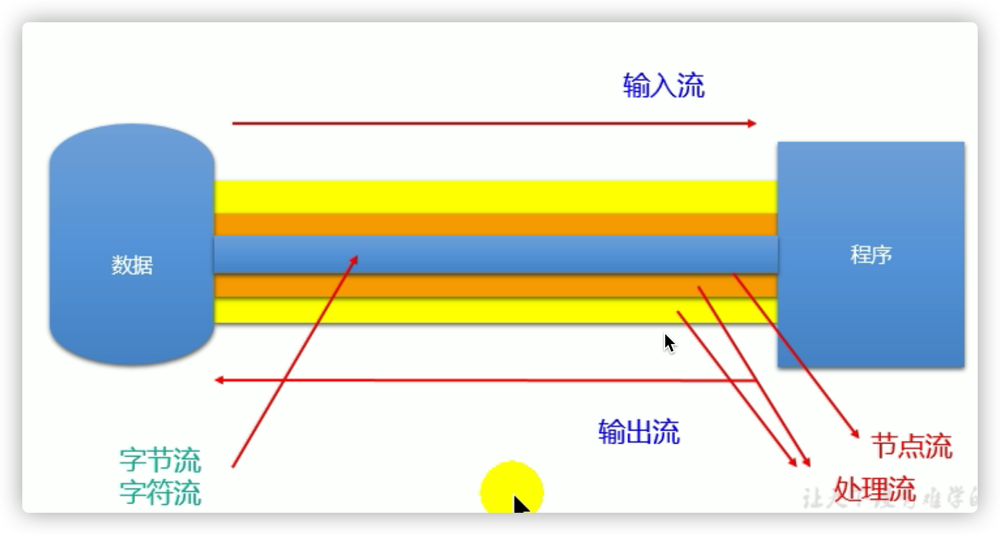

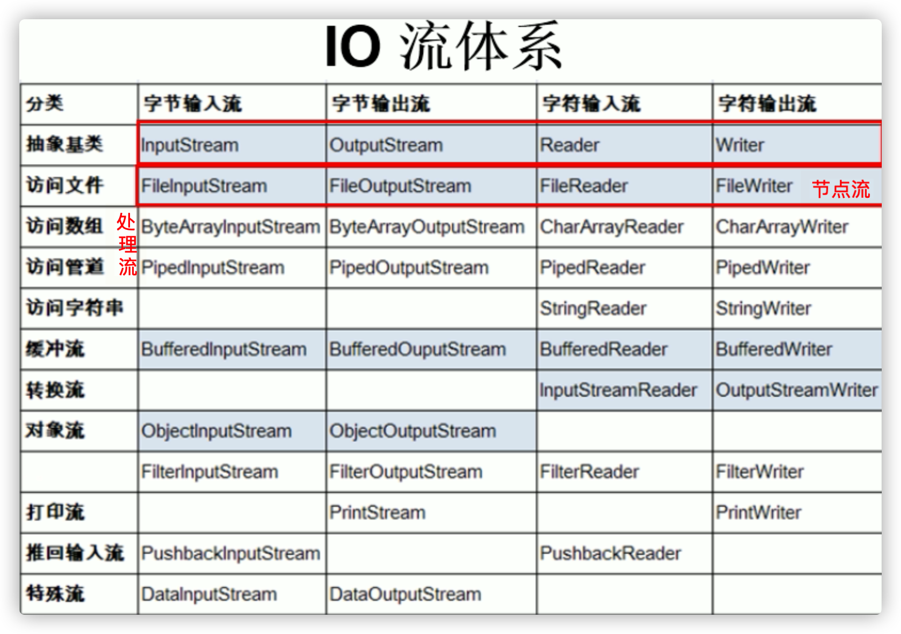

蓝色是需要关注的流

```JAVA
/**
 * 一、流的分类：
 * 1.操作数据单位：字节流、字符流
 * 2.数据的流向：输入流、输出流
 * 3.流的角色：节点流、处理流
 *
 * 二、流的体系结构
 * 抽象基类         节点流（或文件流）                               缓冲流（处理流的一种）
 * InputStream     FileInputStream   (read(byte[] buffer))        BufferedInputStream (read(byte[] buffer))
 * OutputStream    FileOutputStream  (write(byte[] buffer,0,len)  BufferedOutputStream (write(byte[] buffer,0,len) / flush()
 * Reader          FileReader (read(char[] cbuf))                 BufferedReader (read(char[] cbuf) / readLine())
 * Writer          FileWriter (write(char[] cbuf,0,len)           BufferedWriter (write(char[] cbuf,0,len) / flush()刷新缓存区
 //不能使用字符流来处理图片等字节数据
 */
```

## 节点流（文件流）

### FileReader

```JAVA
/*
将day09下的hello.txt文件内容读入程序中，并输出到控制台
说明点：
1. read()的理解：返回读入的一个字符。如果达到文件末尾，返回-1
2. 异常的处理：为了保证流资源一定可以执行关闭操作。需要使用try-catch-finally处理
3. 读入的文件一定要存在，否则就会报FileNotFoundException。
 */
@Test
public void testFileReader(){
    FileReader fr = null;
    try {
        //1.实例化File类的对象，指明要操作的文件
        File file = new File("hello.txt");//相较于当前Module
        //2.提供具体的流
        fr = new FileReader(file);

        //3.数据的读入
        //read():返回读入的一个字符。如果达到文件末尾，返回-1
        int data;
        while((data = fr.read()) != -1){
            System.out.print((char)data);
        }
    } catch (IOException e) {
        e.printStackTrace();
    } finally {
        //4.流的关闭操作
        if(fr != null){
            try {
                fr.close();
            } catch (IOException e) {
                e.printStackTrace();
            }
        }
    }
}
```

```java
//对read()操作升级：使用read的重载方法
    //从一个个字符读取到多个字符一次性读取
    @Test
    public void testFileReader1()  {
        FileReader fr = null;
        try {
            //1.File类的实例化
            File file = new File("hello.txt");

            //2.FileReader流的实例化
            fr = new FileReader(file);

            //3.读入的操作
            //read(char[] cbuf):返回每次读入cbuf数组中的字符的个数。如果达到文件末尾，返回-1
            char[] cbuf = new char[5];
            int len;
            while((len = fr.read(cbuf)) != -1){
                //方式一：
                //错误的写法
                //最后数组填不满，后面几个不够的字符就用上一轮数组遗留下来的字符填满
//                for(int i = 0;i < cbuf.length;i++){
//                    System.out.print(cbuf[i]);
//                }
                //正确的写法
//                for(int i = 0;i < len;i++){
//                    System.out.print(cbuf[i]);
//                }
                //方式二：
                //错误的写法,对应着方式一的错误的写法
//                String str = new String(cbuf);
//                System.out.print(str);
                //正确的写法
                //每次从数组的第0个元素开始填充
                String str = new String(cbuf,0,len);
                System.out.print(str);
            }
        } catch (IOException e) {
            e.printStackTrace();
        } finally {
            if(fr != null){
                //4.资源的关闭
                try {
                    fr.close();
                } catch (IOException e) {
                    e.printStackTrace();
                }
            }
        }
    }
```

### FileWriter

```java
/*
从内存中写出数据到硬盘的文件里。
说明：
1. 输出操作，对应的File可以不存在的。并不会报异常
2.
     File对应的硬盘中的文件如果不存在，在输出的过程中，会自动创建此文件。
     File对应的硬盘中的文件如果存在：
            如果流使用的构造器是：FileWriter(file,false) / FileWriter(file):对原有文件的覆盖
            如果流使用的构造器是：FileWriter(file,true):不会对原有文件覆盖，而是在原有文件基础上追加内容
 */
@Test
public void testFileWriter() {
    FileWriter fw = null;
    try {
        //1.提供File类的对象，指明写出到的文件
        File file = new File("hello1.txt");

        //2.提供FileWriter的对象，用于数据的写出
        fw = new FileWriter(file,false);

        //3.写出的操作
        fw.write("I have a dream!\n");
        fw.write("you need to have a dream!");
    } catch (IOException e) {
        e.printStackTrace();
    } finally {
        //4.流资源的关闭
        if(fw != null){
            try {
                fw.close();
            } catch (IOException e) {
                e.printStackTrace();
            }
        }
    }
}
```

### 二合一

```java
@Test
    public void testFileReaderFileWriter() {
        FileReader fr = null;
        FileWriter fw = null;
        try {
            //1.创建File类的对象，指明读入和写出的文件
            File srcFile = new File("hello.txt");
            File destFile = new File("hello2.txt");

            //2.创建输入流和输出流的对象
            fr = new FileReader(srcFile);
            fw = new FileWriter(destFile);
            
            //3.数据的读入和写出操作
            char[] cbuf = new char[5];
            int len;//记录每次读入到cbuf数组中的字符的个数
            while((len = fr.read(cbuf)) != -1){
                //每次写出len个字符
                fw.write(cbuf,0,len);
            }
        } catch (IOException e) {
            e.printStackTrace();
        } finally {
            //4.关闭流资源
            //方式一：
//            try {
//                if(fw != null)
//                    fw.close();
//            } catch (IOException e) {
//                e.printStackTrace();
//            }finally{
//                try {
//                    if(fr != null)
//                        fr.close();
//                } catch (IOException e) {
//                    e.printStackTrace();
//                }
//            }
            //方式二：
            try {
                if(fw != null)
                    fw.close();
            } catch (IOException e) {
                e.printStackTrace();
            }
            try {
                if(fr != null)
                    fr.close();
            } catch (IOException e) {
                e.printStackTrace();
            }
        }
    }
```

### FileInputStream

```java
/**
 * 测试FileInputStream和FileOutputStream的使用
 * 结论:
 * 1. 对于文本文件(.txt,.java,.c,.cpp)，使用字符流处理
 * 2. 对于非文本文件(.jpg,.mp3,.mp4,.avi,.doc,.ppt,...)，使用字节流处理
 */
```

```java
//使用字节流FileInputStream处理文本文件，可能出现乱码。
//几个几个字节读可能会出现乱码
@Test
public void testFileInputStream() {
    FileInputStream fis = null;
    try {
        //1. 造文件
        File file = new File("hello.txt");

        //2.造流
        fis = new FileInputStream(file);

        //3.读数据
        byte[] buffer = new byte[5];
        int len;//记录每次读取的字节的个数
        while((len = fis.read(buffer)) != -1){
            String str = new String(buffer,0,len);
            System.out.print(str);
        }
    } catch (IOException e) {
        e.printStackTrace();
    } finally {
        if(fis != null){
            //4.关闭资源
            try {
                fis.close();
            } catch (IOException e) {
                e.printStackTrace();
            }
        }
    }
}
```

### FileInputOutputStream

```java
//实现对图片的复制操作
@Test
public void testFileInputOutputStream()  {
    FileInputStream fis = null;
    FileOutputStream fos = null;
    try {
        File srcFile = new File("爱情与友情.jpg");
        File destFile = new File("爱情与友情2.jpg");
        
        fis = new FileInputStream(srcFile);
        fos = new FileOutputStream(destFile);

        //复制的过程
        byte[] buffer = new byte[5];
        int len;
        while((len = fis.read(buffer)) != -1){
            fos.write(buffer,0,len);
        }
    } catch (IOException e) {
        e.printStackTrace();
    } finally {
        if(fos != null){
            try {
                fos.close();
            } catch (IOException e) {
                e.printStackTrace();
            }
        }
        if(fis != null){
            try {
                fis.close();
            } catch (IOException e) {
                e.printStackTrace();
            }
        }
    }
}
```

## 缓冲流


```Java
/**
 * 处理流之一：缓冲流的使用
 *
 * 1.缓冲流：
 * BufferedInputStream
 * BufferedOutputStream
 * BufferedReader
 * BufferedWriter
 *
 * 2.作用：提供流的读取、写入的速度
 *   提高读写速度的原因：内部提供了一个缓冲区
 *
 * 3. 处理流，就是“套接”在已有的流的基础上。
 字节流套字节流
 字符流套字符流
 */
```

### BufferedInputOutputStream

```java
@Test
    public void BufferedStreamTest(){
        BufferedInputStream bis = null;
        BufferedOutputStream bos = null;
 
        try {
            //1.造文件
            File srcFile = new File("爱情与友情.jpg");
            File destFile = new File("爱情与友情3.jpg");
            //2.造流
            //2.1 造节点流
            FileInputStream fis = new FileInputStream((srcFile));
            FileOutputStream fos = new FileOutputStream(destFile);
            //2.2 造缓冲流
            bis = new BufferedInputStream(fis);
            bos = new BufferedOutputStream(fos);

            //3.复制的细节：读取、写入
            byte[] buffer = new byte[10];
            int len;
            while((len = bis.read(buffer)) != -1){
                bos.write(buffer,0,len);
//                bos.flush();//刷新缓冲区
            }
        } catch (IOException e) {
            e.printStackTrace();
        } finally {
            //4.资源关闭
            //要求：先关闭外层的流，再关闭内层的流
            if(bos != null){
                try {
                    bos.close();
                } catch (IOException e) {
                    e.printStackTrace();
                }
            }
            if(bis != null){
                try {
                    bis.close();
                } catch (IOException e) {
                    e.printStackTrace();
                }
            }
            //说明：关闭外层流的同时，内层流也会自动的进行关闭。关于内层流的关闭，我们可以省略.
//        fos.close();
//        fis.close();
        }
    }
```

### BufferedReaderWriter

```java
//使用BufferedReader和BufferedWriter实现文本文件的复制
    @Test
    public void testBufferedReaderBufferedWriter(){
        BufferedReader br = null;
        BufferedWriter bw = null;
        try {
            //创建文件和相应的流
            br = new BufferedReader(new FileReader(new File("dbcp.txt")));
            bw = new BufferedWriter(new FileWriter(new File("dbcp1.txt")));

            //读写操作
            //方式一：使用char[]数组
//            char[] cbuf = new char[1024];
//            int len;
//            while((len = br.read(cbuf)) != -1){
//                bw.write(cbuf,0,len);
//    //            bw.flush();
//            }

            //方式二：使用String
            String data;
            while((data = br.readLine()) != null){
                //方法一：
//                bw.write(data + "\n");//data中不包含换行符
                //方法二：
                bw.write(data);//data中不包含换行符
                bw.newLine();//提供换行的操作
            }
        } catch (IOException e) {
            e.printStackTrace();
        } finally {
            //关闭资源
            if(bw != null){
                try {
                    bw.close();
                } catch (IOException e) {
                    e.printStackTrace();
                }
            }
            if(br != null){
                try {
                    br.close();
                } catch (IOException e) {
                    e.printStackTrace();
                }
            }
        }
    }
```

## 转换流(编码)


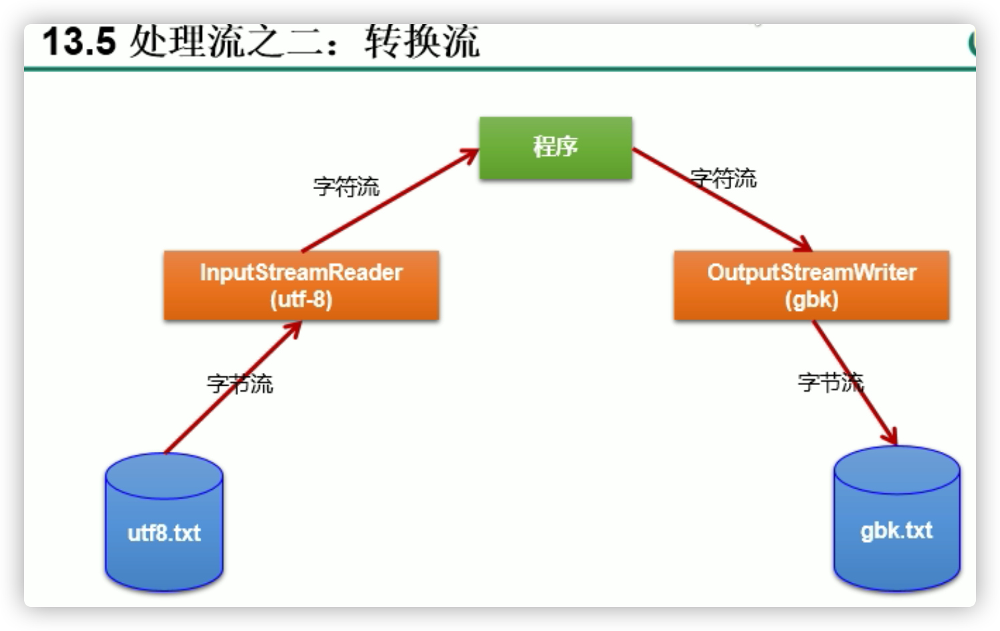


在标准UTF-8编码中，超出基本多语言范围(BMP-Basic Multilingual Plane)的字符被编码为4字节格式，但是在修正的UTF-8编码中，他们由代理编码对(surrogatepairs)表示
然后这些代理编码对在序列中分别重新编码。结果标准UTF-8编码中需要4个字节的字符，在修正后的UTF-8编码中将需要6个字节。

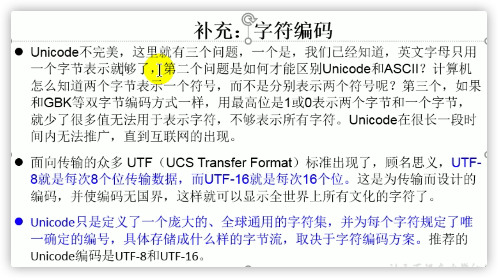


```java
/**
 * 处理流之二：转换流的使用
 * 1.转换流：属于字符流
 *   InputStreamReader：将一个字节的输入流转换为字符的输入流
 *   OutputStreamWriter：将一个字符的输出流转换为字节的输出流
 *
 * 2.作用：提供字节流与字符流之间的转换
 *
 * 3. 解码：字节、字节数组  --->字符数组、字符串
 *    编码：字符数组、字符串 ---> 字节、字节数组
 *
 * 4.字符集
 *ASCII：美国标准信息交换码。
    用一个字节的7位可以表示。
 ISO8859-1：拉丁码表。欧洲码表
    用一个字节的8位表示。
 GB2312：中国的中文编码表。最多两个字节编码所有字符
 GBK：中国的中文编码表升级，融合了更多的中文文字符号。最多两个字节编码
 Unicode：国际标准码，融合了目前人类使用的所有字符。为每个字符分配唯一的字符码。所有的文字都用两个字节来表示。
 UTF-8：变长的编码方式，可用1-4个字节来表示一个字符。
 */
```

### InputStreamReader

```java
/*
    此时处理异常的话，仍然应该使用try-catch-finally
    InputStreamReader的使用，实现字节的输入流到字符的输入流的转换
     */
    @Test
    public void test1() throws IOException {
        FileInputStream fis = new FileInputStream("dbcp.txt");
//        InputStreamReader isr = new InputStreamReader(fis);//使用系统默认的字符集
        //参数2指明了字符集，具体使用哪个字符集，取决于文件dbcp.txt保存时使用的字符集
        InputStreamReader isr = new InputStreamReader(fis,"UTF-8");//使用系统默认的字符集

        char[] cbuf = new char[20];
        int len;
        while((len = isr.read(cbuf)) != -1){
            String str = new String(cbuf,0,len);
            System.out.print(str);
        }
        isr.close();
    }
```

### InputStreamReaderWriter

```java
/*
此时处理异常的话，仍然应该使用try-catch-finally
综合使用InputStreamReader和OutputStreamWriter，里面参数是字节输入输出流
 */
@Test
public void test2() throws Exception {
    //1.造文件、造流
    File file1 = new File("dbcp.txt");
    File file2 = new File("dbcp_gbk.txt");

    FileInputStream fis = new FileInputStream(file1);
    FileOutputStream fos = new FileOutputStream(file2);

    InputStreamReader isr = new InputStreamReader(fis,"utf-8");
    OutputStreamWriter osw = new OutputStreamWriter(fos,"gbk");

    //2.读写过程
    char[] cbuf = new char[20];
    int len;
    while((len = isr.read(cbuf)) != -1){
        osw.write(cbuf,0,len);
    }

    //3.关闭资源
    isr.close();
    osw.close();
}
```

## 标准输入输出流


```java
/*
1.标准的输入、输出流
1.1
System.in:标准的输入流，默认从键盘输入
System.out:标准的输出流，默认从控制台输出
1.2
System类的setIn(InputStream is) / setOut(PrintStream ps)方式重新指定输入和输出的流。

1.3练习：
从键盘输入字符串，要求将读取到的整行字符串转成大写输出。然后继续进行输入操作，
直至当输入“e”或者“exit”时，退出程序。

方法一：使用Scanner实现，调用next()返回一个字符串
方法二：使用System.in实现。System.in  --->  转换流 ---> BufferedReader的readLine()
 */
```

```java
public static void main(String[] args) {
    BufferedReader br = null;
    try {
        InputStreamReader isr = new InputStreamReader(System.in);
        br = new BufferedReader(isr);

        while (true) {
            System.out.println("请输入字符串：");
            String data = br.readLine();
            if ("e".equalsIgnoreCase(data) || "exit".equalsIgnoreCase(data)) {
                System.out.println("程序结束");
                break;
            }

            String upperCase = data.toUpperCase();
            System.out.println(upperCase);
        }
    } catch (IOException e) {
        e.printStackTrace();
    } finally {
        if (br != null) {
            try {
                br.close();
            } catch (IOException e) {
                e.printStackTrace();
            }
        }
    }
}
```

## 打印流

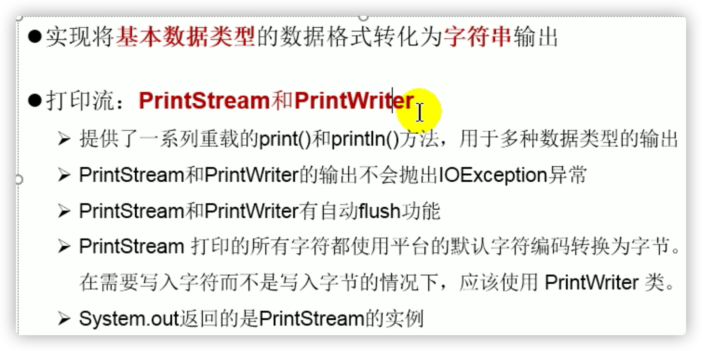

```java
/*
2. 打印流：PrintStream 和PrintWriter
2.1 提供了一系列重载的print() 和 println()
2.2 练习：
 */
@Test
public void test2() {
    PrintStream ps = null;
    try {
        FileOutputStream fos = new FileOutputStream(new File("D:\\IO\\text.txt"));
        // 创建打印输出流,设置为自动刷新模式(写入换行符或字节 '\n' 时都会刷新输出缓冲区)
        ps = new PrintStream(fos, true);
        if (ps != null) {
            // 把标准输出流(控制台输出)改成文件
            System.setOut(ps);
        }

        for (int i = 0; i <= 255; i++) { // 输出ASCII字符
            System.out.print((char) i);
            if (i % 50 == 0) { // 每50个数据一行
                System.out.println(); // 换行
            }
        }
    } catch (FileNotFoundException e) {
        e.printStackTrace();
    } finally {
        if (ps != null) {
            ps.close();
        }
    }
}
```

## 数据流


```java
/*
3. 数据流
3.1 DataInputStream 和 DataOutputStream
3.2 作用：用于读取或写出基本数据类型的变量或字符串

练习：将内存中的字符串、基本数据类型的变量写出到文件中。

注意：处理异常的话，仍然应该使用try-catch-finally.
 */
@Test
public void test3() throws IOException {
    //1.
    DataOutputStream dos = new DataOutputStream(new FileOutputStream("data.txt"));
    //2.
    dos.writeUTF("刘建辰");
    dos.flush();//刷新操作，将内存中的数据写入文件
    dos.writeInt(23);
    dos.flush();
    dos.writeBoolean(true);
    dos.flush();
    //3.
    dos.close();
}
```

```java
/*
将文件中存储的基本数据类型变量和字符串读取到内存中，保存在变量中。
注意点：读取不同类型的数据的顺序要与当初写入文件时，保存的数据的顺序一致！
 */
@Test
public void test4() throws IOException {
    //1.
    DataInputStream dis = new DataInputStream(new FileInputStream("data.txt"));
    //2.
    String name = dis.readUTF();
    int age = dis.readInt();
    boolean isMale = dis.readBoolean();

    System.out.println("name = " + name);
    System.out.println("age = " + age);
    System.out.println("isMale = " + isMale);

    //3.
    dis.close();
}
```

## 对象流

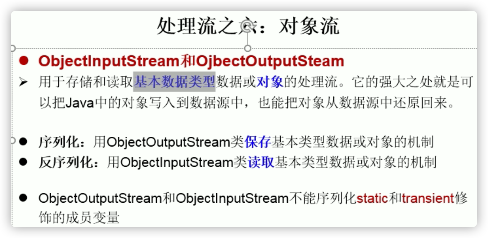


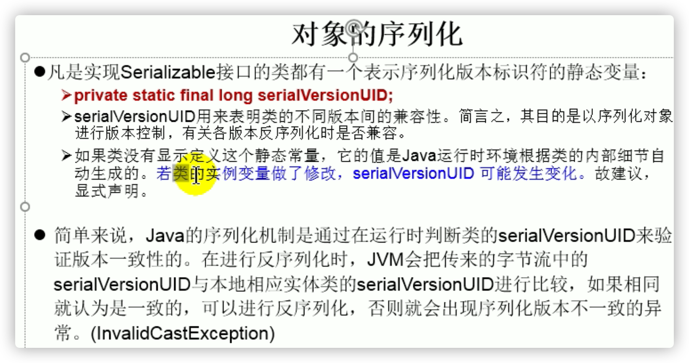

- 凡事跨进程传输对象需要对象可序列化，但是现在转化成json传输（特殊字符串，字符串本身就可以序列化反序列化）

```java
/**
 * 对象流的使用
 * 1.ObjectInputStream 和 ObjectOutputStream
 * 2.作用：用于存储和读取基本数据类型数据或对象的处理流。它的强大之处就是可以把Java中的对象写入到数据源中，也能把对象从数据源中还原回来。
 *
 * 3.要想一个java对象是可序列化的，需要满足相应的要求。见Person.java
 *
 * 4.序列化机制：
 * 对象序列化机制允许把内存中的Java对象转换成平台无关的二进制流，从而允许把这种
 * 二进制流持久地保存在磁盘上，或通过网络将这种二进制流传输到另一个网络节点。
 * 当其它程序获取了这种二进制流，就可以恢复成原来的Java对象。
 */
```

```java
/**
 * Person需要满足如下的要求，方可序列化
 * 1.需要实现接口：Serializable,标识接口，没有抽象方法
 * 2.当前类提供一个全局常量：serialVersionUID
 * 3.除了当前Person类需要实现Serializable接口之外，还必须保证其内部所有属性
 *   也必须是可序列化的。（默认情况下，基本数据类型可序列化）
 *
 * 补充：ObjectOutputStream和ObjectInputStream不能序列化static和transient修饰的成员变量
 */
public class Person implements Serializable{
    public static final long serialVersionUID = 475463534532L;

    private String name;
    private int age;
    private int id;
    private Account acct;

    public Person(String name, int age, int id) {
        this.name = name;
        this.age = age;
        this.id = id;
    }

    public Person(String name, int age, int id, Account acct) {
        this.name = name;
        this.age = age;
        this.id = id;
        this.acct = acct;
    }

    @Override
    public String toString() {
        return "Person{" +
                "name='" + name + '\'' +
                ", age=" + age +
                ", id=" + id +
                ", acct=" + acct +
                '}';
    }

    public int getId() {
        return id;
    }

    public void setId(int id) {
        this.id = id;
    }

    public String getName() {
        return name;
    }

    public void setName(String name) {
        this.name = name;
    }

    public int getAge() {
        return age;
    }

    public void setAge(int age) {
        this.age = age;
    }

    public Person(String name, int age) {
        this.name = name;
        this.age = age;
    }

    public Person() {
    }
}

class Account implements Serializable{
    public static final long serialVersionUID = 4754534532L;
    private double balance;

    @Override
    public String toString() {
        return "Account{" +
                "balance=" + balance +
                '}';
    }

    public double getBalance() {
        return balance;
    }

    public void setBalance(double balance) {
        this.balance = balance;
    }

    public Account(double balance) {
        this.balance = balance;
    }
}
```

```java
/*
序列化过程：将内存中的java对象保存到磁盘中或通过网络传输出去
使用ObjectOutputStream实现
 */
@Test
public void testObjectOutputStream(){
    ObjectOutputStream oos = null;
    try {
        //1.
        oos = new ObjectOutputStream(new FileOutputStream("object.dat"));
        //2.
        oos.writeObject(new String("我爱北京天安门"));
        oos.flush();//刷新写入操作

        oos.writeObject(new Person("王铭",23));
        oos.flush();

        oos.writeObject(new Person("张学良",23,1001,new Account(5000)));
        oos.flush();

    } catch (IOException e) {
        e.printStackTrace();
    } finally {
        if(oos != null){
            //3.
            try {
                oos.close();
            } catch (IOException e) {
                e.printStackTrace();
            }
        }
    }
}
```

```java
/*
反序列化：将磁盘文件中的对象还原为内存中的一个java对象
使用ObjectInputStream来实现
 */
@Test
public void testObjectInputStream(){
    ObjectInputStream ois = null;
    try {
        ois = new ObjectInputStream(new FileInputStream("object.dat"));

        Object obj = ois.readObject();
        String str = (String) obj;

        Person p = (Person) ois.readObject();
        Person p1 = (Person) ois.readObject();

        System.out.println(str);
        System.out.println(p);
        System.out.println(p1);
    } catch (IOException e) {
        e.printStackTrace();
    } catch (ClassNotFoundException e) {
        e.printStackTrace();
    } finally {
        if(ois != null){
            try {
                ois.close();
            } catch (IOException e) {
                e.printStackTrace();
            }
        }
    }
}
```

## 随机存取文件流


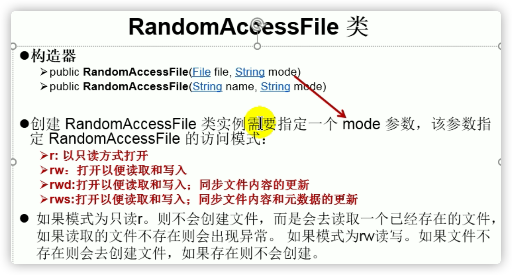

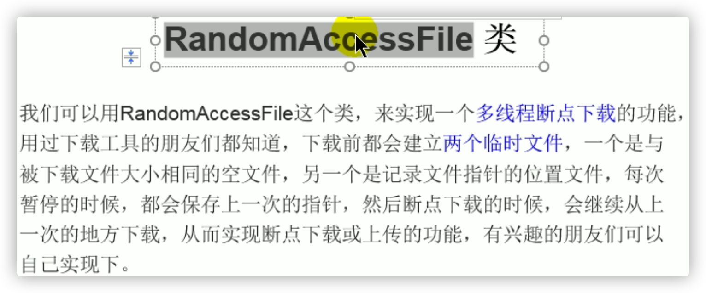

```java
/**
 * RandomAccessFile的使用
 * 1.RandomAccessFile直接继承于java.lang.Object类，实现了DataInput和DataOutput接口
 * 2.RandomAccessFile既可以作为一个输入流，又可以作为一个输出流（同一个类一个对象来输入，一个对象输出）
 *
 * 3.如果RandomAccessFile作为输出流时，写出到的文件如果不存在，则在执行过程中自动创建。
 *   如果写出到的文件存在，则会对原有文件内容进行覆盖。（默认情况下，从头覆盖,没覆盖玩的地方保持不变）
 *
 * 4. 可以通过相关的操作，实现RandomAccessFile“插入”数据的效果
 */
```

随机存取文件流暂且看作字节流:raf1.write("xyz".getBytes());

```java
@Test
public void test1() {
    RandomAccessFile raf1 = null;
    RandomAccessFile raf2 = null;
    try {
        //1.
        raf1 = new RandomAccessFile(new File("爱情与友情.jpg"),"r");
        raf2 = new RandomAccessFile(new File("爱情与友情1.jpg"),"rw");
        //2.
        byte[] buffer = new byte[1024];
        int len;
        while((len = raf1.read(buffer)) != -1){
            raf2.write(buffer,0,len);
        }
    } catch (IOException e) {
        e.printStackTrace();
    } finally {
        //3.
        if(raf1 != null){
            try {
                raf1.close();
            } catch (IOException e) {
                e.printStackTrace();
            }
        }
        if(raf2 != null){
            try {
                raf2.close();
            } catch (IOException e) {
                e.printStackTrace();
            }
        }
    }
}
```

```java
@Test
public void test2() throws IOException {
    RandomAccessFile raf1 = new RandomAccessFile("hello.txt","rw");
    raf1.seek(3);//将指针调到角标为3的位置
    raf1.write("xyz".getBytes());//
    raf1.close();
}
```

## NlO.2中Path、Paths、Files类的使用

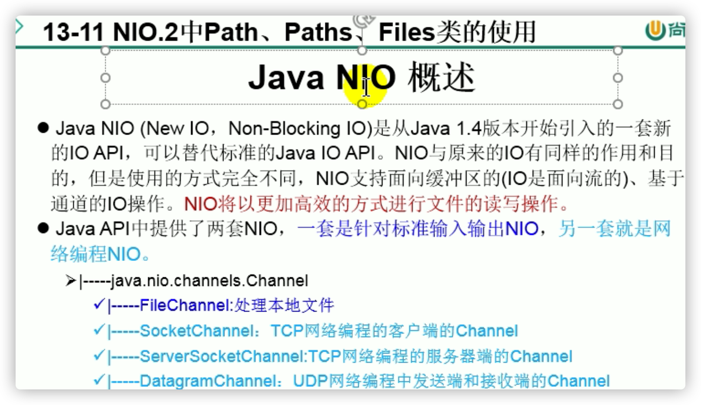


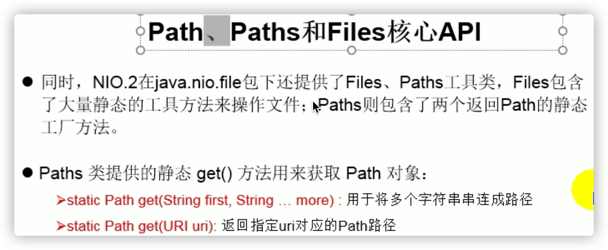


# 导入三方jar包

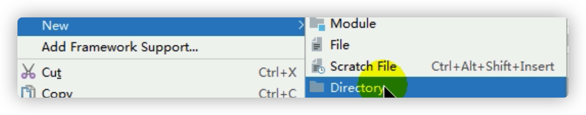

- 命名lib
- 粘贴jar包


