# 网络编程

## 网络通信要素概述


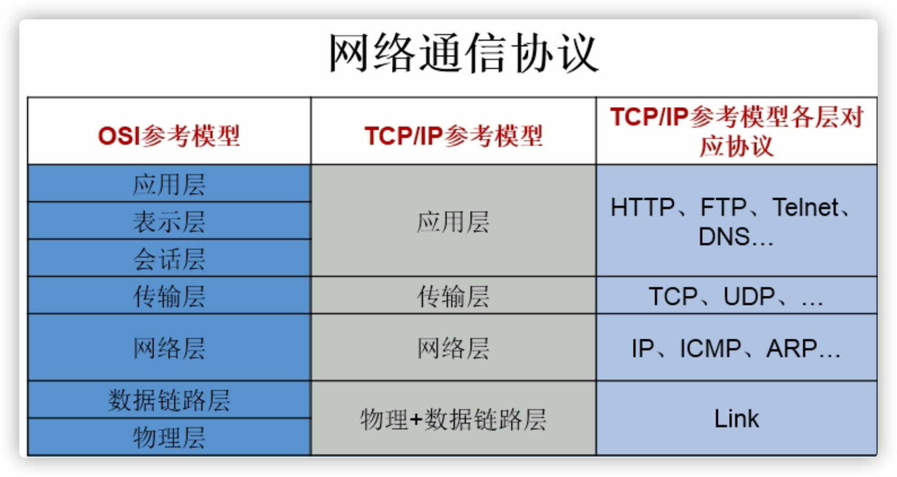


```java
/**
 * 一、网络编程中有两个主要的问题：
 * 1.如何准确地定位网络上一台或多台主机；定位主机上的特定的应用
 * 2.找到主机后如何可靠高效地进行数据传输
 *
 * 二、网络编程中的两个要素：
 * 1.对应问题一：IP和端口号
 * 2.对应问题二：提供网络通信协议：TCP/IP参考模型（应用层、传输层、网络层、物理+数据链路层）
 *
 * 三、通信要素一：IP和端口号
 * 1. IP:唯一的标识 Internet 上的计算机（通信实体）
 * 2. 在Java中使用InetAddress类代表IP
 * 3. IP分类：IPv4 和 IPv6 ; 万维网 和 局域网
 * 4. 域名 (来访问ip):   www.baidu.com   www.mi.com  www.sina.com  www.jd.com
 *            www.vip.com
 域名解析：域名容易记忆，当在连接网络时输入一个主机的域名后，域名服务器(DNS)负责将域名转化成IP地址，这样才能
主机建立连接。域名解析
 * 5. 本地回路地址：127.0.0.1 对应着：localhost
 * 6. 如何实例化InetAddress:两个方法：getByName(String host) 、 getLocalHost()
 *        两个常用方法：getHostName() / getHostAddress()
 *
 * 7. 端口号：正在计算机上运行的进程。
 * 要求：不同的进程有不同的端口号
 * 范围：被规定为一个 16 位的整数 0~65535。
 *
 * 8. 端口号与IP地址的组合得出一个网络套接字：Socket
 */
```

## 通信要素1：IP和端口号


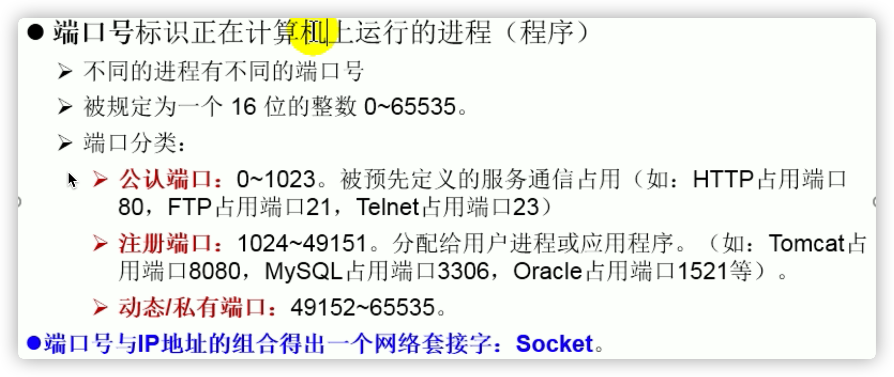

```java
public static void main(String[] args) {
    try {
        InetAddress inet1 = InetAddress.getByName("192.168.10.14");
        System.out.println(inet1);

        InetAddress inet2 = InetAddress.getByName("www.atguigu.com");
        System.out.println(inet2);

        //获取本地ip
        InetAddress inet3 = InetAddress.getLocalHost();
        System.out.println(inet3);

        //getHostName()
        System.out.println(inet2.getHostName());//www.atguigu.com
        //getHostAddress()
        System.out.println(inet2.getHostAddress());//125.76.247.133

    } catch (UnknownHostException e) {
        e.printStackTrace();
    }
```

## 通信要素2：网络协议


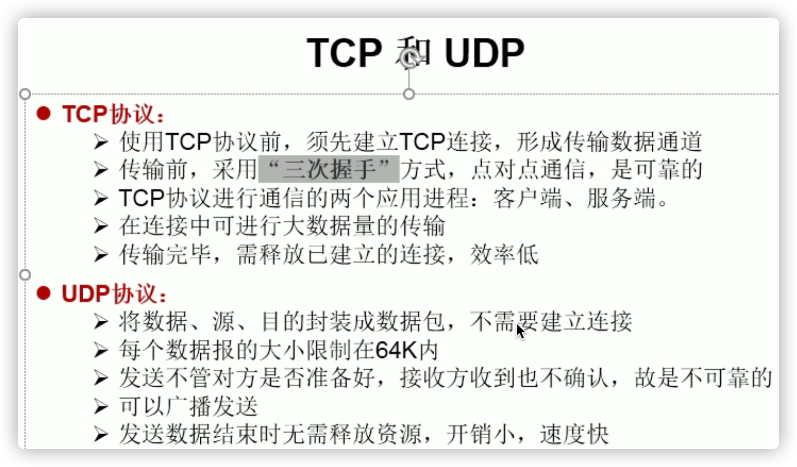

- TCP:可靠的数据传输（三次握手）：进行大数据量的传输：效率低
  UDP:不可靠；以数据报形式发送， 数据报限定为64k:效率高

### TCP网络编程


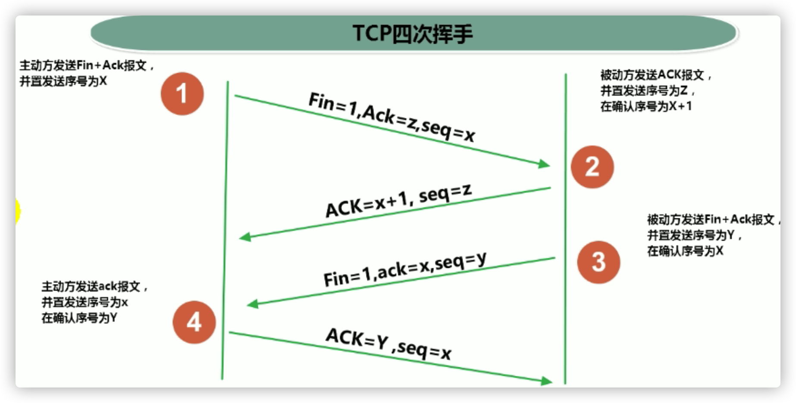

- 客户端(浏览器等)或服务器均可主动发起挥手动作
- TCP,UDP都是接收端先跑着，再跑发送端

```java
/**
 * 实现TCP的网络编程
 * 例子1：客户端发送信息给服务端，服务端将数据显示在控制台上
 * IP 岛
 * port 港口
 */
public class TCPTest1 {
    //客户端
    @Test
    public void client()  {
        Socket socket = null;
        OutputStream os = null;
        try {
            //1.创建Socket对象，指明服务器端的ip和端口号
            InetAddress inet = InetAddress.getByName("127.0.0.1");
            socket = new Socket(inet,8899);
            //2.获取一个输出流，用于输出数据
            os = socket.getOutputStream();
            //3.写出数据的操作
            os.write("你好，我是客户端mm".getBytes());
          //关闭数据的输出，阻塞写出要手动关闭
        	//socket.shutdownOutput();
        } catch (IOException e) {
            e.printStackTrace();
        } finally {
            //4.资源的关闭
            if(os != null){
                try {
                    os.close();
                } catch (IOException e) {
                    e.printStackTrace();
                }
            }
            if(socket != null){
                try {
                    socket.close();
                } catch (IOException e) {
                    e.printStackTrace();
                }
            }
        }
    }
    //服务端
    @Test
    public void server()  {
        ServerSocket ss = null;
        Socket socket = null;
        InputStream is = null;
        ByteArrayOutputStream baos = null;
        try {
            //1.创建服务器端的ServerSocket，指明自己的端口号
            ss = new ServerSocket(8899);
            //2.调用accept()表示接收来自于客户端的socket
            socket = ss.accept();
            //3.获取输入流
            is = socket.getInputStream();
            //4.读取输入流中的数据
            baos = new ByteArrayOutputStream();
            byte[] buffer = new byte[5];
            int len;
            while((len = is.read(buffer)) != -1){
                //字节数组输出流在内存中创建一个字节数组缓冲区，所有发送到输出流的数据保存在该字节数组缓冲区中。
                baos.write(buffer,0,len);
            }
            System.out.println(baos.toString());
            System.out.println("收到了来自于：" + socket.getInetAddress().getHostAddress() + "的数据");
        } catch (IOException e) {
            e.printStackTrace();
        } finally {
            if(baos != null){
                //5.关闭资源
                try {
                    baos.close();
                } catch (IOException e) {
                    e.printStackTrace();
                }
            }
            if(is != null){
                try {
                    is.close();
                } catch (IOException e) {
                    e.printStackTrace();
                }
            }
            if(socket != null){
                try {
                    socket.close();
                } catch (IOException e) {
                    e.printStackTrace();
                }
            }
            if(ss != null){
                try {
                    ss.close();
                } catch (IOException e) {
                    e.printStackTrace();
                }
            }
        }
    }
}
```

### UDP网络编程


```java
/**
 * UDPd协议的网络编程
 */
public class UDPTest {
    //发送端
    @Test
    public void sender() throws IOException {
        DatagramSocket socket = new DatagramSocket();
        String str = "我是UDP方式发送的导弹";
        byte[] data = str.getBytes();
        InetAddress inet = InetAddress.getLocalHost();
        DatagramPacket packet = new DatagramPacket(data,0,data.length,inet,9090);
        socket.send(packet);
        socket.close();
    }
    //接收端
    @Test
    public void receiver() throws IOException {
        DatagramSocket socket = new DatagramSocket(9090);
        byte[] buffer = new byte[100];
        DatagramPacket packet = new DatagramPacket(buffer,0,buffer.length);
        socket.receive(packet);
        System.out.println(new String(packet.getData(),0,packet.getLength()));
        socket.close();
    }
}
```

## URL编程

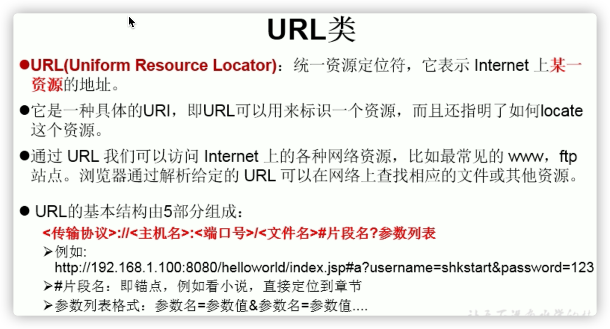

```java
/**
 * URL网络编程
 * 1.URL:统一资源定位符，对应着互联网的某一资源地址
 * 2.格式：
 *  http://localhost:8080/examples/beauty.jpg?username=Tom
 *  协议   主机名    端口号  资源地址           参数列表
 */
public class URLTest {
    public static void main(String[] args) {
        try {
            URL url = new URL("http://localhost:8080/examples/beauty.jpg?username=Tom");
//            public String getProtocol(  )     获取该URL的协议名
            System.out.println(url.getProtocol());//http
//            public String getHost(  )           获取该URL的主机名
            System.out.println(url.getHost());//localhost
//            public String getPort(  )            获取该URL的端口号
            System.out.println(url.getPort());//8080
//            public String getPath(  )           获取该URL的文件路径
            System.out.println(url.getPath());///examples/beauty.jpg
//            public String getFile(  )             获取该URL的文件名
            System.out.println(url.getFile());///examples/beauty.jpg?username=Tom
//            public String getQuery(   )        获取该URL的查询名
            System.out.println(url.getQuery());///examples/beauty.jpg?username=Tom
        } catch (MalformedURLException e) {
            e.printStackTrace();
        }
    }
}
```

```java
public class URLTest1 {
    public static void main(String[] args) {
        HttpURLConnection urlConnection = null;
        InputStream is = null;
        FileOutputStream fos = null;
        try {
            URL url = new URL("http://localhost:8080/examples/beauty.jpg");
            urlConnection = (HttpURLConnection) url.openConnection();
            urlConnection.connect();
            is = urlConnection.getInputStream();
            fos = new FileOutputStream("day10\\beauty3.jpg");
            byte[] buffer = new byte[1024];
            int len;
            while((len = is.read(buffer)) != -1){
                fos.write(buffer,0,len);
            }
            System.out.println("下载完成");
        } catch (IOException e) {
            e.printStackTrace();
        } finally {
            //关闭资源
            if(is != null){
                try {
                    is.close();
                } catch (IOException e) {
                    e.printStackTrace();
                }
            }
            if(fos != null){
                try {
                    fos.close();
                } catch (IOException e) {
                    e.printStackTrace();
                }
            }
            if(urlConnection != null){
                urlConnection.disconnect();
            }
        }
    }
}
```

# 反射机制

- 主要是框架用

- 体验：可以使用反射机制调用私有构造器，属性，方法

```java
public class Person {
    private String name;
    public int age;

    @Override
    public String toString() {
        return "Person{" +
                "name='" + name + '\'' +
                ", age=" + age +
                '}';
    }

    public String getName() {
        return name;
    }

    public void setName(String name) {
        this.name = name;
    }

    public int getAge() {
        return age;
    }

    public void setAge(int age) {
        this.age = age;
    }

    public Person(String name, int age) {
        this.name = name;
        this.age = age;
    }

    private Person(String name) {
        this.name = name;
    }

    public Person() {
        System.out.println("Person()");
    }

    public void show(){
        System.out.println("你好，我是一个人");
    }

    private String showNation(String nation){
        System.out.println("我的国籍是：" + nation);
        return nation;
    }
}
```

```java
@Test
public void test2() throws Exception{
    Class clazz = Person.class;
    //1.通过反射，创建Person类的对象
    Constructor cons = clazz.getConstructor(String.class,int.class);
    Object obj = cons.newInstance("Tom", 12);
    Person p = (Person) obj;
    System.out.println(p.toString());//Person{name='Tom', age=12}
    //2.通过反射，调用对象指定的属性、方法
    //调用属性
    Field age = clazz.getDeclaredField("age");
    age.set(p,10);
    System.out.println(p.toString());//Person{name='Tom', age=10}
    //调用方法
    Method show = clazz.getDeclaredMethod("show");
    show.invoke(p);//你好，我是一个人

    System.out.println("*******************************");

    //通过反射，可以调用Person类的私有结构的。比如：私有的构造器、方法、属性
    //调用私有的构造器
    Constructor cons1 = clazz.getDeclaredConstructor(String.class);
    cons1.setAccessible(true);//访问私有
    Person p1 = (Person) cons1.newInstance("Jerry");
    System.out.println(p1);

    //调用私有的属性
    Field name = clazz.getDeclaredField("name");
    name.setAccessible(true);//访问私有
    name.set(p1,"HanMeimei");
    System.out.println(p1);

    //调用私有的方法
    Method showNation = clazz.getDeclaredMethod("showNation", String.class);
    showNation.setAccessible(true);//访问私有
    //相当于String nation = p1.showNation("中国")
    String nation = (String) showNation.invoke(p1,"中国");
    System.out.println(nation);
}
```

```java
疑问1：通过直接new的方式或反射的方式都可以调用公共的结构，开发中到底用那个？
建议：直接new的方式。
什么时候会使用：反射的方式。 反射的特征：动态性
疑问2：反射机制与面向对象中的封装性是不是矛盾的？如何看待两个技术？
不矛盾。反射机制偏向能否使用，面向对象中的封装性偏向建议使用不
```

## 理解Class类并获取Class实例


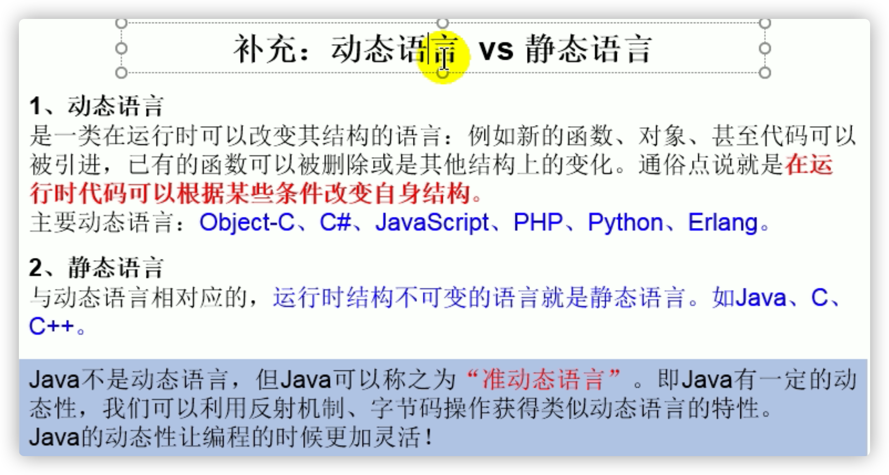

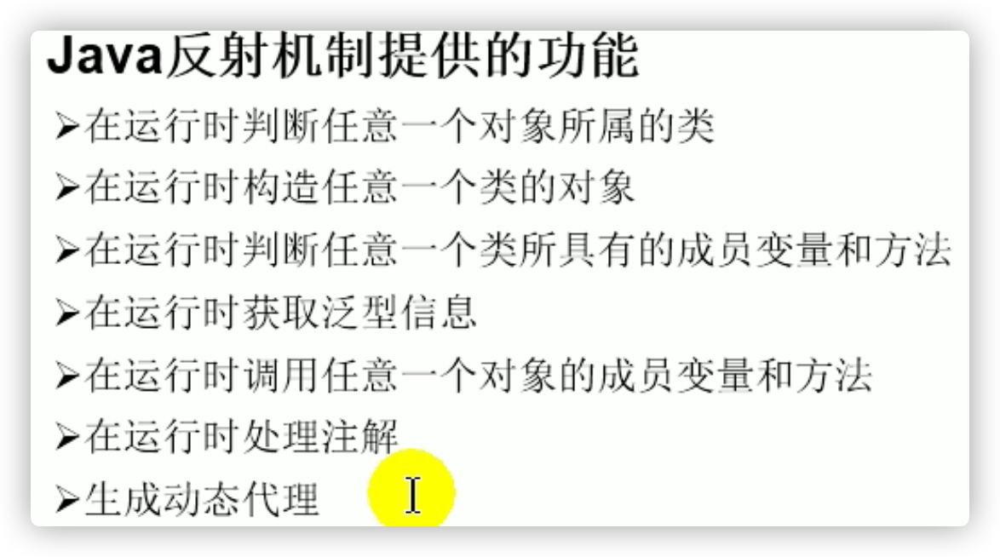


```java
//Class实例可以是哪些结构的说明：
    @Test
    public void test4(){
        Class c1 = Object.class;
        Class c2 = Comparable.class;
        Class c3 = String[].class;
        Class c4 = int[][].class;
        Class c5 = ElementType.class;
        Class c6 = Override.class;
        Class c7 = int.class;
        Class c8 = void.class;
        Class c9 = Class.class;

        int[] a = new int[10];
        int[] b = new int[100];
        Class c10 = a.getClass();
        Class c11 = b.getClass();
        // 只要数组的元素类型与维度一样，就是同一个Class
        System.out.println(c10 == c11);//true
    }
}
```

```java
/*
关于java.lang.Class类的理解
1.类的加载过程：
程序经过javac.exe命令以后，会生成一个或多个字节码文件(.class结尾)。
接着我们使用java.exe命令对某个字节码文件进行解释运行。相当于将某个字节码文件
加载到内存中。此过程就称为类的加载。加载到内存中的类，我们就称为运行时类，此
运行时类，就作为Class的一个实例。

2.换句话说，Class的实例就对应着一个运行时类。
3.加载到内存中的运行时类，会缓存一定的时间。在此时间之内，我们可以通过不同的方式
来获取此运行时类。
 */
```

```java
//获取Class的实例的方式（前三种方式需要掌握）
@Test
public void test3() throws ClassNotFoundException {
    //方式一：调用运行时类的属性：.class
    Class clazz1 = Person.class;
    System.out.println(clazz1);//class com.atguigu.java.Person
    //方式二：通过运行时类的对象,调用getClass()
    Person p1 = new Person();
    Class clazz2 = p1.getClass();
    System.out.println(clazz2);//class com.atguigu.java.Person
    //方式三：调用Class的静态方法：forName(String classPath)
    Class clazz3 = Class.forName("com.atguigu.java.Person");
    System.out.println(clazz3);//class com.atguigu.java.Person

    System.out.println(clazz1 == clazz2);//true 地址值相同，同一个实例类
    System.out.println(clazz1 == clazz3);//true

    //方式四：使用类的加载器：ClassLoader  (了解)
    ClassLoader classLoader = ReflectionTest.class.getClassLoader();
    Class clazz4 = classLoader.loadClass("com.atguigu.java.Person");
    System.out.println(clazz4);
    System.out.println(clazz1 == clazz4);//true
}
```

## 类的加载与ClassLoader的理解

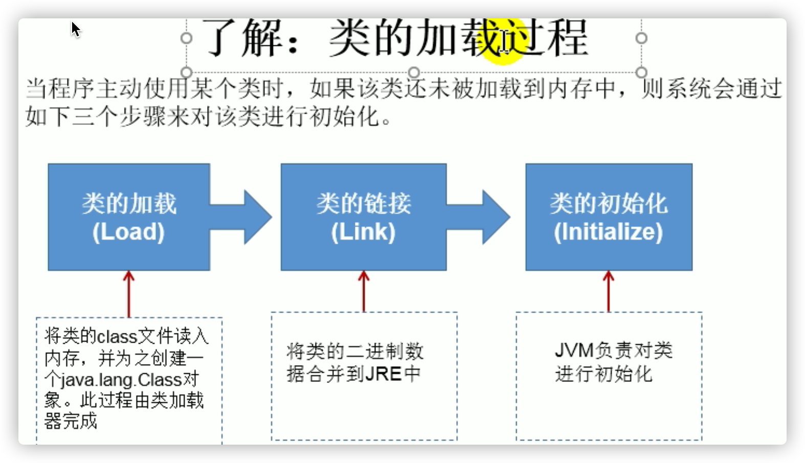

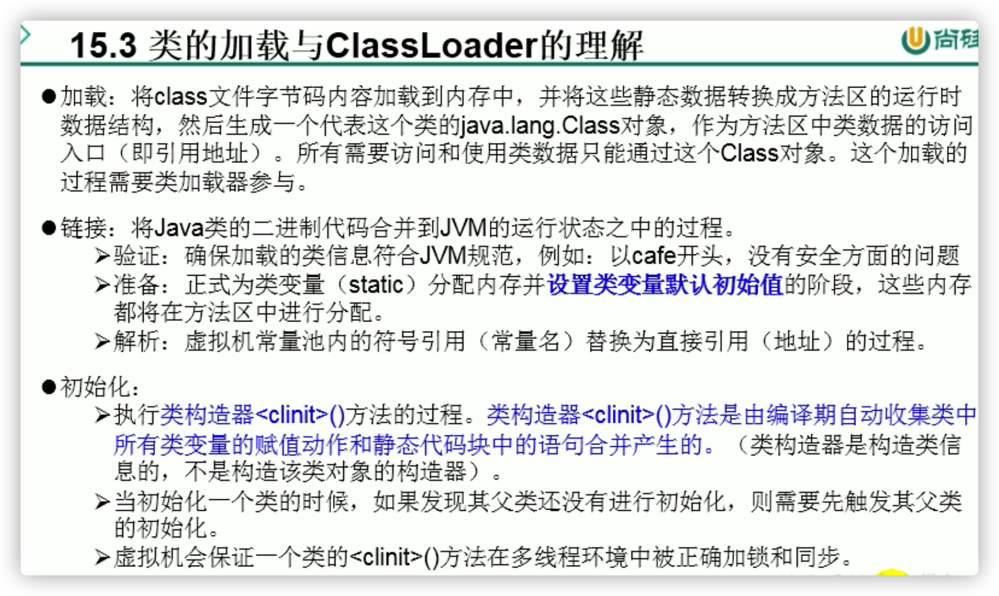


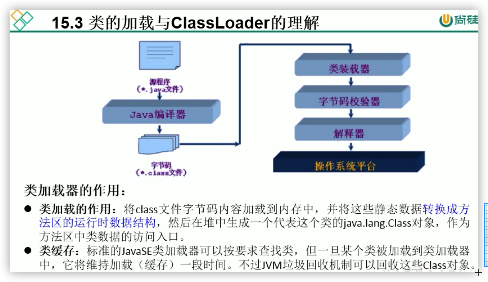


```java
@Test
public void test1(){
    //对于自定义类，使用系统类加载器进行加载
    ClassLoader classLoader = ClassLoaderTest.class.getClassLoader();
    System.out.println(classLoader);
    //jdk.internal.loader.ClassLoaders$AppClassLoader@14899482
    //调用系统类加载器的getParent()：获取扩展类加载器
    ClassLoader classLoader1 = classLoader.getParent();
    System.out.println(classLoader1);
    //jdk.internal.loader.ClassLoaders$PlatformClassLoader@32eebfca
    //调用扩展类加载器的getParent()：无法获取引导类加载器
    //引导类加载器主要负责加载java的核心类库，无法加载自定义类的。
    ClassLoader classLoader2 = classLoader1.getParent();
    System.out.println(classLoader2);//null

    ClassLoader classLoader3 = String.class.getClassLoader();
    System.out.println(classLoader3);//null
}
```

### 读取配置文件

```
//jdbc.properties文件
user=吴飞
password=abc123
```

```java
public class ClassLoaderTest {
//    Properties：用来读取配置文件。
    @Test
    public void test2() throws Exception {
        Properties pros =  new Properties();
        //此时的文件默认在当前的module下。
        //读取配置文件的方式一：
//        FileInputStream fis = new FileInputStream("jdbc.properties");
        //不在module在src时
//        FileInputStream fis = new FileInputStream("src\\jdbc1.properties");
//        pros.load(fis);

        //读取配置文件的方式二：使用ClassLoader
        //配置文件默认识别为：当前module的src下(推荐放在src下)
        ClassLoader classLoader = ClassLoaderTest.class.getClassLoader();
        InputStream is = classLoader.getResourceAsStream("jdbc1.properties");
        pros.load(is);
        String user = pros.getProperty("user");
        String password = pros.getProperty("password");
        System.out.println("user = " + user + ",password = " + password);
    }
}
```

## 创建运行时类的对象

```java
@Test
public void test1() throws IllegalAccessException, InstantiationException {
    Class<Person> clazz = Person.class;
    /*
    newInstance():调用此方法，创建对应的运行时类的对象。内部调用了运行时类的空参的构造器。

    要想此方法正常的创建运行时类的对象，要求：
    1.运行时类必须提供空参的构造器
    2.空参的构造器的访问权限得够。通常，设置为public。

    在javabean中要求提供一个public的空参构造器。原因：
    1.便于通过反射，创建运行时类的对象
    2.便于子类继承此运行时类时，默认调用super()时，保证父类有此构造器
     */
    Person obj = clazz.newInstance();//指定泛型，返回值就是指定的泛型
    //反射造对象通常先造一个空参对象，之后按需再给参数赋值
    System.out.println(obj);
}
```

## 获取运行时类的完整结构

### 属性结构

```java
@Test
public void test1(){
    Class clazz = Person.class;
    //获取属性结构
    //getFields():获取当前运行时类及其父类中声明为public访问权限的属性
    Field[] fields = clazz.getFields();
    for(Field f : fields){
        System.out.println(f);
    }
    System.out.println();
    //getDeclaredFields():获取当前运行时类中声明的所有属性。（不包含父类中声明的属性）
    Field[] declaredFields = clazz.getDeclaredFields();
    for(Field f : declaredFields){
        System.out.println(f);
    }
}
```

### 权限修饰符  数据类型 变量名

```java
//权限修饰符  数据类型 变量名
@Test
public void test2(){
    Class clazz = Person.class;
    Field[] declaredFields = clazz.getDeclaredFields();
    for(Field f : declaredFields){
        //1.权限修饰符
        int modifier = f.getModifiers();
        System.out.print(Modifier.toString(modifier) + "\t");

        //2.数据类型
        Class type = f.getType();
        System.out.print(type.getName() + "\t");

        //3.变量名
        String fName = f.getName();
        System.out.print(fName);
    }
}
```

### 方法结构

```java
@Test
public void test1(){
    Class clazz = Person.class;
    //getMethods():获取当前运行时类及其所有父类中声明为public权限的方法
    Method[] methods = clazz.getMethods();
    for(Method m : methods){
        System.out.println(m);
    }
    System.out.println();
    //getDeclaredMethods():获取当前运行时类中声明的所有方法。（不包含父类中声明的方法）
    Method[] declaredMethods = clazz.getDeclaredMethods();
    for(Method m : declaredMethods){
        System.out.println(m);
    }
}
```

```java
/*
@Xxxx
权限修饰符  返回值类型  方法名(参数类型1 形参名1,...) throws XxxException{}
 */
@Test
public void test2(){
    Class clazz = Person.class;
    Method[] declaredMethods = clazz.getDeclaredMethods();
    for(Method m : declaredMethods){
        //1.获取方法声明的注解 生命周期要够runtime
        Annotation[] annos = m.getAnnotations();
        for(Annotation a : annos){
            System.out.println(a);
        }
        //2.权限修饰符
        System.out.print(Modifier.toString(m.getModifiers()) + "\t");

        //3.返回值类型
        System.out.print(m.getReturnType().getName() + "\t");

        //4.方法名
        System.out.print(m.getName());
        System.out.print("(");
        //5.形参列表
        Class[] parameterTypes = m.getParameterTypes();
        if(!(parameterTypes == null && parameterTypes.length == 0)){
            for(int i = 0;i < parameterTypes.length;i++){
                if(i == parameterTypes.length - 1){
                    System.out.print(parameterTypes[i].getName() + " args_" + i);
                    break;
                }
                System.out.print(parameterTypes[i].getName() + " args_" + i + ",");
            }
        }

        System.out.print(")");

        //6.抛出的异常
        Class[] exceptionTypes = m.getExceptionTypes();
        if(exceptionTypes.length > 0){
            System.out.print("throws ");
            for(int i = 0;i < exceptionTypes.length;i++){
                if(i == exceptionTypes.length - 1){
                    System.out.print(exceptionTypes[i].getName());
                    break;
                }
                System.out.print(exceptionTypes[i].getName() + ",");
            }
        }
        System.out.println();
    }
}
```

### 构造器结构

```java
/*
获取构造器结构
 */
@Test
public void test1(){
    Class clazz = Person.class;
    //getConstructors():获取当前运行时类中声明为public的构造器
    Constructor[] constructors = clazz.getConstructors();
    for(Constructor c : constructors){
        System.out.println(c);
    }
    System.out.println();
    //getDeclaredConstructors():获取当前运行时类中声明的所有的构造器
    Constructor[] declaredConstructors = clazz.getDeclaredConstructors();
    for(Constructor c : declaredConstructors){
        System.out.println(c);
    }
}
```

### 运行时类的父类

```Java
//获取运行时类的父类
@Test
public void test2(){
    Class clazz = Person.class;

    Class superclass = clazz.getSuperclass();
    System.out.println(superclass);
}
```

### 运行时类的带泛型的父类

```Java
/*
获取运行时类的带泛型的父类
 */
@Test
public void test3(){
    Class clazz = Person.class;

    Type genericSuperclass = clazz.getGenericSuperclass();
    System.out.println(genericSuperclass);
}
```

### 运行时类的带泛型的父类的泛型

```java
/*
    获取运行时类的带泛型的父类的泛型(会用到)
    代码：逻辑性代码  vs 功能性代码
     */
    @Test
    public void test4() throws Exception{
        Class clazz = Person.class;
        Type genericSuperclass = clazz.getGenericSuperclass();
        ParameterizedType paramType = (ParameterizedType) genericSuperclass;
        //获取泛型类型
        Type[] actualTypeArguments = paramType.getActualTypeArguments();
//        System.out.println(actualTypeArguments[0].getTypeName());
        System.out.println(((Class)actualTypeArguments[0]).getName());//java.lang.String
    }
```

### 运行时类实现的接口

```java
/*
获取运行时类实现的接口(动态代理用)
 */
@Test
public void test5(){
    Class clazz = Person.class;
    Class[] interfaces = clazz.getInterfaces();
    for(Class c : interfaces){
        System.out.println(c);
    }
    System.out.println();
    //获取运行时类的父类实现的接口
    Class[] interfaces1 = clazz.getSuperclass().getInterfaces();
    for(Class c : interfaces1){
        System.out.println(c);
    }
}
```

### 运行时类所在的包

```java
/*
    获取运行时类所在的包
 */
@Test
public void test6(){
    Class clazz = Person.class;
    Package pack = clazz.getPackage();
    System.out.println(pack);
}
```

### 运行时类声明的注解

```java
/*
    获取运行时类声明的注解
 */
@Test
public void test7(){
    Class clazz = Person.class;
    Annotation[] annotations = clazz.getAnnotations();
    for(Annotation annos : annotations){
        System.out.println(annos);
    }
}
```

## 调用运行时类的指定结构

### 属性

```java
/*
如何操作运行时类中的指定的属性 -- 需要掌握
 */
@Test
public void testField1() throws Exception {
    Class clazz = Person.class;
    //创建运行时类的对象
    Person p = (Person) clazz.newInstance();
    //1. getDeclaredField(String fieldName):获取运行时类中指定变量名的属性
    Field name = clazz.getDeclaredField("name");
    //2.保证当前属性是可访问的
    name.setAccessible(true);
    //3.获取、设置指定对象的此属性值
    name.set(p,"Tom");
    System.out.println(name.get(p));
}
```

### 方法

```java
/*
    如何操作运行时类中的指定的方法 -- 需要掌握
     */
    @Test
    public void testMethod() throws Exception {
        Class clazz = Person.class;
        //创建运行时类的对象
        Person p = (Person) clazz.newInstance();
        /*
        1.获取指定的某个方法
        getDeclaredMethod():参数1 ：指明获取的方法的名称  参数2：指明获取的方法的形参列表
         */
        Method show = clazz.getDeclaredMethod("show", String.class);
        //2.保证当前方法是可访问的
        show.setAccessible(true);
        /*
        3. 调用方法的invoke():参数1：方法的调用者  参数2：给方法形参赋值的实参
        invoke()的返回值即为对应类中调用的方法的返回值。
         */
        Object returnValue = show.invoke(p,"CHN"); //String nation = p.show("CHN");
        System.out.println(returnValue);//CHN

        System.out.println("*************如何调用静态方法*****************");

        // private static void showDesc()
        Method showDesc = clazz.getDeclaredMethod("showDesc");
        showDesc.setAccessible(true);
        //如果调用的运行时类中的方法没有返回值，则此invoke()返回null
//        Object returnVal = showDesc.invoke(null);
        Object returnVal = showDesc.invoke(Person.class);
        System.out.println(returnVal);//null
    }
```

### 构造器

```java
/*
如何调用运行时类中的指定的构造器;当然也可以空参构造器
 */
@Test
public void testConstructor() throws Exception {
    Class clazz = Person.class;
    //private Person(String name)
    /*
    1.获取指定的构造器
    getDeclaredConstructor():参数：指明构造器的参数列表
     */
    Constructor constructor = clazz.getDeclaredConstructor(String.class);

    //2.保证此构造器是可访问的
    constructor.setAccessible(true);

    //3.调用此构造器创建运行时类的对象
    Person per = (Person) constructor.newInstance("Tom");
    System.out.println(per);
}
```

## 反射的应用:动态代理

- 总结：创建类的对象的方式？
  方式一：new+构造器
  方式二：要创建Xxx类的对象，可以考虑：Xxx、Xxxs、XxxFactory、XxxBuilder类中查看是否有
  静态方法的存在。可以调用其静态方法，创建XXX对象。
  方式三：通过反射


### 静态代理举例

```java
/**
 * 静态代理举例
 *
 * 特点：代理类和被代理类在编译期间，就确定下来了。
 */
interface ClothFactory{
    void produceCloth();
}
//代理类
class ProxyClothFactory implements ClothFactory{
    private ClothFactory factory;//用被代理类对象进行实例化
    public ProxyClothFactory(ClothFactory factory){
        this.factory = factory;
    }
    @Override
    public void produceCloth() {
        System.out.println("代理工厂做一些准备工作");
        factory.produceCloth();
        System.out.println("代理工厂做一些后续的收尾工作");
    }
}
//被代理类
class NikeClothFactory implements ClothFactory{
    @Override
    public void produceCloth() {
        System.out.println("Nike工厂生产一批运动服");
    }
}
public class StaticProxyTest {
    public static void main(String[] args) {
        //创建被代理类的对象
        ClothFactory nike = new NikeClothFactory();
        //创建代理类的对象
        ClothFactory proxyClothFactory = new ProxyClothFactory(nike);
        proxyClothFactory.produceCloth();
    }
}
```

### 动态代理的举例

```java
interface Human{
    String getBelief();
    void eat(String food);
}

//被代理类
class SuperMan implements Human{
    @Override
    public String getBelief() {
        return "I believe I can fly!";
    }
    @Override
    public void eat(String food) {
        System.out.println("我喜欢吃" + food);
    }
}

class HumanUtil{
    public void method1(){
        System.out.println("====================通用方法一====================");
    }
    public void method2(){
        System.out.println("====================通用方法二====================");
    }
}

/*
要想实现动态代理，需要解决的问题？
问题一：如何根据加载到内存中的被代理类，动态的创建一个代理类及其对象。
问题二：当通过代理类的对象调用方法a时，如何动态的去调用被代理类中的同名方法a。
 */
class ProxyFactory{
    //调用此方法，返回一个代理类的对象。解决问题一
    public static Object getProxyInstance(Object obj){//obj:被代理类的对象
        MyInvocationHandler handler = new MyInvocationHandler();
        handler.bind(obj);
        return Proxy.newProxyInstance(obj.getClass().getClassLoader(),obj.getClass().getInterfaces(),handler);
    }
}

class MyInvocationHandler implements InvocationHandler{
    private Object obj;//需要使用被代理类的对象进行赋值

    public void bind(Object obj){
        this.obj = obj;
    }

    //当我们通过代理类的对象，调用方法a时，就会自动的调用如下的方法：invoke()
    //将被代理类要执行的方法a的功能就声明在invoke()中
    @Override
    public Object invoke(Object proxy, Method method, Object[] args) throws Throwable {
        HumanUtil util = new HumanUtil();
        util.method1();

        //method:即为代理类对象调用的方法，此方法也就作为了被代理类对象要调用的方法
        //obj:被代理类的对象
        Object returnValue = method.invoke(obj,args);

        util.method2();

        //上述方法的返回值就作为当前类中的invoke()的返回值。
        return returnValue;
    }
}

public class ProxyTest {
    public static void main(String[] args) {
        SuperMan superMan = new SuperMan();
        //proxyInstance:代理类的对象
        Human proxyInstance = (Human) ProxyFactory.getProxyInstance(superMan);
        //当通过代理类对象调用方法时，会自动的调用被代理类中同名的方法
        String belief = proxyInstance.getBelief();
        System.out.println(belief);
        proxyInstance.eat("四川麻辣烫");

        System.out.println("*****************************");

        NikeClothFactory nikeClothFactory = new NikeClothFactory();
        ClothFactory proxyClothFactory = (ClothFactory) ProxyFactory.getProxyInstance(nikeClothFactory);
        proxyClothFactory.produceCloth();
    }
}
```

# Java8新特性

新出Java版本新特性不要急着学，看看时间的检验（可能下一个版本就删去了）

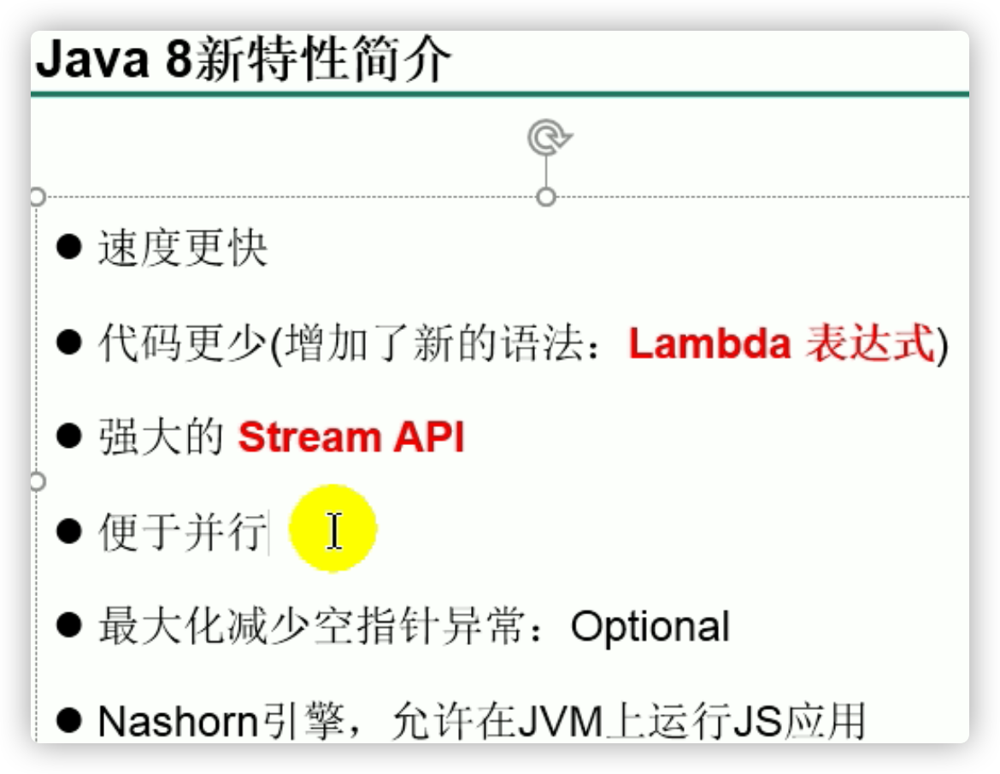

## Lambda表达式

## 函数式(Functional)接口

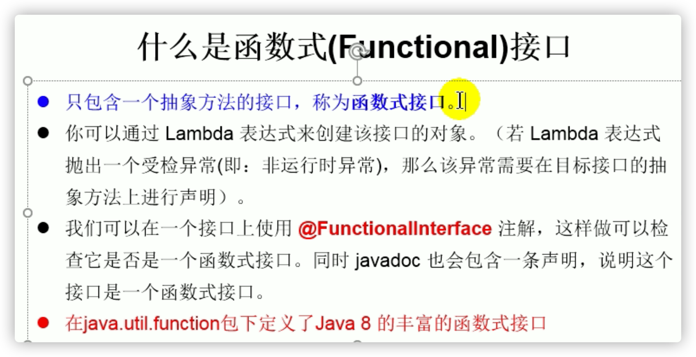

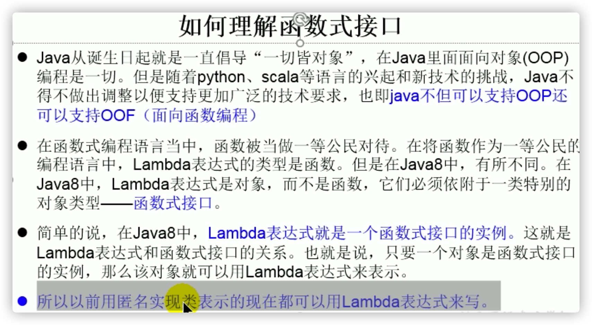

```java
/**
 * Lambda表达式的使用
 *
 * 1.举例： (o1,o2) -> Integer.compare(o1,o2);
 * 2.格式：
 *      -> :lambda操作符 或 箭头操作符
 *      ->左边：lambda形参列表 （其实就是接口中的抽象方法的形参列表）
 *      ->右边：lambda体 （其实就是重写的抽象方法的方法体）
 *
 * 3. Lambda表达式的使用：（分为6种情况介绍）
 *    总结：
 *    ->左边：lambda形参列表的参数类型可以省略(类型推断)；如果lambda形参列表只有一个参数，其一对()也可以省略
 *    ->右边：lambda体应该使用一对{}包裹；如果lambda体只有一条执行语句（可能是return语句），省略这一对{}和return关键字
 *
 * 4.Lambda表达式的本质：作为函数式接口的实例
 *
 * 5. 如果一个接口中，只声明了一个抽象方法，则此接口就称为函数式接口。我们可以在一个接口上使用 @FunctionalInterface 注解，
 *   这样做可以检查它是否是一个函数式接口。
 *
 * 6. 所以以前用匿名实现类表示的现在都可以用Lambda表达式来写。
 */
```

```java
public class LambdaTest1 {
    //语法格式一：无参，无返回值
    @Test
    public void test1(){
        Runnable r1 = new Runnable() {
            @Override
            public void run() {
                System.out.println("我爱北京天安门");
            }
        };
        r1.run();
        System.out.println("***********************");
        Runnable r2 = () -> {
            System.out.println("我爱北京故宫");
        };
        r2.run();
    }

    //语法格式三：数据类型可以省略，因为可由编译器推断得出，称为“类型推断”
    //语法格式四：Lambda 若只需要一个参数时，参数的小括号可以省略
    @Test
    public void test3(){
        Consumer<String> con = new Consumer<String>() {
            @Override
            public void accept(String s) {
                System.out.println(s);
            }
        };
        con.accept("谎言和誓言的区别是什么？");
        System.out.println("*******************");
        Consumer<String> con2 = s -> {
            System.out.println(s);
        };
        con2.accept("一个是听得人当真了，一个是说的人当真了");
    }

    //语法格式五：Lambda 需要两个或以上的参数，多条执行语句，并且可以有返回值
    @Test
    public void test6(){
        Comparator<Integer> com1 = new Comparator<Integer>() {
            @Override
            public int compare(Integer o1, Integer o2) {
                System.out.println(o1);
                System.out.println(o2);
                return o1.compareTo(o2);
            }
        };
        System.out.println(com1.compare(12,21));
        System.out.println("*****************************");
        Comparator<Integer> com2 = (o1,o2) -> {
            System.out.println(o1);
            System.out.println(o2);
            return o1.compareTo(o2);
        };
        System.out.println(com2.compare(12,6));
    }

    //语法格式六：当 Lambda 体只有一条语句时，return 与大括号若有，都可以省略
    @Test
    public void test7(){
        Comparator<Integer> com1 = (o1,o2) -> {
            return o1.compareTo(o2);
        };
        System.out.println(com1.compare(12,6));
        System.out.println("*****************************");
        Comparator<Integer> com2 = (o1,o2) -> o1.compareTo(o2);
        System.out.println(com2.compare(12,21));
    }
}
```

### java内置的4大核心函数式接口


```java
public class LambdaTest2 {
    @Test
    public void test1(){
        happyTime(500, new Consumer<Double>() {
            @Override
            public void accept(Double aDouble) {
                System.out.println("学习太累了，去天上人间买了瓶矿泉水，价格为：" + aDouble);
            }
        });
        System.out.println("********************");
        happyTime(400,money -> System.out.println("学习太累了，去天上人间喝了口水，价格为：" + money));
    }

    public void happyTime(double money, Consumer<Double> con){
        con.accept(money);
    }
    
    @Test
    public void test2(){
        List<String> list = Arrays.asList("北京","南京","天津","东京","西京","普京");
        List<String> filterStrs = filterString(list, new Predicate<String>() {
            @Override
            public boolean test(String s) {
                return s.contains("京");
            }
        });
        System.out.println(filterStrs);
        List<String> filterStrs1 = filterString(list,s -> s.contains("京"));
        System.out.println(filterStrs1);
    }

    //根据给定的规则，过滤集合中的字符串。此规则由Predicate的方法决定
    public List<String> filterString(List<String> list, Predicate<String> pre){
        ArrayList<String> filterList = new ArrayList<>();
        for(String s : list){
            if(pre.test(s)){
                filterList.add(s);
            }
        }
        return filterList;
    }
}
```


## 方法引用与构造器引用

### 方法引用


```java
/**
 * 方法引用的使用
 *
 * 1.使用情境：当要传递给Lambda体的操作，已经有实现的方法了，可以使用方法引用！
 *
 * 2.方法引用，本质上就是Lambda表达式，而Lambda表达式作为函数式接口的实例。所以
 *   方法引用，也是函数式接口的实例。
 *
 * 3. 使用格式：  类(或对象) :: 方法名
 *
 * 4. 具体分为如下的三种情况：
 *    情况1     对象 :: 非静态方法
 *    情况2     类 :: 静态方法
 *
 *    情况3     类 :: 非静态方法
 *
 * 5. 方法引用使用的要求：要求接口中的抽象方法的形参列表和返回值类型与方法引用的方法的
 *    形参列表和返回值类型相同！（针对于情况1和情况2）
 *
 *    情况三 第一个参数作为下面方法的调用者
 */
```

```java
public class MethodRefTest {
   // 情况一：对象 :: 实例方法
   //Consumer中的void accept(T t)
   //PrintStream中的void println(T t)
   @Test
   public void test1() {
      Consumer<String> con1 = str -> System.out.println(str);
      con1.accept("北京");

      System.out.println("*******************");
      PrintStream ps = System.out;
      Consumer<String> con2 = ps::println;
      con2.accept("beijing");
   }
   
   //Supplier中的T get()
   //Employee中的String getName()
   @Test
   public void test2() {
      Employee emp = new Employee(1001,"Tom",23,5600);
      Supplier<String> sup1 = () -> emp.getName();
      System.out.println(sup1.get());

      System.out.println("*******************");
      Supplier<String> sup2 = emp::getName;
      System.out.println(sup2.get());
   }

   // 情况二：类 :: 静态方法
   //Comparator中的int compare(T t1,T t2)
   //Integer中的int compare(T t1,T t2)
   @Test
   public void test3() {
      Comparator<Integer> com1 = (t1,t2) -> Integer.compare(t1,t2);
      System.out.println(com1.compare(12,21));
      System.out.println("*******************");

      Comparator<Integer> com2 = Integer::compare;
      System.out.println(com2.compare(12,3));
   }
   
   //Function中的R apply(T t)
   //Math中的Long round(Double d)
   @Test
   public void test4() {
      Function<Double,Long> func = new Function<Double, Long>() {
         @Override
         public Long apply(Double d) {
            return Math.round(d);
         }
      };
      System.out.println("*******************");

      Function<Double,Long> func1 = d -> Math.round(d);
      System.out.println(func1.apply(12.3));

      System.out.println("*******************");

      Function<Double,Long> func2 = Math::round;
      System.out.println(func2.apply(12.6));
   }

   // 情况三：类 :: 实例方法  (有难度)
   // Comparator中的int comapre(T t1,T t2)
   // String中的int t1.compareTo(t2)
   @Test
   public void test5() {
      Comparator<String> com1 = (s1,s2) -> s1.compareTo(s2);
      System.out.println(com1.compare("abc","abd"));

      System.out.println("*******************");

      Comparator<String> com2 = String :: compareTo;
      System.out.println(com2.compare("abd","abm"));
   }

   //BiPredicate中的boolean test(T t1, T t2);
   //String中的boolean t1.equals(t2)
   @Test
   public void test6() {
      BiPredicate<String,String> pre1 = (s1,s2) -> s1.equals(s2);
      System.out.println(pre1.test("abc","abc"));

      System.out.println("*******************");
      BiPredicate<String,String> pre2 = String :: equals;
      System.out.println(pre2.test("abc","abd"));
   }
   
   // Function中的R apply(T t)
   // Employee中的String getName();
   @Test
   public void test7() {
      Employee employee = new Employee(1001, "Jerry", 23, 6000);
      
      Function<Employee,String> func1 = e -> e.getName();
      System.out.println(func1.apply(employee));

      System.out.println("*******************");

      Function<Employee,String> func2 = Employee::getName;
      System.out.println(func2.apply(employee));
   }
}
```

### 构造器引用


## 强大的Stream API


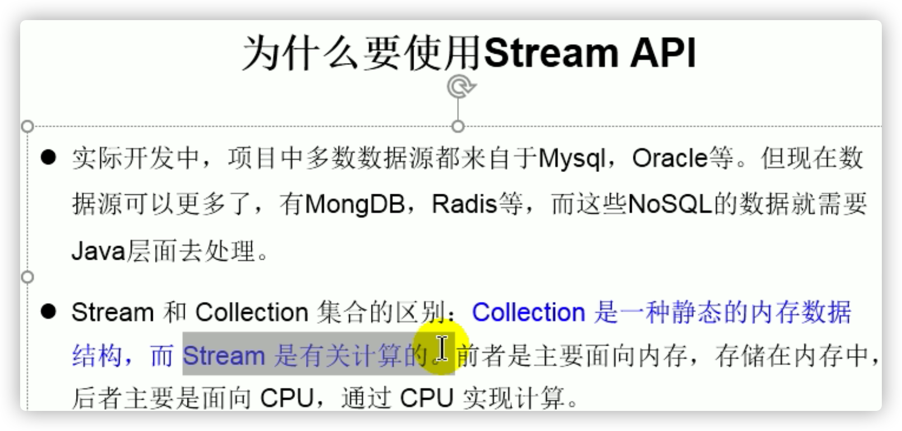

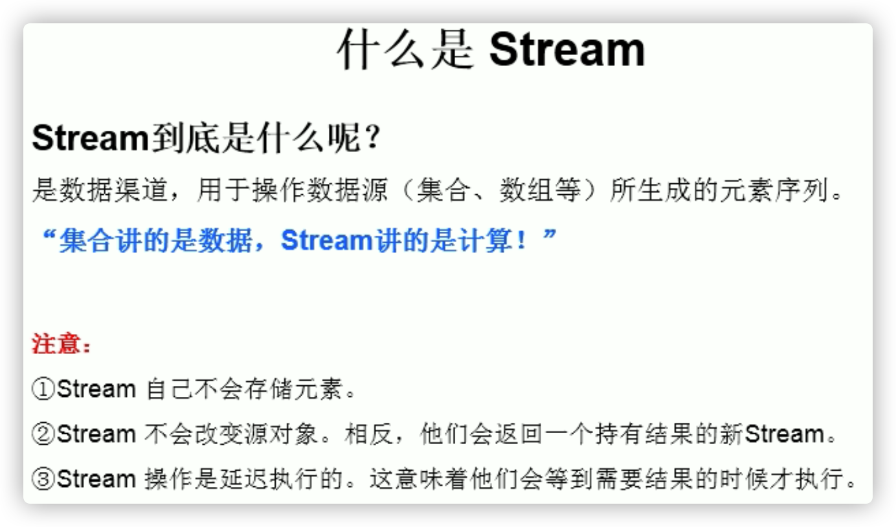


## Optional类


