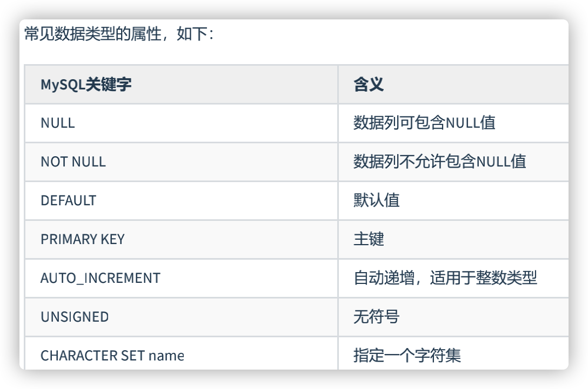
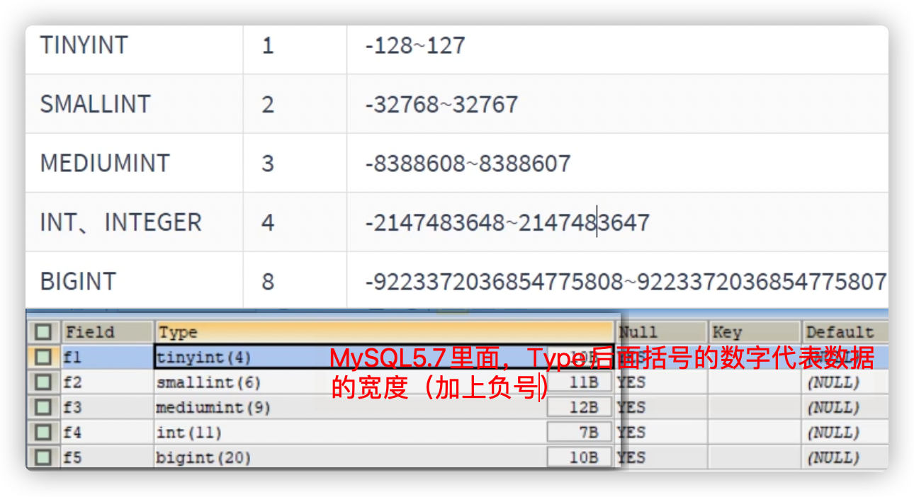
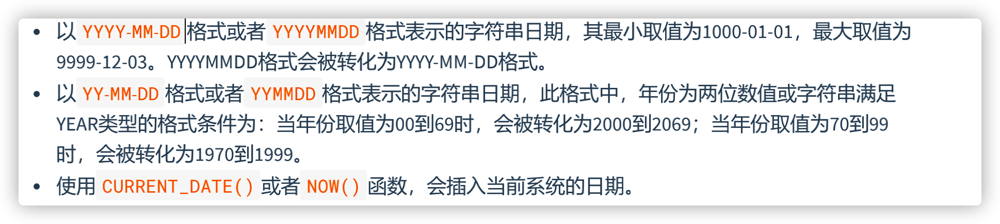
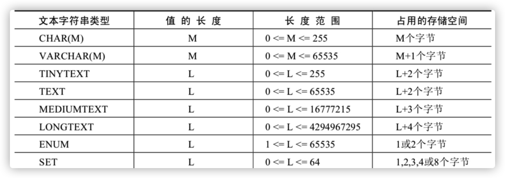
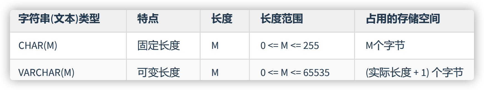
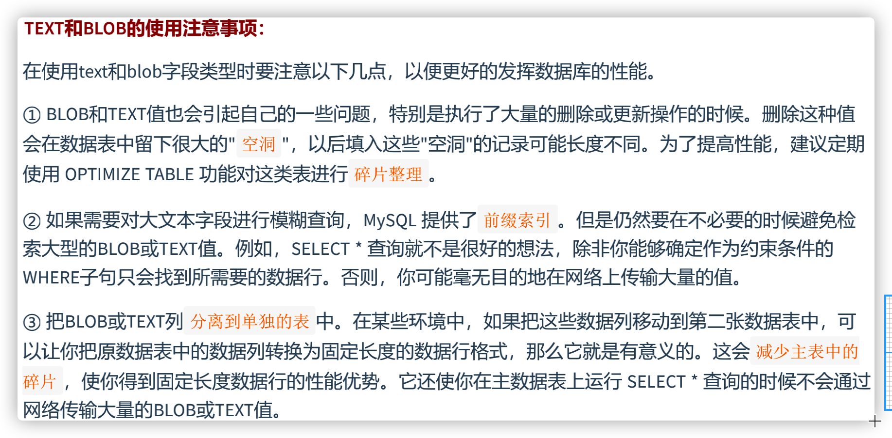

# MySQL数据类型




## character set

```sql
#1.关于属性：character set name
SHOW VARIABLES LIKE 'character_%';

#创建数据库时指名字符集
-- 一般就光写这个，之后表、字段就不用制定字符集
-- 创建数据库时没有指名字符集的话，根据系统默认的字符集走
CREATE DATABASE IF NOT EXISTS dbtest12 CHARACTER SET 'utf8';

SHOW CREATE DATABASE dbtest12;

#创建表的时候，指名表的字符集
CREATE TABLE temp(
id INT
) CHARACTER SET 'utf8';

SHOW CREATE TABLE temp;

#创建表，指名表中的字段时，可以指定字段的字符集
CREATE TABLE temp1(
id INT,
NAME VARCHAR(15) CHARACTER SET 'gbk'

);
SHOW CREATE TABLE temp1;
```


## 整数类型


```sql
#2.整型数据类型
USE dbtest12;

CREATE TABLE test_int1(
f1 TINYINT,
f2 SMALLINT,
f3 MEDIUMINT,
f4 INTEGER,
f5 BIGINT
);

DESC test_int1;

INSERT INTO test_int1(f1)
VALUES(12),(-12),(-128),(127);

SELECT * FROM test_int1;

#Out of range value for column 'f1' at row 1
INSERT INTO test_int1(f1)
VALUES(128);
```

### 可选属性

####  M & ZEROFILL

- M : 表示显示宽度，M的取值范围是(0, 255)。例如，int(5)：当数据宽度小于5位的时候在数字前面需要用字符填满宽度。**该项功能需要配合“ ZEROFILL ”**使用，表示用“0”填满宽度，否则指定显示宽度无效。

- 如果设置了显示宽度，那么插入的数据宽度超过显示宽度限制，会不会截断或插入失败？

  答案：不会对插入的数据有任何影响，还是按照类型的实际宽度进行保存，即 显示宽度与类型可以存储的 值范围无关 。

- **从MySQL 8.0.17开始，整数数据类型不推荐使用显示宽度属性。**

```sql
CREATE TABLE test_int2(
f1 INT,
f2 INT(5),
f3 INT(5) ZEROFILL  
#① 显示宽度为5。当insert的值不足5位时，使用0填充。 
#②当使用ZEROFILL时，自动会添加UNSIGNED
);

INSERT INTO test_int2(f1,f2)
VALUES(123,123),(123456,123456);

SELECT * FROM test_int2;

INSERT INTO test_int2(f3)
VALUES(123),(123456);
```

- 整型数据类型可以在定义表结构时指定所需要的显示宽度，如果不指定，则系统为每一种类型指定默认的宽度值。



#### UNSIGNED

- UNSIGNED : 无符号类型（非负），所有的整数类型都有一个可选的属性UNSIGNED（无符号属性），无符号整数类型的最小取值为0。所以，如果需要在MySQL数据库中保存非负整数值时，可以将整数类型设置为无符号类型。
- int类型默认显示宽度为int(11)，无符号int类型默认显示宽度为int(10)。

```sql
CREATE TABLE test_int3(
f1 INT UNSIGNED
);

DESC test_int3;

INSERT INTO test_int3
VALUES(2412321);

#Out of range value for column 'f1' at row 1
INSERT INTO test_int3
VALUES(4294967296);
```

### 选择

- **一般情况用int**
- 

- 用空间换取可靠性 

## 浮点类型

>由于 DECIMAL 数据类型的精准性，在我们的项目中，除了极少数（比如商品编号）用到整数类型外，其他的数值都用的是 DECIMAL，原因就是这个项目所处的零售行业，要求精准，一分钱也不能差。 ” ——来自某项目经理


- MySQL支持的浮点数类型，分别是 FLOAT、DOUBLE、REAL（一般不用）。
- REAL默认就是 DOUBLE。如果你把 SQL 模式设定为启用“ REAL_AS_FLOAT ”，那 么，MySQL 就认为REAL 是 FLOAT。如果要启用“REAL_AS_FLOAT”，可以通过以下 SQL 语句实现：

```sql
SET sql_mode = “REAL_AS_FLOAT”;
```

- **问题**：为什么浮点数类型的无符号数取值范围，只相当于有符号数取值范围的一半，也就是只相当于有符号数取值范围大于等于零的部分呢？

  MySQL 存储浮点数的格式为： 符号(S) 、 尾数(M) 和 阶码(E) 。因此，无论有没有符号，MySQL 的浮点数都会存储表示符号的部分。因此， 所谓的无符号数取值范围，其实就是有符号数取值范围大于等于零的部分。

### 数据精度

- MySQL允许使用 非标准语法 （其他数据库未必支持，因此如果涉及到数据迁移，则最好不要这么用）： FLOAT(M,D) 或 DOUBLE(M,D) 。这里，M称为 精度 ，D称为 标度 。(M,D)中 M=整数位+小数位，D=小数位。 D<=M<=255，0<=D<=30。
- FLOAT和DOUBLE类型在不指定(M,D)时，默认会按照实际的精度（由实际的硬件和操作系统决定）来显示。
- 说明：浮点类型，也可以加 UNSIGNED ，但是不会改变数据范围，例如：FLOAT(3,2) UNSIGNED仍然只能表示0-9.99的范围。

```sql
#测试FLOAT和DOUBLE的精度问题
CREATE TABLE test_double2(
f1 DOUBLE
);

INSERT INTO test_double2
VALUES(0.47),(0.44),(0.19);

SELECT SUM(f1)
FROM test_double2;

SELECT SUM(f1) = 1.1,1.1 = 1.1
FROM test_double2;
```

- **MySQL 8.0.17开始，FLOAT(M,D) 和DOUBLE(M,D)用法在官方文档中已经明确不推荐使用**，将来可能被移除。另外，关于浮点型FLOAT和DOUBLE的UNSIGNED也不推荐使用了，将来也可能被移除。

```sql
#3.浮点类型
CREATE TABLE test_double1(
f1 FLOAT,
f2 FLOAT(5,2),
f3 DOUBLE,
f4 DOUBLE(5,2)
);

DESC test_double1;

INSERT INTO test_double1(f1,f2)
VALUES(123.45,123.45);

SELECT * FROM test_double1;

INSERT INTO test_double1(f3,f4)
VALUES(123.45,123.456); #存在四舍五入

#Out of range value for column 'f4' at row 1
INSERT INTO test_double1(f3,f4)
VALUES(123.45,1234.456);

#Out of range value for column 'f4' at row 1
-- 四舍五入后越界 也报错
INSERT INTO test_double1(f3,f4)
VALUES(123.45,999.995);
```

- 误差: FLOAT和DOUBLE都有误差

  MySQL 用 4 个字节存储 FLOAT 类型数据，用 8 个字节来存储 DOUBLE 类型数据。无论哪个，都是采用二进制的方式来进行存储的。无法用一个二进制数来精确表达。进而，就只好在取值允许的范围内进行四舍五入。

- **因为浮点数是不准确的，所以我们要避免使用“=”来**判断两个数是否相等。同时，在一些对精确度要求较高的项目中，千万不要使用浮点数，不然会导致结果错误，甚至是造成不可挽回的损失。那么，MySQL 有没有精准的数据类型呢？当然有，这就是定点数类型： DECIMAL 。 

```sql
#测试FLOAT和DOUBLE的精度问题
CREATE TABLE test_double2(
f1 DOUBLE
);

INSERT INTO test_double2
VALUES(0.47),(0.44),(0.19);

SELECT SUM(f1)
FROM test_double2;

SELECT SUM(f1) = 1.1,1.1 = 1.1
FROM test_double2;
-- 0,1
```

## 定点数类型


- 使用 DECIMAL(M,D) 的方式表示高精度小数。其中，M被称为精度，D被称为标度。0<=M<=65， 0<=D<=30，D<M。例如，定义DECIMAL（5,2）的类型，表示该列取值范围是-999.99~999.99。
- DECIMAL(M,D)**的最大取值范围与DOUBLE**类型一样**，但是有效的数据范围是由M和D决定的。
- 定点数在MySQL内部是以 字符串 的形式进行存储，这就决定了它一定是精准的。
- 当DECIMAL类型不指定精度和标度时，其默认为DECIMAL(10,0)。当数据的精度超出了定点数类型的精度范围时，则MySQL同样会进行四舍五入处理。

```sql
#4. 定点数类型
CREATE TABLE test_decimal1(
f1 DECIMAL,
f2 DECIMAL(5,2)
);

DESC test_decimal1;
-- decimal(10,0)
-- decimal(5,2)

INSERT INTO test_decimal1(f1)
VALUES(123),(123.45);

SELECT * FROM test_decimal1;

INSERT INTO test_decimal1(f2)
VALUES(999.99);

INSERT INTO test_decimal1(f2)
VALUES(67.567);#存在四色五入

#Out of range value for column 'f2' at row 1
INSERT INTO test_decimal1(f2)
VALUES(1267.567);

#Out of range value for column 'f2' at row 1
INSERT INTO test_decimal1(f2)
VALUES(999.995);
```

```sql
#演示DECIMAL替换DOUBLE，体现精度
ALTER TABLE test_double2
MODIFY f1 DECIMAL(5,2);

DESC test_double2;

SELECT SUM(f1)
FROM test_double2;

SELECT SUM(f1) = 1.1,1.1 = 1.1
FROM test_double2;
-- 1		1
```

### 浮点数 vs 定点数

- 浮点数相对于定点数的优点是在长度一定的情况下，浮点类型取值范围大，但是不精准，适用于需要取值范围大，又可以容忍微小误差的科学计算场景（比如计算化学、分子建模、流体动力学等）
- 定点数类型取值范围相对小，但是精准，没有误差，适合于对精度要求极高的场景 （比如涉及金额计算的场景）

##  **位类型：**BIT

- BIT类型中存储的是二进制值，类似010110。 
- 
- BIT类型，如果没有指定(M)，默认是1位。这个1位，表示只能存1位的二进制值。这里(M)是表示二进制的位数，位数最小值为1，最大值为64。
- 

```sql
#5. 位类型：BIT
CREATE TABLE test_bit1(
f1 BIT, -- 详情显示 bit(1)
f2 BIT(5),
f3 BIT(64)
);

DESC test_bit1;

INSERT INTO test_bit1(f1)
VALUES(0),(1);

SELECT *
FROM test_bit1;

#Data too long for column 'f1' at row 1
INSERT INTO test_bit1(f1)
VALUES(2);

INSERT INTO test_bit1(f2)
VALUES(31);

#Data too long for column 'f2' at row 1
INSERT INTO test_bit1(f2)
VALUES(32);
```

### 进制转换

```sql
SELECT BIN(f1),BIN(f2),HEX(f1),HEX(f2)
FROM test_bit1;
-- BIN 二位数 HEX 16位数

#此时+0以后，可以以十进制的方式显示数据
SELECT f1 + 0, f2 + 0
FROM test_bit1;
```

# 日期与时间类型

- **日期加上单引号**
- MySQL有多种表示日期和时间的数据类型，不同的版本可能有所差异，MySQL8.0版本支持的日期和时间类型主要有：YEAR类型、TIME类型、DATE类型、DATETIME类型和TIMESTAMP类型。
- 
- 为什么时间类型 TIME 的取值范围不是 -23:59:59～23:59:59 呢？原因是 MySQL 设计的 TIME 类型，不光表示一天之内的时间，而且可以用来表示一个时间间隔，这个时间间隔可以超过 24 小时。

### YEAR类型


```sql
#6.1 YEAR类型
CREATE TABLE test_year(
f1 YEAR,
f2 YEAR(4)
);

DESC test_year;

INSERT INTO test_year(f1)
VALUES('2021'),(2022);

SELECT * FROM test_year;

INSERT INTO test_year(f1)
VALUES ('2155');

#Out of range value for column 'f1' at row 1
INSERT INTO test_year(f1)
VALUES ('2156');

INSERT INTO test_year(f1)
VALUES ('69'),('70');

INSERT INTO test_year(f1)
VALUES (0),('00');
```

### DATE类型

- DATE类型表示日期，没有时间部分，格式为 YYYY-MM-DD ，其中，YYYY表示年份，MM表示月份，DD表示日期。需要 3个字节 的存储空间。



```sql
#6.2 DATE类型
CREATE TABLE test_date1(
f1 DATE
);

DESC test_date1;

INSERT INTO test_date1
VALUES ('2020-10-01'), ('20201001'),(20201001);

INSERT INTO test_date1
VALUES ('00-01-01'), ('000101'), ('69-10-01'), ('691001'), ('70-01-01'), ('700101'), ('99-01-01'), ('990101');

INSERT INTO test_date1
VALUES (000301), (690301), (700301), (990301); #存在隐式转换

INSERT INTO test_date1
VALUES (CURDATE()),(CURRENT_DATE()),(NOW());

SELECT *
FROM test_date1;
```

### TIME类型

- TIME类型用来表示时间，不包含日期部分。
- 在MySQL中，需要 3个字节 的存储空间来存储TIME类型的数据，可以使用“HH:MM:SS”格式来表示TIME类型，其中，HH表示小时，MM表示分钟，SS表示秒。


```sql
#6.3 TIME类型
CREATE TABLE test_time1(
f1 TIME
);

DESC test_time1;

INSERT INTO test_time1
VALUES('2 12:30:29'), ('12:35:29'), ('12:40'), ('2 12:40'),('1 05'), ('45');

INSERT INTO test_time1
VALUES ('123520'), (124011),(1210);

INSERT INTO test_time1
VALUES (NOW()), (CURRENT_TIME()),(CURTIME());

SELECT *
FROM test_time1;
```

### DATETIME类型

- DATETIME类型在所有的日期时间类型中占用的存储空间最大，总共需要 8 个字节的存储空间。在格式上为DATE类型和TIME类型的组合，可以表示为 YYYY-MM-DD HH:MM:SS ，其中YYYY表示年份，MM表示月份，DD表示日期，HH表示小时，MM表示分钟，SS表示秒。


```sql
#6.4 DATETIME类型
CREATE TABLE test_datetime1(
dt DATETIME
);

INSERT INTO test_datetime1
VALUES ('2021-01-01 06:50:30'), ('20210101065030');

INSERT INTO test_datetime1
VALUES ('99-01-01 00:00:00'), ('990101000000'), ('20-01-01 00:00:00'), ('200101000000');

INSERT INTO test_datetime1
VALUES (20200101000000), (200101000000), (19990101000000), (990101000000);
 
INSERT INTO test_datetime1
VALUES (CURRENT_TIMESTAMP()), (NOW()),(SYSDATE());

SELECT *
FROM test_datetime1;
```

### TIMESTAMP类型

- TIMESTAMP类型也可以表示日期时间，其显示格式与DATETIME类型相同，都是 YYYY-MM-DD HH:MM:SS ，需要4个字节的存储空间。但是TIMESTAMP存储的时间范围比DATETIME要小很多，只能存储“1970-01-01 00:00:01 UTC”到“2038-01-19 03:14:07 UTC”之间的时间。其中，UTC表示世界统一时间，也叫作世界标准时间。
- **使用TIMESTAMP存储的同一个时间值，在不同的时区查询时会显示不同的时间。**

```sql
#6.5 TIMESTAMP类型
CREATE TABLE test_timestamp1(
ts TIMESTAMP
);

INSERT INTO test_timestamp1
VALUES ('1999-01-01 03:04:50'), ('19990101030405'), ('99-01-01 03:04:05'), ('990101030405');

INSERT INTO test_timestamp1
VALUES ('2020@01@01@00@00@00'), ('20@01@01@00@00@00');

INSERT INTO test_timestamp1
VALUES (CURRENT_TIMESTAMP()), (NOW());

#Incorrect datetime value
INSERT INTO test_timestamp1
VALUES ('2038-01-20 03:14:07');

SELECT *
FROM test_timestamp1;
```

### TIMESTAMP**和**DATETIME的区别

- TIMESTAMP存储空间比较小，表示的日期时间范围也比较小
- 底层存储方式不同，TIMESTAMP底层存储的是毫秒值，距离1970-1-1 0:0:0 0毫秒的毫秒值。
- 两个日期比较大小或日期计算时，TIMESTAMP更方便、更快。
- TIMESTAMP和时区有关。TIMESTAMP会根据用户的时区不同，显示不同的结果。而DATETIME则只能反映出插入时当地的时区，其他时区的人查看数据必然会有误差的。

```sql
#对比DATETIME 和 TIMESTAMP
CREATE TABLE temp_time(
d1 DATETIME,
d2 TIMESTAMP
);

INSERT INTO temp_time VALUES('2021-9-2 14:45:52','2021-9-2 14:45:52');

INSERT INTO temp_time VALUES(NOW(),NOW());

SELECT * FROM temp_time;

#修改当前的时区
SET time_zone = '+9:00';

SELECT * FROM temp_time;
```

### 选择

- 用得最多的日期时间类型，就是 DATETIME 。
- 因为这个数据类型包括了完整的日期和时间信息，取值范围也最大，使用起来比较方便。
- 此外，一般存注册时间、商品发布时间等，不建议使用DATETIME存储，而是使用 时间戳(UNIX_TIMESTAMP(); ) ，因为DATETIME虽然直观，但不便于计算。

## 文本字符串类型

- MySQL中，文本字符串总体上分为 CHAR 、 VARCHAR 、 TINYTEXT 、 TEXT 、 MEDIUMTEXT 、 LONGTEXT 、 ENUM 、 SET 等类型。



### CHAR**与**VARCHAR类型

- CHAR和VARCHAR类型都可以存储比较短的字符串。



#### CHAR类型

- CHAR(M) 类型一般需要预先定义字符串长度。如果不指定(M)，则表示长度默认是1个字符。
- 如果保存时，数据的实际长度比CHAR类型声明的长度小，则会在 右侧填充 空格以达到指定的长度。当MySQL检索CHAR类型的数据时，CHAR类型的字段会去除尾部的空格。
- 定义CHAR类型字段时，声明的字段长度即为CHAR类型字段所占的存储空间的字节数。

```sql
#7.1 CHAR类型
CREATE TABLE test_char1(
c1 CHAR, -- char(1)
c2 CHAR(5)
);

DESC test_char1;

INSERT INTO test_char1(c1)
VALUES('a');

#Data too long for column 'c1' at row 1
INSERT INTO test_char1(c1)
VALUES('ab');

INSERT INTO test_char1(c2)
VALUES('ab');

INSERT INTO test_char1(c2)
VALUES('hello');

INSERT INTO test_char1(c2)
VALUES('尚');

INSERT INTO test_char1(c2)
VALUES('硅谷');

INSERT INTO test_char1(c2)
VALUES('尚硅谷教育');

#Data too long for column 'c2' at row 1
INSERT INTO test_char1(c2)
VALUES('尚硅谷IT教育');

SELECT * FROM test_char1;

SELECT CONCAT(c2,'***')
FROM test_char1;

INSERT INTO test_char1(c2)
VALUES('ab  ');
-- ab***
-- 空格被无视
-- 2个char长度

SELECT CHAR_LENGTH(c2)
FROM test_char1;
```

#### VARCHAR类型

- VARCHAR(M) 定义时， 必须指定 长度M，否则报错。
- 检索VARCHAR类型的字段数据时，会保留数据尾部的空格。VARCHAR类型的字段所占用的存储空间为字符串实际长度加1个字节。

```sql
#7.2 VARCHAR类型
-- 可变字符，要指定长度(CHAR长度)
CREATE TABLE test_varchar1(
NAME VARCHAR  #错误
);

#Column length too big for column 'name' (max = 21845); use BLOB or TEXT instead
-- 21845 * 3 = 65535，在此编码集里面，是3个字节一个汉字
CREATE TABLE test_varchar2(
NAME VARCHAR(65535)
);

CREATE TABLE test_varchar3(
NAME VARCHAR(5)
);

INSERT INTO test_varchar3
VALUES('尚硅谷'),('尚硅谷教育');

#Data too long for column 'NAME' at row 1
INSERT INTO test_varchar3
VALUES('尚硅谷IT教育');
```

#### 选择


### TEXT类型

- 在MySQL中，TEXT用来保存文本类型的字符串，总共包含4种类型，分别为TINYTEXT、TEXT、 MEDIUMTEXT 和 LONGTEXT 类型。
- **由于实际存储的长度不确定，**MySQL **不允许** TEXT **类型的字段做主键**。遇到这种情况，你只能采用CHAR(M)，或者 VARCHAR(M)。


- TEXT文本类型，可以存比较大的文本段，搜索速度稍慢，因此如果不是特别大的内容，建议使用CHAR， VARCHAR来代替。还有TEXT类型不用加默认值，加了也没用。而且text和blob类型的数据删除后容易导致“空洞”，使得文件碎片比较多，所以频繁使用的表不建议包含TEXT类型字段，建议单独分出去，单独用一个表。

```sql
#7.3 TEXT类型
CREATE TABLE test_text(
tx TEXT
);

INSERT INTO test_text
VALUES('atguigu   ');
-- 存储数据包括了空格

SELECT CHAR_LENGTH(tx)
FROM test_text; #10
```

###  ENUM类型

- ENUM类型也叫作枚举类型，ENUM类型的取值范围需要在定义字段时进行指定。设置字段值时，ENUM类型只允许从成员中选取单个值，不能一次选取多个值。
- 其所需要的存储空间由定义ENUM类型时指定的成员个数决定。

```sql
#8. ENUM类型
CREATE TABLE test_enum(
season ENUM('春','夏','秋','冬','unknow')
);

INSERT INTO test_enum
VALUES('春'),('秋');

SELECT * FROM test_enum;

#Data truncated for column 'season' at row 1
INSERT INTO test_enum
VALUES('春,秋');
#Data truncated for column 'season' at row 1
INSERT INTO test_enum
VALUES('人');

INSERT INTO test_enum
VALUES('unknow');

#忽略大小写的
INSERT INTO test_enum
VALUES('UNKNOW');
-- 存储的是枚举指定的小写

#可以使用索引进行枚举元素的调用
INSERT INTO test_enum
VALUES(1),('3');

# 没有限制非空的情况下，可以添加null值
INSERT INTO test_enum
VALUES (NULL);
```

### SET类型

- SET表示一个字符串对象，可以包含0个或多个成员，但成员个数的上限为 64 。设置字段值时，可以取取值范围内的 0 个或多个值。
- SET类型在选取成员时，可以一次选择多个成员，这一点与ENUM类型不同。

```sql
#9. SET类型
CREATE TABLE test_set(
s SET ('A', 'B', 'C')
);

INSERT INTO test_set (s) VALUES ('A'), ('A,B');

#插入重复的SET类型成员时，MySQL会自动删除重复的成员
INSERT INTO test_set (s) VALUES ('A,B,C,A');

#向SET类型的字段插入SET成员中不存在的值时，MySQL会抛出错误。
INSERT INTO test_set (s) VALUES ('A,B,C,D');

SELECT *
FROM test_set;
```

## 二进制字符串类型

- MySQL中的二进制字符串类型主要存储一些二进制数据，比如可以存储图片、音频和视频等二进制数据。
- MySQL中支持的二进制字符串类型主要包括BINARY、VARBINARY、TINYBLOB、BLOB、MEDIUMBLOB 和 LONGBLOB类型。

### BINARY**与**VARBINARY类型

- BINARY (M)为固定长度的二进制字符串，M表示最多能存储的字节数，取值范围是0~255个字符。如果未指定(M)，表示只能存储 1个字节 。例如BINARY (8)，表示最多能存储8个字节，如果字段值不足(M)个字节，将在右边填充'\0'以补齐指定长度。
- VARBINARY (M)为可变长度的二进制字符串，M表示最多能存储的字节数，总字节数不能超过行的字节长度限制65535，另外还要考虑额外字节开销，VARBINARY类型的数据除了存储数据本身外，还需要1或2个字节来存储数据的字节数。VARBINARY类型 必须指定(M) ，否则报错。

```sql
#10.1 BINARY 与 VARBINARY类型
CREATE TABLE test_binary1(
f1 BINARY,-- binary(1)
f2 BINARY(3),
#f3 VARBINARY,
f4 VARBINARY(10)
);

DESC test_binary1;

INSERT INTO test_binary1(f1,f2)
VALUES('a','abc');

SELECT * FROM test_binary1;

#Data too long for column 'f1' at row 1
INSERT INTO test_binary1(f1)
VALUES('ab');

INSERT INTO test_binary1(f2,f4)
VALUES('ab','ab');-- 长度 3 2

SELECT LENGTH(f2),LENGTH(f4)
FROM test_binary1;
```

### BLOB**类型** 

- BLOB是一个 二进制大对象 ，可以容纳可变数量的数据。
- 需要注意的是，在实际工作中，往往不会在MySQL数据库中使用BLOB类型存储大对象数据，通常会将图片、音频和视频文件存储到 服务器的磁盘上 ，并将图片、音频和视频的访问路径存储到MySQL中。


```sql
#10.2 Blob类型
CREATE TABLE test_blob1(
id INT,
img MEDIUMBLOB
);

INSERT INTO test_blob1(id)
VALUES (1001);

SELECT *
FROM test_blob1;
```



## JSON类型

- JSON（JavaScript Object Notation）是一种轻量级的 数据交换格式 。
- JSON **可以将** JavaScript **对象中表示的一组数据转换为字符串，然后就可以在网络或者程序之间轻**松地传递这个字符串，并在需要的时候将它还原为各编程语言所支持的数据格式。

```sql
#11. JSON类型
CREATE TABLE test_json(
js json
);

INSERT INTO test_json (js) 
VALUES ('{"name":"songhk", "age":18, "address":{"province":"beijing", "city":"beijing"}}');


SELECT * FROM test_json;

SELECT js -> '$.name' AS NAME,js -> '$.age' AS age ,js -> '$.address.province' AS province, js -> '$.address.city' AS city
FROM test_json;
```

## 小结及选择建议


# 约束_1

```sql
/*
1. 基础知识
1.1 为什么需要约束？ 为了保证数据的完整性！

1.2 什么叫约束？对表中字段的限制。

1.3 约束的分类：

角度1：约束的字段的个数
单列约束:每个约束只约束一列
vs 
多列约束:每个约束可约束多列数据

角度2：约束的作用范围

列级约束：将此约束声明在对应字段的后面
只能作用在一个列上，

表级约束：在表中所有字段都声明完，在所有字段的后面声明的约束
可以作用在多个列上

角度3：约束的作用（或功能）

① not null (非空约束)
② unique  (唯一性约束)
③ primary key (主键约束)
④ foreign key (外键约束) (非空且唯一)
⑤ check (检查约束) 
注意： MySQL不支持check约束，但可以使用check约束，而没有任何效果
⑥ default (默认值约束)

1.4 如何添加/删除约束？

CREATE TABLE时添加约束

ALTER TABLE 时增加约束、删除约束
*/
```


## 查看某个表已有的约束

```sql
#information_schema数据库名（系统库）
#table_constraints表名称（专门存储各个表的约束）
SELECT * FROM information_schema.table_constraints 
WHERE table_name = '表名称';
```

## 非空约束

- 限定某个字段/某列的值不允许为空
- 特点:
  - 默认，所有的类型的值都可以是NULL，包括INT、FLOAT等数据类型
  - 非空约束只能出现在表对象的列上，只能某个列单独限定非空，不能组合非空
  - 一个表可以有很多列都分别限定了非空
  - 空字符串''不等于NULL，0也不等于NULL 

```sql
-- 添加非空约束
-- 建表时
CREATE TABLE 表名称(
  字段名 数据类型, 
  字段名 数据类型 NOT NULL,
  字段名 数据类型 NOT NULL 
);

-- 建表后
-- 添加not null约束时，要保证该字段的数据没有null
alter table 表名称 modify 字段名 数据类型 not null;

CREATE TABLE test1(
id INT NOT NULL,
last_name VARCHAR(15) NOT NULL,
email VARCHAR(25),
salary DECIMAL(10,2)
);

ALTER TABLE test1
MODIFY email VARCHAR(25) NOT NULL;
```

```sql
 -- 删除非空约束
 alter table 表名称 modify 字段名 数据类型 NULL;
 #去掉not null，相当于修改某个非注解字段，该字段允许为空 
 -- 或
 alter table 表名称 modify 字段名 数据类型;
 #去掉not null，相当于修改某个非注解字段，该字段允许为空
 
#3.3 在ALTER TABLE时删除约束
ALTER TABLE test1
MODIFY email VARCHAR(25) NULL;
```

## 唯一性约束

- 用来限制某个字段/某列的值不能重复。
- 唯一约束，允许出现多个空值：null。
- 特点：
  - 同一个表可以有多个唯一约束。
  - 唯一约束可以是某一个列的值唯一，也可以多个列组合的值唯一。
  - 在创建唯一约束的时候，如果不给唯一约束命名，就默认和列名相同。
  - MySQL**会给唯一约束的列上默认创建一个唯一索引。**

```sql
-- 建表时
create table 表名称(
  字段名 数据类型 unique,
  字段名 数据类型 unique key,
  字段名 数据类型 
);

create table 表名称( 
  字段名 数据类型, 
  字段名 数据类型,
  [constraint 约束名] unique [key](字段名)
);

-- 建表后指定唯一键约束
#字段列表中如果是一个字段，表示该列的值唯一。如果是两个或更多个字段，那么复合唯一，即多个字段的组合是唯 一的
#方式1： 
alter table 表名称 add [constraint 约束名] unique [key](字段列表);

#方式2： 
alter table 表名称 modify 字段名 字段类型 unique;

CREATE TABLE test2(
id INT UNIQUE, #列级约束
last_name VARCHAR(15) ,
email VARCHAR(25),
salary DECIMAL(10,2),
#表级约束
-- UNIQUE(email) 没有起名字，也可以
CONSTRAINT uk_test2_email UNIQUE(email)
);

#方式1：
ALTER TABLE test2
ADD CONSTRAINT uk_test2_sal UNIQUE(salary);
#方式2：
ALTER TABLE test2
MODIFY last_name VARCHAR(15) UNIQUE;
```

### 复合唯一性约束

```sql
-- 复合的唯一性约束
create table 表名称( 
  字段名 数据类型,
  字段名 数据类型,
  字段名 数据类型,
  unique key(字段列表)
  #字段列表中写的是多个字段名，多个字段名用逗号分隔，表示那么是复合唯一，即多 个字段的组合是唯一的
);

#4.3 复合的唯一性约束
CREATE TABLE USER(
id INT,
`name` VARCHAR(15),
`password` VARCHAR(25),

#表级约束
CONSTRAINT uk_user_name_pwd UNIQUE(`name`,`password`)
);

INSERT INTO USER
VALUES(1,'Tom','abc');
#可以成功的：
INSERT INTO USER
VALUES(1,'Tom1','abc');

SELECT *
FROM USER;
```

### 删除唯一性约束

- 添加唯一性约束的列上也会自动创建唯一索引。
- 删除唯一约束只能通过删除唯一索引的方式删除。
- 删除时需要指定唯一索引名，唯一索引名就和唯一约束名一样。
- 如果创建唯一约束时未指定名称，如果是单列，就默认和列名相同；如果是组合列，那么默认和()中排在第一个的列名相同。也可以自定义唯一性约束名。

```sql
SELECT * FROM information_schema.table_constraints 
WHERE table_name = '表名';
#查看都有哪些约束

ALTER TABLE 表名
DROP INDEX uk_name_pwd;

show index from 表名称; 
-- 查看表的索引

ALTER TABLE test2
DROP INDEX uk_test2_sal;
```

## 主键约束

- 用来唯一标识表中的一行记录。
- 主键约束相当于**唯一约束**+**非空约束的组合**，主键约束列不允许重复，也不允许出现空值。
- **一定只要有一个主键约束**
- 主键小的行自动往前面放
- 建立主键约束可以在列级别创建，也可以在表级别上创建。
- 主键约束对应着表中的一列或者多列（复合主键）
- MySQL**的主键名总是**PRIMARY，就算自己命名了主键约束名也没用。
- 当创建主键约束时，系统默认会在所在的列或列组合上建立对应的**主键索引**（能够根据主键查询的，就根据主键查询，效率更高）。如果删除主键约束了，主键约束对应的索引就自动删除了。需要注意的一点是，不要修改主键字段的值。因为主键是数据记录的唯一标识，如果修改了主键的值，就有可能会破坏数据的完整性。

```sql
-- 建表时指定主键约束
#列级模式 
create table 表名称(
字段名 数据类型 primary key, 
字段名 数据类型
);

#表级模式
create table 表名称(
字段名 数据类型,
字段名 数据类型,
[constraint 约束名] primary key(字段名) 
);
#5. primary key (主键约束)
#5.1 在CREATE TABLE时添加约束
# 主键约束特征：非空且唯一，用于唯一的标识表中的一条记录。
CREATE TABLE test4(
id INT PRIMARY KEY, #列级约束
last_name VARCHAR(15),
salary DECIMAL(10,2),
email VARCHAR(25)
);

#MySQL的主键名总是PRIMARY，就算自己命名了主键约束名也没用。
CREATE TABLE test5(
id INT , 
last_name VARCHAR(15),
salary DECIMAL(10,2),
email VARCHAR(25),
#表级约束
CONSTRAINT pk_test5_id PRIMARY KEY(id)  #没有必要起名字。
);
```

```sql
-- 建表后增加主键约束
ALTER TABLE 表名称
ADD PRIMARY KEY(字段列表);
#字段列表可以是一个字段，也可以是多个字段，如果是多个字段的话，是复合主键

CREATE TABLE test6(
id INT ,
last_name VARCHAR(15),
salary DECIMAL(10,2),
email VARCHAR(25)
);

DESC test6;

ALTER TABLE test6
ADD PRIMARY KEY (id);
```

```sql
#5.3 如何删除主键约束 (在实际开发中，不会去删除表中的主键约束！)
-- 删除主键约束，不需要指定主键名，因为一个表只有一个主键，删除主键约束后，非空还存在。
ALTER TABLE test6
DROP PRIMARY KEY;
```

### 复合主键约束

```sql
CREATE TABLE user1(
id INT,
NAME VARCHAR(15),
PASSWORD VARCHAR(25),
PRIMARY KEY (NAME,PASSWORD)
);

#如果是多列组合的复合主键约束，那么这些列都不允许为空值，并且组合的值不允许重复。
INSERT INTO user1
VALUES(1,'Tom','abc');

INSERT INTO user1
VALUES(1,'Tom1','abc');

SELECT * FROM user1;
```

## 自增列

- 某个字段的值自增，默认从1开始（包括1）
- 在上一条的基础上自增
- 特点:
  - 一个表最多只能有一个自增长列
  - 当需要产生唯一标识符或顺序值时，可设置自增长
  - 自增长列约束的列必须是键列（主键列，唯一键列）
  - 自增约束的列的数据类型必须是整数类型
  - 如果自增列指定了 0 和 null，会在当前最大值的基础上自增；如果自增列手动指定了具体值，直接赋值为具体值。

```sql
-- 建表时
create table 表名称( 
字段名 数据类型 primary key auto_increment,
字段名 数据类型 unique key not null,
字段名 数据类型 unique key,
字段名 数据类型 not null default 默认值);

create table 表名称( 
字段名 数据类型 default 默认值,
字段名 数据类型 unique key auto_increment,
字段名 数据类型 not null default 默认值,
primary key(字段名)
);

#6. 自增长列:AUTO_INCREMENT
-- 在上一条的基础上自增
# 6.1 在CREATE TABLE时添加
CREATE TABLE test7(
id INT PRIMARY KEY AUTO_INCREMENT,
-- 一个字段添加多个约束？
last_name VARCHAR(15) 
);
#开发中，一旦主键作用的字段上声明有AUTO_INCREMENT，则我们在添加数据时，就不要给主键
#对应的字段去赋值了。（放它自增）
INSERT INTO test7(last_name)
VALUES('Tom');

SELECT * FROM test7;

#当我们向主键（含AUTO_INCREMENT）的字段上添加0 或 null时，实际上会自动的往上添加指定的字段的数值
INSERT INTO test7(id,last_name)
VALUES(0,'Tom');

INSERT INTO test7(id,last_name)
VALUES(NULL,'Tom');

-- 如果自增列手动指定了具体值，直接赋值为具体值。
INSERT INTO test7(id,last_name)
VALUES(10,'Tom');

INSERT INTO test7(id,last_name)
VALUES(-10,'Tom');
```

```sql
-- 建表后
alter table 表名称 
modify 字段名 数据类型 auto_increment;

#6.2 在ALTER TABLE 时添加
CREATE TABLE test8(
id INT PRIMARY KEY ,
last_name VARCHAR(15) 
);

DESC test8;

ALTER TABLE test8
MODIFY id INT AUTO_INCREMENT;
```

### 删除自增约束

```sql
alter table 表名称 modify 字段名 数据类型 auto_increment;
#给这个字段增加自增约束 

alter table 表名称 modify 字段名 数据类型;
#去掉auto_increment相当于删除
```

### MySQL8.0新特性—自增变量的持久化

在MySQL 8.0之前，自增主键AUTO_INCREMENT的值如果大于max(primary key)+1，在MySQL重启后，会重置

AUTO_INCREMENT=max(primary key)+1，这种现象在某些情况下会导致业务主键冲突或者其他难以发现的问题。 下面通过案例来对比不同的版本中自增变量是否持久化。 在MySQL 5.7版本中，测试步骤如下： 创建的数据表中包含自增主键的id字段，语句如下：


