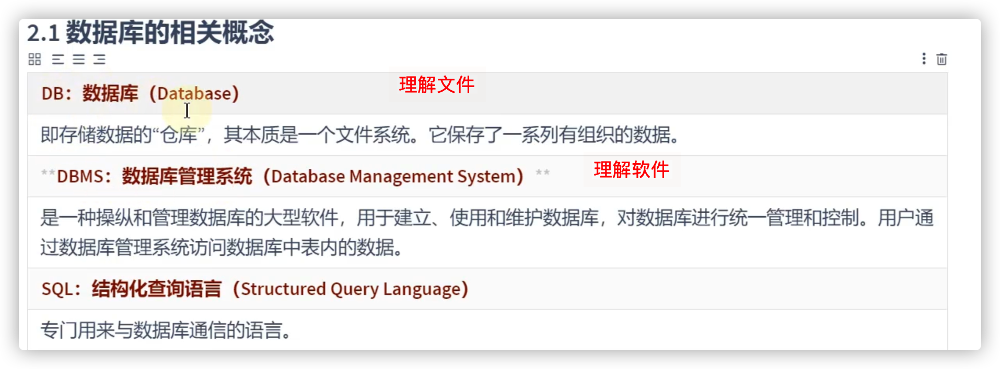
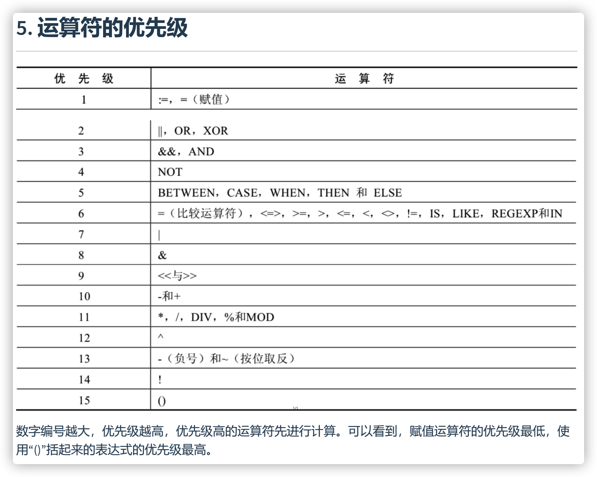
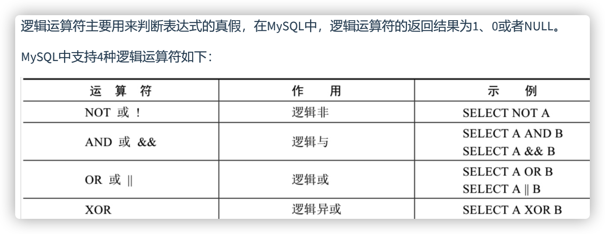
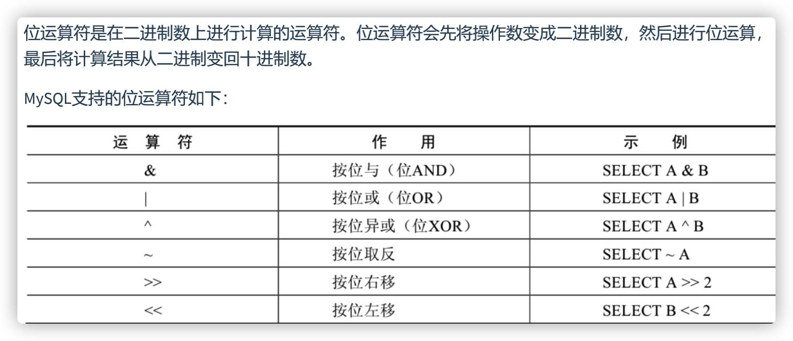

# 数据库概述

## 数据库概念




- SQLite
  嵌入式的小型数据库，应用在手机端。零配置，SQLite不用安装，不用配置，不用启动，关闭或者配置数据库实例。当系统崩溃后不用做任何恢复操作，再下次使用数据库的时候自动恢复。

## MySQL介绍

- MySQL是一个 开放源代码的 **关系型**数据库管理系统

- MySQL6.x 版本之后分为 社区版 和 商业版 。 

- MySQL是可以定制的，采用了 GPL（GNU General Public License） 协议，你可以修改源码来

  开发自己的MySQL系统。

- MySQL支持大型的数据库。可以处理拥有上千万条记录的大型数据库。

- MySQL支持大型数据库，支持5000万条记录的数据仓库，32位系统表文件最大可支持 4GB ，64位系统支持最大的表文件为 8TB 。

- 15年发布的MySQL5.7用的多


## RDBMS **与 非**RDBMS

- 关系型数据库绝对是 DBMS 的主流，其中使用最多的 DBMS 分别是 Oracle、 MySQL 和 SQL Server。这些都是关系型数据库（RDBMS）。

### 关系型数据库(RDBMS)

- 这种类型的数据库是 最古老 的数据库类型，关系型数据库模型是把复杂的数据结构归结为简单的二元关系 （即二维表格形式）。
- 关系型数据库以 行(row) 和 列(column) 的形式存储数据，以便于用户理解。这一系列的行和列被称为 表(table) ，一组表组成了一个库(database)。
- 表与表之间的数据记录有关系(relationship)。现实世界中的各种实体以及实体之间的各种联系均用关系模型 来表示。关系型数据库，就是建立在 关系模型 基础上的数据库。
-  **优势**
  - **复杂查询** 可以用SQL语句方便的在一个表以及多个表之间做非常复杂的数据查询。
  - **事务支持** 使得对于安全性能很高的数据访问要求得以实现。

### 非关系型数据库(非RDBMS) 

- **非关系型数据库**，可看成传统关系型数据库的功能 阉割版本 ，基于键值对存储数据，不需要经过SQL层的解析， 性能非常高 。同时，通过减少不常用的功能，进一步提高性能。目前基本上大部分主流的非关系型数据库都是免费的。
- NoSQL 泛指非关系型数据库

#### 键值型数据库

键值型数据库通过 Key-Value 键值的方式来存储数据。Key 作为唯一的标识符，优点是查找速度快，在这方面明显优于关系型数据库，缺点是无法像关系型数据库一样使用条件过滤（比如 WHERE），如果你不知道去哪里找数据，就要遍历所有的键，这就会消耗大量的计算。键值型数据库典型的使用场景是作为 内存缓存 。 **Redis** 是最流行的键值型数据库。

#### 文档型数据库

此类数据库可存放并获取文档，可以是XML、JSON等格式。在数据库中文档作为处理信息的基本单位，一个文档就相当于一条记录。文档数据库所存放的文档，就相当于键值数据库所存放的“值”。**MongoDB**是最流行的文档型数据库。此外，还有CouchDB等。

#### 搜索引擎数据库

虽然关系型数据库采用了索引提升检索效率，但是针对全文索引效率却较低。搜索引擎数据库是应用在搜索引擎领域的数据存储形式，由于搜索引擎会爬取大量的数据，并以特定的格式进行存储，这样在检索的时候才能保证性能最优。核心原理是“倒排索引”。典型产品：Solr（没人用了）、Elasticsearch（相比更重要）、Splunk 等。

#### 列式数据库

列式数据库是相对于行式存储的数据库，Oracle、MySQL、SQL Server 等数据库都是采用的行式存储（Row-based），而列式数据库是将数据按照列存储到数据库中，这样做的好处是可以大量降低系统的I/O，适合于分布式文件系统，不足在于功能相对有限。典型产品：**HBase**,**ClickHouse**（相比更重要）等。查询减少内存空间。

#### 图形数据库

图形数据库(趋势，但现在不咋用)，利用了图这种数据结构存储了实体（对象）之间的关系。图形数据库最典型的例子就是社交网络中人与人的关系，数据模型主要是以节点和边（关系）来实现，特点在于能高效地解决复杂的关系问题。图形数据库顾名思义，就是一种存储图形关系的数据库。它利用了图这种数据结构存储了实体（对象）之间的关系。关系型数据用于存储明确关系的数据，但对于复杂关系的数据存储却有些力不从心。如社交网络中人物之间的关系，如果用关系型数据库则非常复杂，用图形数据库将非常简单。典型产品：Neo4J、InfoGrid等。

## 关系型数据库设计规则

- 将数据放到表中，表再放到库中。
- 一个数据库中可以有多个表，每个表都有一个名字，用来标识自己。表名具有唯一性。

### 表、记录、字段

- E-R（entity-relationship，实体-联系）模型中有三个主要概念是： 实体集 、 属性 、 联系集 。
  - 一个实体集（class）对应于数据库中的一个表（table），一个实体（instance）则对应于数据库表中的一行（row），也称为一条记录（record）。一个属性（attribute）对应于数据库表中的一列（column），也称为一个字段（field）。
  - 联系集：一张表的一条条和另外一张表的一条条数据之间的联系

### 表的关联关系

- 四种：一对一关联、一对多关联、多对多关联、自我引用

####  一对一关联（one-to-one)

- 在实际的开发中应用不多，因为一对一可以创建成一张表。

- 举例：设计 学生表 ：学号、姓名、手机号码、班级、系别、身份证号码、家庭住址、籍贯、紧急联系人、...拆为两个表：两个表的记录是一一对应关系。
  - 基础信息表 （常用信息）：学号、姓名、手机号码、班级、系别
  - 档案信息表 （不常用信息）：学号、身份证号码、家庭住址、籍贯、紧急联系人、...
- 两种建表原则：
  - 外键唯一：主表的主键和从表的外键（唯一），形成主外键关系，外键唯一。
  - 外键是主键：主表的主键和从表的主键，形成主外键关系。
  - 一份表常用字段，一份少用

#### 一对多关系（one-to-many)

- 常见实例场景： 客户表和订单表 ， 分类表和商品表 ， 部门表和员工表 。
  - 举例：
    - 员工表：编号、姓名、...、所属部门
    - 部门表：编号、名称、简介
- 一对多建表原则：在从表(多方)创建一个字段，字段作为外键指向主表(一方)的主键

#### 多对多（many-to-many）

- 要表示多对多关系，必须创建第三个表，该表通常称为 联接表 ，它将多对多关系划分为两个一对多关系。将这两个表的主键都插入到第三个表中。


####  自我引用(Self reference)


# 我的尝试

## docker安装mysql

- MySQL8.0.26

  MySQL5.7企业用得多

- 听说把数据库安装到docker比较好，参考下面的装了mysql5.7和8+的版本，结果5.7可以链接navicat,8+不能链接navicat。5.7还牵扯文件改编码格式UTF-8，咱不会改，找不到文件夹，就删了docker

https://juejin.cn/post/7039024521159901197

https://blog.csdn.net/a1023266384/article/details/119455841

https://prinsss.github.io/build-x86-docker-images-on-an-m1-macs/

## 直接安装mysql

- 还是老老实实安装mysql到本地好了，于是参考下面的文件

https://blog.csdn.net/weixin_58089927/article/details/122061041

我是直接复制路径在bash文件修改配置的 ~/.bash_profile

```bash
export PATH=$PATH:/usr/local/mysql/bin
export PATH=$PATH:/usr/local/mysql/support-files
```

## mysql初步几个终端指令

### 自带客户端的登录与退出

当MySQL服务启动完成后，便可以通过客户端来登录MySQL数据库。注意：确认服务是开启的。（下载设置mysql自动勾选默认服务开启）

- 登陆

   mysql -u root -p 

- 退出登录 

  - exit 

    或

  - quit 

### mac下启动/停止/重启mysql服务

- ⚠️遇到问题的话

  - sudo su 的条件下搞上面的 启动/停止/重启mysql服务

  - **杀死线程**

    https://www.jianshu.com/p/8095bdbf20bb 

    - 执行`ps -ef|grep mysqld`查看mysql的进程
    - 使用`sudo kill -9 进程id`杀死进程

  - ⚠️要不然全删了再安装mysql

    - sudo su 的条件下搞下面的（可以删除干净）

    - ```bash
      sudo rm /usr/local/mysql
      sudo rm -rf /usr/local/mysql*
      sudo rm -rf /Library/StartupItems/MySQLCOM
      sudo rm -rf /Library/PreferencePanes/My*
      rm -rf ~/Library/PreferencePanes/My*
      sudo rm -rf /Library/Receipts/mysql*
      sudo rm -rf /Library/Receipts/MySQL*
      sudo rm -rf /var/db/receipts/com.mysql.*
      ```

    - 完成会发现user/local 路径没有mysql之类的文件

    - System Preferences里面也没有mysql🐬图标

- 遇到的问题:
  -  Access denied for user 'root'@'localhost' (using password: YES)
    - 我这里应该是密码错误，停止mysql -> mysql.server stop，删除多余进程 -> sudo kill -9
    - 在System Preferences里面的mysql🐬图标，Initialize Database，里面重新设置密码
  - Can't connect to local MySQL server through socket '/tmp/mysql.sock' (2)
    - 没有启动mysql, mysql.server start 

- 开始mysql

  mysql.server start 

  或者

   sudo /usr/local/mysql/support-files/mysql.server start

- 停止mysql

  mysql.server stop

  或者

  sudo /usr/local/mysql/support-files/mysql.server stop

- 重启mysql

  mysql.server restart

  或者

  sudo /usr/local/mysql/support-files/mysql.server restart

  - mac重启mysql提示ERROR! MySQL server PID file could not be found!的解决办法 **杀死线程**

    https://www.jianshu.com/p/8095bdbf20bb 

    - 执行`ps -ef|grep mysqld`查看mysql的进程
    - 使用`sudo kill -9 进程id`杀死进程
    - 执行`sudo /usr/local/mysql/support-files/mysql.server restart`重启mysql。我这里执行了两次(推荐两次)

### 创建/查看/增删

- 创建自己的数据库

```bash
create database 数据库名;
```

- 使用自己的数据库

```bash
use 数据库名;
```

- 查看某个库的所有表格

```bash
show tables; #要求前面有use语句
```

- 查看数据库的创建信息

```bash
show create database 数据库名\G
```

- 删除表格

```bash
drop table 表名称;
```

- 删除数据库

```bash
drop database 数据库名;
```

- 添加数据库

```sql
source 路径;
```

# 基本的SELECT语句

##  SQL **分类** 

- SQL语言在功能上主要分为如下3大类：
  - DDL**（**Data Definition Languages**、数据定义语言）**，这些语句定义了不同的数据库、表、视图、索引等数据对象，还可以用来创建、删除、修改数据库和数据表的结构。主要的语句关键字包括 CREATE 、 DROP 、 ALTER 等。
  - DML**（**Data Manipulation Language**、数据操作语言）**，用于添加、删除、更新和查询数据库记录，并检查数据完整性。主要的语句关键字包括 INSERT 、 DELETE 、 UPDATE 、 SELECT 等。SELECT**是**SQL**语言的基础，最为重要。**
  - DCL**（**Data Control Language**、数据控制语言）**，用于定义数据库、表、字段、用户的访问权限和安全级别。主要的语句关键字包括 GRANT 、 REVOKE 、 COMMIT 、 ROLLBACK 、 SAVEPOINT 等。
- 因为查询语句使用的非常的频繁，所以很多人把查询语句单拎出来一类：DQL（数据查询语言）。还有单独将 COMMIT 、 ROLLBACK 取出来称为TCL （Transaction Control Language，事务控制语言）。

##  SQL语言的规则与规范

- SQL 可以写在一行或者多行。为了提高可读性，各子句分行写，必要时使用缩进
- 每条命令以 ; （navicat）或 \g 或 \G 结束（terminal）
- 关键字不能被缩写也不能分行
- 关于标点符号
  - 必须保证所有的()、单引号、双引号是成对结束的
  - 必须使用英文状态下的半角输入方式
  - 字符串型和日期时间类型的数据可以使用单引号（' '）表示
  - 列的别名，尽量使用双引号（" "），而且不建议省略as 
- **推荐采用统一的书写规范：**
  - 数据库名、表名、表别名、字段名、字段别名等都小写
  - SQL 关键字、函数名、绑定变量等都大写

## 注 释

可以使用如下格式的注释结构

```sql
单行注释：#注释文字(MySQL特有的方式) 

单行注释：-- 注释文字(--后面必须包含一个空格。) 

多行注释：/* 注释文字 */ 
```

## 命名规则

- 数据库、表名不得超过30个字符，变量名限制为29个
- 数据库名、表名、字段名等对象名中间不要包含空格
- 同一个MySQL软件中，数据库不能同名；同一个库中，表不能重名；同一个表中，字段不能重名
- 必须保证你的字段名，表名没有和保留字、数据库系统或常用方法冲突。如果坚持使用，请在SQL语句中使用`（着重号）引起来
- 保持字段名和类型的一致性，在命名字段并为其指定数据类型的时候一定要保证一致性。假如数据类型在一个表里是整数，那在另一个表里可就别变成字符型了

## **基本的**SELECT语句

### SELECT ... FROM

- ```sql
  SELECT 标识选择哪些列 FROM 标识从哪个表中选择

- 选择全部列：

```sql
SELECT * FROM 表名;
```

- 选择特定的列：

```sql
SELECT department_id, location_id 
FROM departments;
```

将关键字大写、数据列和表名小写

###  列的别名

- as:全称：alias(别名),可以省略
- 列的别名可以使用一对" "引起来，不要使用' '。

```sql
-- 下面几种写法都可以

SELECT employee_id emp_id,
last_name AS lname,
department_id "部门id",
salary * 12 AS "annual sal"
FROM employees;
```

### 去除重复行

```sql
SELECT DISTINCT department_id 
FROM employees;
```

```sql
SELECT DISTINCT department_id,salary 
FROM employees;

/*
1. DISTINCT 需要放到所有列名的前面，如果写成 SELECT salary, DISTINCT department_id FROM employees 会报错。
2. DISTINCT 其实是对后面所有列名的组合进行去重，你能看到最后的结果是 74 条，因为这 74 个部
门id不同，都有 salary 这个属性值。如果你想要看都有哪些不同的部门（department_id），只需
要写 DISTINCT department_id 即可，后面不需要再加其他的列名了。
*/
```

### 空值参与运算

- 所有运算符或列值遇到null值，运算的结果都为null

- 在 MySQL 里面， 空值不等于空字符串。一个空字符串的长度是 0，而一个空值的长

  度是空。而且，在 MySQL 里面，空值是占用空间的。

### 着重号

- 我们需要保证表中的字段、表名等没有和保留字、数据库系统或常用方法冲突。如果真的相同，请在

  SQL语句中使用一对``（着重号）引起来。

### 查询常数

- 是在 SELECT 查询结果中增加一列固定的常数列。这列的取值是我们指定的，而不是从数据表中动态取出的。

- 如果我们想整合不同的数据源，用常数列作为这个表的标记，就需要查询常数。

- 我们想对 employees 数据表中的员工姓名进行查询，同时增加一列字段 corporation ，这个字段固定值为“尚硅谷”，可以这样写：

  ```sql
  SELECT '尚硅谷' as corporation, last_name 
  FROM employees;
  ```

### 显示表结构

- 使用DESCRIBE 或 DESC 命令，表示表结构。

```sql
DESCRIBE employees; 
或
DESC employees;
```

- Null：表示该列是否可以存储NULL值。

  Key：表示该列是否已编制索引。PRI表示该列是表主键的一部分；UNI表示该列是UNIQUE索引的一

  部分；MUL表示在列中某个给定值允许出现多次。

  Default：表示该列是否有默认值，如果有，那么值是多少。

  Extra：表示可以获取的与给定列有关的附加信息，例如AUTO_INCREMENT等。

### 过滤数据

```sql
SELECT 字段1,字段2 
FROM 表名 
WHERE 过滤条件

-- WHRER 比较的结果不是1都不要
```

- **WHERE子句紧随FROM子句**

```sql
SELECT employee_id, last_name, job_id, department_id 
FROM employees 
WHERE department_id = 90 ;
```

# 运算符



## 算术运算符


- 加（+）、减（-）、乘（*）、除（/ 或者 DIV）和取模（% 或者 MOD）

- 一个整数类型的值对整数进行加法和减法操作，结果还是一个整数；

  一个整数类型的值对浮点数进行加法和减法和乘法操作，结果是一个浮点数；

- 如果遇到非数值类型，先尝试转成数值，如果转失败，就按0计算。

- 加减

```sql
# 在SQL中，+没有连接的作用，就表示加法运算。此时，会将字符串转换为数值（隐式转换）
SELECT 100 + '1'  # 在Java语言中，结果是：1001。 
FROM DUAL;
# 101

SELECT 100 + 'a' #此时将'a'看做0处理;如果遇到非数值类型，先尝试转成数值，如果转失败，就按0计算。
FROM DUAL;
# 100

SELECT 100 + NULL  # null值参与运算，结果为null
FROM DUAL;
```

- 乘除
  - 整形与整形作除法，结果都是浮点型，并保留到小数点后4位

```sql
SELECT 100, 100 * 1, 100 * 1.0, 100 / 1.0, 100 / 2,
100 + 2 * 5 / 2,100 / 3, 100 DIV 0  # 分母如果为0，则结果为null
FROM DUAL;
-- 100	100	100.0	100.0000	50.0000	105.0000	33.3333	
```

- 取模

```sql
# 取模运算： % mod
-- % 取模结果与被模数的正负性有关
SELECT 12 % 3,12 % 5, 12 MOD -5,-12 % 5,-12 % -5
FROM DUAL;
-- 0	2	2	-2	-2
```

## 比较运算符


- 比较的结果为真则返回1，比较的结果为假则返回0，其他情况则返回NULL。

- **数字用符号 字段用关键字**

- =  <=>  <> !=  <  <=  >  >= 

- 等号运算符

  - 如果等号两边的值、字符串或表达式中有一个为NULL，则比较结果为NULL。

  - ```sql
    SELECT 1 = 2,1 != 2,1 = '1',1 = 'a',0 = 'a' #字符串存在隐式转换。如果转换数值不成功，则看做0
    FROM DUAL;
    -- 0	1	1	0	1
    
    SELECT 'a' = 'a','ab' = 'ab','a' = 'b' #两边都是字符串的话，则按照ANSI的比较规则进行比较。
    FROM DUAL;
    
    SELECT 1 = NULL,NULL = NULL # 只要有null参与判断，结果就为null
    FROM DUAL;
    
    SELECT last_name,salary,commission_pct
    FROM employees
    WHERE commission_pct = NULL;  #此时执行，不会有任何的结果
    ```

- 安全等于运算符

```sql
# <=> ：安全等于。 记忆技巧：为NULL而生。
SELECT 1 <=> 2,1 <=> '1',1 <=> 'a',0 <=> 'a'
FROM DUAL;
-- 0	1	0	1

SELECT 1 <=> NULL, NULL <=> NULL
FROM DUAL;
-- 0	1
```

安全等于运算符（<=>）与等于运算符（=）的作用是相似的， 唯一的区别 是‘<=>’可以用来对NULL进行判断。在两个操作数均为NULL时，其返回值为1，而不为NULL；当一个操作数为NULL时，其返回值为0，而不为NULL。

- 不等于运算符

不等于运算符（<>和!=）用于判断两边的数字、字符串或者表达式的值是否不相等，如果不相等则返回1，相等则返回0。不等于运算符不能判断NULL值。如果两边的值有任意一个为NULL，或两边都为NULL，则结果为NULL。 

```sql
SELECT 3 <> 2,'4' <> NULL, '' != NULL,NULL != NULL
FROM DUAL;
-- 1	 NULL NULL
```

- 空运算符

 空运算符（IS NULL或者ISNULL）判断一个值是否为NULL，如果为NULL则返回1，否则返回0。

```sql
#① IS NULL \ IS NOT NULL \ ISNULL
#练习：查询表中commission_pct为null的数据有哪些
SELECT last_name,salary,commission_pct
FROM employees
WHERE commission_pct IS NULL;
#或
SELECT last_name,salary,commission_pct
FROM employees
WHERE ISNULL(commission_pct);
```

- 非空运算符

非空运算符（IS NOT NULL）判断一个值是否不为NULL，如果不为NULL则返回1，否则返回0。

```sql
#查询commission_pct不等于NULL 
SELECT employee_id,commission_pct FROM employees WHERE commission_pct IS NOT NULL; 
SELECT employee_id,commission_pct FROM employees WHERE NOT commission_pct <=> NULL; 
SELECT employee_id,commission_pct FROM employees WHERE NOT ISNULL(commission_pct);
```

- 最小值运算符
  - 语法格式为：LEAST(值1，值2，...，值n)。其中，“值n”表示参数列表中有n个值。在有两个或多个参数的情下，返回最小值。
  - 当比较值列表中有NULL时，不能判断大小，返回值为NULL。 
  - 字符串比较，有' '，' '最小

```sql
SELECT LEAST('g','b','t',NULL,'');
```

- 最大值运算符

 语法格式为：GREATEST(值1，值2，...，值n)。其中，n表示参数列表中有n个值。当有两个或多个参数时，返回值为最大值。假如任意一个自变量为NULL，则GREATEST()的返回值为NULL。

```sql
mysql> SELECT GREATEST(1,0,2), GREATEST('b','a','c'), GREATEST(1,NULL,2);
```

-  BETWEEN AND运算符

BETWEEN运算符使用的格式通常为SELECT D FROM TABLE WHERE C BETWEEN A AND B，此时，当C大于或等于A，并且C小于或等于B时，结果为1，否则结果为0。 

```sql
#③ BETWEEN 条件下界1 AND 条件上界2  （查询条件1和条件2范围内的数据，包含边界）
#查询工资在6000 到 8000的员工信息
SELECT employee_id,last_name,salary
FROM employees
#where salary between 6000 and 8000;
WHERE salary >= 6000 && salary <= 8000;
#交换6000 和 8000之后，查询不到数据

#查询工资不在6000 到 8000的员工信息
SELECT employee_id,last_name,salary
FROM employees
WHERE salary NOT BETWEEN 6000 AND 8000;
#where salary < 6000 or salary > 8000;
```

-  IN运算符

IN运算符用于判断给定的值是否是IN列表中的一个值，如果是则返回1，否则返回0。如果给定的值为NULL则结果为NULL。 

```sql
SELECT 'a' IN ('a','b','c'), 1 IN (2,3), NULL IN ('a','b'), 'a' IN (NULL,'a'),'a' IN (NULL,'b');
-- 1	0	NULL 1 NULL

#练习：查询部门为10,20,30部门的员工信息
SELECT last_name,salary,department_id
FROM employees
# where department_id = 10 or department_id = 20 or department_id = 30; 
# or 跟着的的字段名要写
WHERE department_id IN (NULL,10,20,30);
```

- NOT IN运算符

NOT IN运算符用于判断给定的值是否不是IN列表中的一个值，如果不是IN列表中的一个值，则返回1，否则返回0。 

```sql
SELECT NULL NOT IN ('a','b'), 'a' NOT IN (NULL,'b'),'a' NOT IN (NULL,'a');
-- NULL NULL 0

#练习：查询工资不是6000,7000,8000的员工信息
SELECT last_name,salary,department_id
FROM employees
WHERE salary NOT IN (6000,7000,8000);
```

- LIKE运算符 

LIKE运算符主要用来匹配字符串，通常用于模糊匹配，如果满足条件则返回1，否则返回0。如果给定的值或者匹配条件为NULL，则返回结果为NULL。 

LIKE运算符通常使用如下通配符：

```sql
“%”：不确定个数的字符0个或多个字符。 
“_”：只能匹配一个字符。

#练习：查询last_name中包含字符'a'的员工信息
SELECT last_name
FROM employees
WHERE last_name LIKE '%a%';

#练习：查询last_name中以字符'a'开头的员工信息
SELECT last_name
FROM employees
WHERE last_name LIKE 'a%';

#练习：查询last_name中包含字符'a'且包含字符'e'的员工信息
#写法1：
SELECT last_name
FROM employees
WHERE last_name LIKE '%a%' AND last_name LIKE '%e%';
#写法2：
SELECT last_name
FROM employees
WHERE last_name LIKE '%a%e%' OR last_name LIKE '%e%a%';

------------------------------------------------------
#练习：查询第3个字符是'a'的员工信息
SELECT last_name
FROM employees
WHERE last_name LIKE '__a%';

#练习：查询第2个字符是_且第3个字符是'a'的员工信息
#需要使用转义字符: \ 
SELECT last_name
FROM employees
WHERE last_name LIKE '_\_a%';
```

-  REGEXP 或者 RLIKE 运算符（正则表达式）

REGEXP运算符用来匹配字符串，语法格式为： expr REGEXP 匹配条件 。如果expr满足匹配条件，返回1；如果不满足，则返回0。若expr或匹配条件任意一个为NULL，则结果为NULL。 

REGEXP运算符在进行匹配时，常用的有下面几种通配符：

```sql
（1）‘^’匹配以该字符后面的字符开头的字符串。 
（2）‘$’匹配以该字符前面的字符结尾的字符串。 
（3）‘.’匹配任何一个单字符。 
（4）“[...]”匹配在方括号内的任何字符。例如，“[abc]”匹配“a”或“b”或“c”。为了命名字符的范围，使用一 个‘-’。“[a-z]”匹配任何字母，而“[0-9]”匹配任何数字。 
（5）‘*’匹配零个或多个在它前面的字符。例如，“x*”匹配任何数量的‘x’字符，“[0-9]*”匹配任何数量的数字， 而“*”匹配任何数量的任何字符。

SELECT 'shkstart' RLIKE '^shk', 'shkstart' RLIKE 't$', 'shkstart' RLIKE 'hk'
FROM DUAL;
-- 是不是有'hk' 的字符
-- 1 1 1

SELECT 'atguigu' REGEXP 'gu.gu','atguigu' REGEXP '[ab]'
FROM DUAL;
-- 1 1
```

## 逻辑运算符



- 逻辑非运算符 

逻辑非（NOT或!）运算符表示当给定的值为0时返回1；当给定的值为非0值时返回0；当给定的值为NULL时，返回NULL。 

```sql
# not 
SELECT last_name,salary,department_id
FROM employees
#where salary not between 6000 and 8000;
#where commission_pct is not null;
WHERE NOT commission_pct <=> NULL;
```

- 逻辑与运算符

逻辑与（AND或&&）运算符是当给定的所有值均为非0值，并且都不为NULL时，返回1；当给定的一个值或者多个值为0时则返回0；否则返回NULL。 

```sql
SELECT 1 AND -1, 0 AND 1, 0 AND NULL, 1 AND NULL;
-- 1	0	0	NULL

SELECT last_name,salary,department_id
FROM employees
#where department_id = 10 and department_id = 20;
WHERE department_id = 50 AND salary > 6000;
```

- 逻辑或运算符

逻辑或（OR或||）运算符是当给定的值都不为NULL，并且任何一个值为非0值时，则返回1，否则返回0；当一个值为NULL，并且另一个值为非0值时，返回1，否则返回NULL；当两个值都为NULL时，返回NULL。 

```sql
SELECT 1 OR -1, 1 OR 0, 1 OR NULL, 0 || NULL, NULL || NULL; 
-- 1  1  1  NULL  NULL 
```

>OR可以和AND一起使用，但是在使用时要注意两者的优先级，由于AND的优先级高于OR，因此先对AND两边的操作数进行操作，再与OR中的操作数结合。

```sql
SELECT last_name,salary,department_id
FROM employees
WHERE department_id = 10 OR department_id = 20;
```

- 逻辑异或运算符 

逻辑异或（XOR）运算符是当给定的值中任意一个值为NULL时，则返回NULL；如果两个非NULL的值都是0或者都不等于0时，则返回0；如果一个值为0，另一个值不为0时，则返回1。

```sql
SELECT last_name,salary,department_id
FROM employees
WHERE department_id = 50 XOR salary > 6000;
```

## 位运算符



# 排序与分页

## 排序

- 如果没有使用排序操作，默认情况下查询返回的数据是按照添加数据的顺序显示的。
- 可以使用不在SELECT列表中的列排序。

### 升序&&降序

```sql
# 1.1 基本使用
# 使用 ORDER BY 对查询到的数据进行排序操作。
# 升序：ASC (ascend)
# 降序：DESC (descend)

# 练习：按照salary从高到低的顺序显示员工信息
SELECT employee_id,last_name,salary
FROM employees
ORDER BY salary DESC;

# 练习：按照salary从低到高的顺序显示员工信息
SELECT employee_id,last_name,salary
FROM employees
ORDER BY salary ASC;


SELECT employee_id,last_name,salary
FROM employees
ORDER BY salary; # 如果在ORDER BY 后没有显式指名排序的方式的话，则默认按照升序排列。
```

### 别名问题

```sql
#2. 我们可以使用列的别名，进行排序
#列的别名只能在 ORDER BY 中使用，不能在WHERE中使用。
SELECT employee_id,salary,salary * 12 annual_sal
FROM employees
ORDER BY annual_sal;

#3. 强调格式：WHERE 需要声明在FROM后，ORDER BY之前。
SELECT employee_id,salary # 实际操作第三步 可以在 SELECT里面取别名 
FROM employees # 实际操作第一步
WHERE department_id IN (50,60,70) # 实际操作第二步
ORDER BY department_id DESC; # 实际操作第四步
```

### 二级排序

```sql
#练习：显示员工信息，按照department_id的降序排列，salary的升序排列
SELECT employee_id,salary,department_id
FROM employees
ORDER BY department_id DESC,salary ASC;
```

## 分页

- 截取显示部分数据

```sql
LIMIT [位置偏移量,] 行数

-- 第一个“位置偏移量”参数指示MySQL从哪一行开始显示，是一个可选参数，如果不指定“位置偏移量”，将会从表中的第一条记录开始（第一条记录的位置偏移量是0，第二条记录的位置偏移量是1，以此类推）；第二个参数“行数”指示返回的记录条数。

-- 前10条记录： 
SELECT * FROM 表名 LIMIT 0,10; 
或者
SELECT * FROM 表名 LIMIT 10;
```

- MySQL 8.0中可以使用“LIMIT 3 OFFSET 4”，意思是获取从第5条记录开始后面的3条记录，和“LIMIT 4,3;”返回的结果相同。

```sql
#练习：表里有107条数据，我们只想要显示第 32、33 条数据怎么办呢？
SELECT employee_id,last_name
FROM employees
LIMIT 2 OFFSET 31;
```

- 分页显式公式**：（当前页数**-1**）*****每页条数，每页条数**

```sql
SELECT * FROM table 
LIMIT(PageNo - 1)*PageSize,PageSize;

# 需求1：每页显示20条记录，此时显示第1页
SELECT employee_id,last_name
FROM employees
LIMIT 0,20;


# 需求2：每页显示20条记录，此时显示第2页
SELECT employee_id,last_name
FROM employees
LIMIT 20,20;
```

- **注意：LIMIT 子句必须放在整个SELECT语句的最后！**
- 分页 在不同的 DBMS 中使用的关键字可能不同。**不能使用在SQL Server、DB2、Oracle！**

```sql
SELECT employee_id,last_name,salary
FROM employees
WHERE salary > 6000
ORDER BY salary DESC
#limit 0,10;
LIMIT 10;
```

# 多表查询


>之前sql顺序汇总
>
>SELECT ...,....,....
>FROM ....
>WHERE .... AND / OR / NOT....
>ORDER BY .... (ASC/DESC),....,...
>LIMIT ...,...

## 笛卡尔积（或交叉连接）的理解

- 假设我有两个集合 X 和 Y，那么 X 和 Y 的笛卡尔积就是 X 和 Y 的所有可能组合，也就是第一个对象来自于 X，第二个对象来自于 Y 的所有可能。组合的个数即为两个集合中元素个数的乘积数。
- 出现笛卡尔积的错误原因：
  - 缺少了有效的多表的连接条件

```sql
#3. 多表查询的正确方式：需要有连接条件
SELECT employee_id,department_name
FROM employees,departments
#两个表的连接条件
WHERE employees.`department_id` = departments.department_id;

-- 着重号这里可加可不加
```

```sql
#4. 如果查询语句中出现了多个表中都存在的字段，则必须指明此字段所在的表。
SELECT employees.employee_id,departments.department_name,employees.department_id
FROM employees,departments
-- 着重号这里可加可不加
WHERE employees.`department_id` = departments.department_id;
#建议：从sql优化的角度，建议多表查询时，每个字段前都指明其所在的表。
```

```sql
#5. 可以给表起别名，在SELECT和WHERE中使用表的别名。
SELECT emp.employee_id,dept.department_name,emp.department_id
FROM employees emp,departments dept
WHERE emp.`department_id` = dept.department_id;
#如果给表起了别名，一旦在SELECT或WHERE中使用表名的话，则必须使用表的别名，而不能再使用表的原名。
#可以理解原来的表名被别名覆盖掉了
```

```sql
#6. 结论：如果有n个表实现多表的查询，则需要至少n-1个连接条件
#练习：查询员工的employee_id,last_name,department_name,city
SELECT e.employee_id,e.last_name,d.department_name,l.city,e.department_id,l.location_id
FROM employees e,departments d,locations l
WHERE e.`department_id` = d.`department_id`
AND d.`location_id` = l.`location_id`;
```

## 多表查询的分类

每种分类都是不同角度的分类

### 等值连接vs非等值连接

- 之前的例子都是等值连接`WHERE e.department_id = d.department_id`

- ```sql
  #非等值连接的例子：
  SELECT e.last_name, e.salary, j.grade_level
  FROM employees e,job_grades j
  #where e.`salary` between j.`lowest_sal` and j.`highest_sal`;
  WHERE e.`salary` >= j.`lowest_sal` AND e.`salary` <= j.`highest_sal`;
  ```

### 自连接vs非自连接

```sql
#自连接的例子：
#练习：查询员工id,员工姓名及其管理者的id和姓名
SELECT emp.employee_id,emp.last_name,mgr.employee_id,mgr.last_name
FROM employees emp ,employees mgr
WHERE emp.`manager_id` = mgr.`employee_id`;
```

当table1和table2本质上是同一张表，只是用取别名的方式虚拟成两张表以代表不同的意义。然后两个表再进行内连接，外连接等查询。

### 内连接vs外连接

#### 内连接(SQL92)

```sql
#SQL92语法实现内连接:
# 内连接：合并具有同一列的两个以上的表的行, 结果集中不包含一个表与另一个表不匹配的行
# 单独截取交集
SELECT employee_id,department_name
FROM employees e,departments d
WHERE e.`department_id` = d.department_id;  #只有106条记录
```

#### 外连接(SQL92)

- 合并具有同一列的两个以上的表的行, 结果集中除了包含一个表与另一个表匹配的行之外，还查询到了左表 或 右表中不匹配的行。

- 外连接的分类：左外连接、右外连接、满外连接

  - 左外连接：两个表在连接过程中除了返回满足连接条件的行以外还返回左表中不满足条件的行，这种连接称为左外连接。
  - 右外连接：两个表在连接过程中除了返回满足连接条件的行以外还返回右表中不满足条件的行，这种连接称为右外连接。

- 如果是左外连接，则连接条件中左边的表也称为 主表 ，右边的表称为 从表 。

  如果是右外连接，则连接条件中右边的表也称为 主表 ，左边的表称为 从表 。 

```sql
#SQL92语法实现外连接：使用 +  ----------MySQL不支持SQL92语法中外连接的写法！
-- 在 SQL92 中采用（+）代表从表所在的位置。即左或右外连接中，(+) 表示哪个是从表。
-- Oracle 对 SQL92 支持较好，而 MySQL 则不支持 SQL92 的外连接。
-- 而且在 SQL92 中，只有左外连接和右外连接，没有满（或全）外连接。
#不支持：
# 左外连接
SELECT employee_id,department_name
FROM employees e,departments d
WHERE e.`department_id` = d.department_id(+);
```

## SQL99语法实现多表查询

### JOIN ...ON

- SQL99语法中使用 JOIN ...ON 的方式实现多表的查询。这种方式也能解决外连接的问题。MySQL是支持此种方式的。
- 它的嵌套逻辑类似我们使用的 FOR 循环

### 内连接

- 关键字 JOIN、INNER JOIN、CROSS JOIN 的含义是一样的，都表示内连接

```sql
#SQL99语法实现内连接：
SELECT 字段列表 
FROM A表 
INNER JOIN B表
ON 关联条件 
WHERE 等其他子句;

SELECT last_name,department_name
-- 可以省略INNER
FROM employees e INNER JOIN departments d
-- 下面ON =号左右语句可以颠倒
ON e.`department_id` = d.`department_id`;

-- 连续使用
SELECT last_name,department_name,city
FROM employees e JOIN departments d
ON e.`department_id` = d.`department_id`
JOIN locations l
ON d.`location_id` = l.`location_id`;
```

### 外连接

- 需要注意的是，LEFT JOIN 和 RIGHT JOIN 只存在于 SQL99 及以后的标准中，在 SQL92 中不存在，只能用 (+) 表示。

```sql
-- 左外连接(LEFT OUTER JOIN)
#实现查询结果是A 
SELECT 字段列表 
FROM A表 LEFT JOIN B表 
ON 关联条件 
WHERE 等其他子句;

SELECT last_name,department_name
FROM employees e LEFT JOIN departments d
ON e.`department_id` = d.`department_id`;

#右外连接：
-- 没有OUTER也可以
SELECT last_name,department_name
FROM employees e RIGHT OUTER JOIN departments d
ON e.`department_id` = d.`department_id`;

#满外连接：mysql不支持FULL OUTER JOIN
```

##  UNION的使用

**合并查询结果** 利用UNION关键字，可以给出多条SELECT语句，并将它们的结果组合成单个结果集。合并时，两个表对应的列数和数据类型必须相同，并且相互对应。各个SELECT语句之间使用UNION或UNION ALL关键字分隔。


>注意：执行UNION ALL语句时所需要的资源比UNION语句少。如果明确知道合并数据后的结果数据不存在重复数据，或者不需要去除重复的数据，则尽量使用UNION ALL语句，以提高数据查询的效率。

## 7种JOIN的实现


