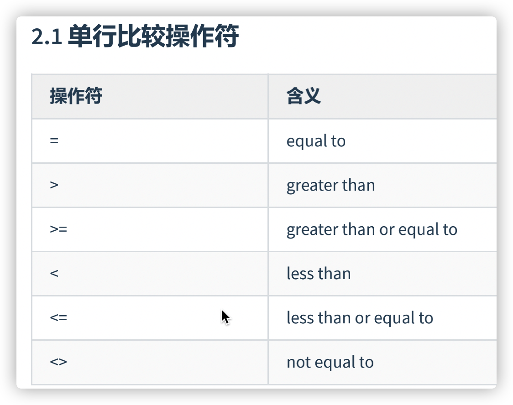
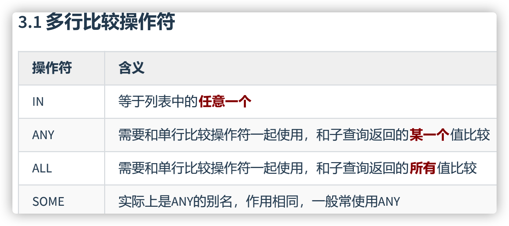

#  函数理解

- 从函数定义的角度出发，我们可以将函数分成 内置函数 和 自定义函数 。在 SQL 语言中，同样也包括了内置函数和自定义函数。内置函数是系统内置的通用函数，而自定义函数是我们根据自己的需要编写的，本章及下一章讲解的是 SQL 的内置函数。
- 我们在使用 SQL 语言的时候，不是直接和这门语言打交道，而是通过它使用不同的数据库软件，即DBMS。DBMS **之间的差异性很大，远大于同一个语言不同版本之间的差异。**实际上，只有很少的函数是被 DBMS 同时支持的。比如，大多数 DBMS 使用（||）或者（+）来做拼接符，而在 MySQL 中的字符串拼接函数为concat()。大部分 DBMS 会有自己特定的函数，这就意味着**采用** SQL **函数的代码可移植性是很差的**，因此在使用函数的时候需要特别注意。
- 的内置函数分为两类： 单行函数 、 聚合函数（或分组函数） 。


- 单行函数：
  - **每行返回一个结果**
  - 可以嵌套

# 单行函数

**见 第07章_单行函数.pdf**

## 数值函数

## 字符串函数

- MySQL里面，字段名下数据的查询不分大小写，即使查询条件是字段名下数据的小写，大写的数据也会查询出来
- MySQL里面，角标从1开始

## 日期和时间函数

## 流程控制函数

SQL查询自带循环

## 加密与解密函数

## MySQL信息函数

## 其他函数

# 聚合函数

- 聚合（或聚集、分组）函数，它是对一组数据进行汇总的函数，输入的是一组数据的集合，输出的是单个值。
- 聚合函数不能嵌套调用。

## 聚合函数介绍

### AVG和SUM函数

```sql
#1.1 AVG / SUM ：只适用于数值类型的字段（或变量）
-- 不能用于日期，字符串
SELECT AVG(salary),SUM(salary),AVG(salary) * 107
FROM employees;
```

### MIN和MAX函数

可以对**任意数据类型**的数据使用 MIN 和 MAX 函数。

```sql
#1.2 MAX / MIN :适用于任意数据类型
SELECT MAX(salary),MIN(salary)
FROM employees;

SELECT MAX(last_name),MIN(last_name),MAX(hire_date),MIN(hire_date)
FROM employees;
```

```sql
#2.查询公司员工工资的最大值，最小值，平均值，总和
-- 组函数一般要起别名
SELECT MAX(salary) max_sal ,MIN(salary) mim_sal,AVG(salary) avg_sal,SUM(salary) sum_sal
FROM employees;
```

### COUNT函数

```sql
#1.3 COUNT：
# ① 作用：计算指定字段在查询结构中出现的个数（不包含NULL值的）
SELECT COUNT(employee_id),COUNT(salary),COUNT(2 * salary),COUNT(1),COUNT(2),COUNT(*)
FROM employees;

#如果计算表中有多少条记录，如何实现？
#方式1：COUNT(*) 返回表中记录总数，适用于**任意数据类型**。 
#方式2：COUNT(1)
#方式3：COUNT(具体字段) : 不一定对！
-- COUNT(expr) 返回expr**不为空**的记录总数。

# 如何需要统计表中的记录数，使用COUNT(*)、COUNT(1)、COUNT(具体字段) 哪个效率更高呢？
# 如果使用的是MyISAM 存储引擎，则三者效率相同，都是O(1)
# 如果使用的是InnoDB 存储引擎，则三者效率：COUNT(*) = COUNT(1)> COUNT(字段)

#② 注意：计算指定字段出现的个数时，是不计算NULL值的。
-- count(*)会统计值为 NULL 的行，而 count(列名)不会统计此列为 NULL 值的行。
SELECT COUNT(commission_pct)
FROM employees;
-- 上下两者等价
SELECT commission_pct
FROM employees
WHERE commission_pct IS NOT NULL;
```

```sql
#③ 公式：AVG = SUM / COUNT
SELECT AVG(salary),SUM(salary)/COUNT(salary),
AVG(commission_pct),SUM(commission_pct)/COUNT(commission_pct),
SUM(commission_pct) / 107
FROM employees;

#需求：查询公司中平均奖金率
#错误的！
SELECT AVG(commission_pct)
FROM employees;

#正确的：
SELECT SUM(commission_pct) / COUNT(IFNULL(commission_pct,0)),
AVG(IFNULL(commission_pct,0))
FROM employees;
```

## GROUP BY


```sql
#2. GROUP BY 的使用
#需求：查询各个部门的平均工资，最高工资
SELECT department_id,AVG(salary),SUM(salary)
FROM employees
GROUP BY department_id

#需求：查询各个department_id,job_id的平均工资
#方式1：
SELECT department_id,job_id,AVG(salary)
FROM employees
GROUP BY  department_id,job_id;
-- GROUP BY job_id,department_id;
-- GROUP BY 两者交换对结果没有影响

#错误的！job_id 无法显示结果
SELECT department_id,job_id,AVG(salary)
FROM employees
GROUP BY department_id;
#结论1：SELECT中出现的非组函数的字段必须声明在GROUP BY 中。
#      反之，GROUP BY中声明的字段可以不出现在SELECT中。
```

### WITH ROLLUP

```sql
#结论3：MySQL中GROUP BY中使用WITH ROLLUP
-- 使用 WITH ROLLUP 关键字之后，在所有查询出的分组记录之后增加一条记录，该记录计算查询出的所有记录的总和，即统计记录数量。
SELECT department_id,AVG(salary)
FROM employees
GROUP BY department_id WITH ROLLUP;
```

```sql
#需求：查询各个部门的平均工资，按照平均工资升序排列
SELECT department_id,AVG(salary) avg_sal
FROM employees
GROUP BY department_id
ORDER BY avg_sal ASC;

#说明：当使用ROLLUP时，不能同时使用ORDER BY子句进行结果排序，即ROLLUP和ORDER BY是互相排斥的。
-- 自定义平均不能排序（矛盾）
#错误的：
SELECT department_id,AVG(salary) avg_sal
FROM employees
GROUP BY department_id WITH ROLLUP
ORDER BY avg_sal ASC;
```

## HAVING

```sql
#3. HAVING的使用 (作用：用来过滤数据的)
#练习：查询各个部门中最高工资比10000高的部门信息

#要求1：如果过滤条件中使用了聚合函数，则必须使用HAVING来替换WHERE。否则，报错。
#要求2：HAVING 必须声明在 GROUP BY 的后面。
SELECT department_id,MAX(salary)
FROM employees
GROUP BY department_id
HAVING MAX(salary) > 10000;

#要求3：开发中，我们使用HAVING的前提是SQL中使用了GROUP BY。
```

```sql
#练习：查询部门id为10,20,30,40这4个部门中最高工资比10000高的部门信息
SELECT department_id,MAX(salary)
FROM employees
WHERE department_id IN (10,20,30,40)
GROUP BY department_id
HAVING MAX(salary) > 10000;
#结论：当过滤条件中有聚合函数时，则此过滤条件必须声明在HAVING中。
#      当过滤条件中没有聚合函数时，则此过滤条件声明在WHERE中或HAVING中都可以。但是，建议大家声明在WHERE中。

/*
  WHERE 与 HAVING 的对比
1. 从适用范围上来讲，HAVING的适用范围更广。 
2. 如果过滤条件中没有聚合函数：这种情况下，WHERE的执行效率要高于HAVING
*/
```

## SQL底层执行原理

### SELECT 语句的完整结构

```sql
/*
#sql92语法：
SELECT ....,....,....(存在聚合函数)
FROM ...,....,....
WHERE 多表的连接条件 AND 不包含聚合函数的过滤条件
GROUP BY ...,....
HAVING 包含聚合函数的过滤条件
ORDER BY ....,...(ASC / DESC )
LIMIT ...,....


#sql99语法：
SELECT ....,....,....(存在聚合函数)
FROM ... (LEFT / RIGHT)JOIN ....ON 多表的连接条件 
(LEFT / RIGHT)JOIN ... ON .... （习惯上把数据多的放在左边，一般就是左外）
WHERE 不包含聚合函数的过滤条件
GROUP BY ...,....
HAVING 包含聚合函数的过滤条件
ORDER BY ....,...(ASC / DESC )
LIMIT ...,....
*/
```

### SQL语句的执行过程

```sql
#4.2 SQL语句的执行过程：
#FROM ...,...-> ON -> (LEFT/RIGNT  JOIN) -> WHERE -> GROUP BY -> HAVING -> SELECT -> DISTINCT -> 
# ORDER BY -> LIMIT
```

```sql
SELECT DISTINCT player_id, player_name, count(*) as num # 顺序 5
FROM player JOIN team ON player.team_id = team.team_id # 顺序 1
WHERE height > 1.80 # 顺序 2
GROUP BY player.team_id # 顺序 3
HAVING num > 2 # 顺序 4
ORDER BY num DESC # 顺序 6
LIMIT 2 # 顺序 7
```

# 子查询

```sql
#1. 由一个具体的需求，引入子查询
#需求：谁的工资比Abel的高？
#方式1：
SELECT salary
FROM employees
WHERE last_name = 'Abel';

SELECT last_name,salary
FROM employees
WHERE salary > 11000;

#方式2：自连接
SELECT e2.last_name,e2.salary
FROM employees e1,employees e2
WHERE e2.`salary` > e1.`salary` #多表的连接条件
AND e1.last_name = 'Abel';

#方式3：子查询
SELECT last_name,salary
FROM employees
WHERE salary > (
		SELECT salary
		FROM employees
		WHERE last_name = 'Abel'
		);

#2. 称谓的规范：外查询（或主查询）、内查询（或子查询）
```

## 子查询的基本使用与分类

```sql
/*
- 子查询（内查询）在主查询之前一次执行完成。
- 子查询的结果被主查询（外查询）使用 。
- 注意事项
  - 子查询要包含在括号内
  - 将子查询放在比较条件的右侧
  - 单行操作符对应单行子查询，多行操作符对应多行子查询
*/
```

```sql
/*
3. 子查询的分类
角度1：从内查询返回的结果的条目数
	单行子查询  vs  多行子查询

角度2：内查询是否被执行多次
	相关子查询  vs  不相关子查询
	
子查询从数据表中查询了数据结果，如果这个数据结果只执行一次，然后这个数据结果作为主查询的条
件进行执行，那么这样的子查询叫做不相关子查询。
同样，如果子查询需要执行多次，即采用循环的方式，先从外部查询开始，每次都传入子查询进行查
询，然后再将结果反馈给外部，这种嵌套的执行方式就称为相关子查询。
	
 比如：相关子查询的需求：查询工资大于本部门平均工资的员工信息。
      不相关子查询的需求：查询工资大于本公司平均工资的员工信息。
*/
```

```sql
/* 
子查询的编写技巧（或步骤）：① 从里往外写  ② 从外往里写

如何选择？
① 如果子查询相对较简单，建议从外往里写。一旦子查询结构较复杂，则建议从里往外写
② 如果是相关子查询的话，通常都是从外往里写。
*/
```

## 单行子查询

### 单行操作符



```sql
#4. 单行子查询
#4.1 单行操作符： =  !=  >   >=  <  <= 
#题目：查询工资大于149号员工工资的员工的信息
-- WHERE比较的就是子查询里面SELECT的内容

SELECT employee_id,last_name,salary
FROM employees
WHERE salary > (
		SELECT salary
		FROM employees
		WHERE employee_id = 149
		);
		
#题目：返回job_id与141号员工相同，salary比143号员工多的员工姓名，job_id和工资
SELECT last_name,job_id,salary
FROM employees
WHERE job_id = (
		SELECT job_id
		FROM employees
		WHERE employee_id = 141
		)
AND salary > (
		SELECT salary
		FROM employees
		WHERE employee_id = 143
		);
		
#题目：返回公司工资最少的员工的last_name,job_id和salary
SELECT last_name,job_id,salary
FROM employees
WHERE salary = (
		SELECT MIN(salary)
		FROM employees
		);
		
#题目：查询与141号员工的manager_id和department_id相同的其他员工
#的employee_id，manager_id，department_id。
#方式1：
SELECT employee_id,manager_id,department_id
FROM employees
WHERE manager_id = (
		    SELECT manager_id
		    FROM employees
		    WHERE employee_id = 141
		   )
AND department_id = (
		    SELECT department_id
		    FROM employees
		    WHERE employee_id = 141
		   )
-- AND employee_id != 141;
AND employee_id <> 141;
```

###  HAVING中的子查询

- 首先执行子查询。
- 向主查询中的HAVING 子句返回结果。

```sql
#题目：查询最低工资大于 110号部门最低工资 的部门id和其最低工资
SELECT department_id,MIN(salary)
FROM employees
WHERE department_id IS NOT NULL
GROUP BY department_id
HAVING MIN(salary) > (
			SELECT MIN(salary)
			FROM employees
			WHERE department_id = 110
		     );
```

### CASE中的子查询

```sql
#题目：显式员工的employee_id,last_name和location。
#其中，若员工department_id与location_id为1800的department_id相同，
#则location为’Canada’，其余则为’USA’。
SELECT employee_id,last_name,CASE department_id WHEN (SELECT department_id 
                                                      FROM departments 
                                                      WHERE location_id = 1800) 
                                                THEN 'Canada'
																								ELSE 'USA' 
																								END "location"
																								FROM employees;
```

### 子查询中的空值问题

**不返回任何行**

```sql
#4.2 子查询中的空值问题
SELECT last_name, job_id
FROM   employees
WHERE  job_id =
                (SELECT job_id
                 FROM   employees
                 WHERE  last_name = 'Haas');
```

### 非法使用子查询

```sql
-- 多行子查询使用单行比较符
#4.3 非法使用子查询
#错误：Subquery returns more than 1 row
SELECT employee_id, last_name
FROM   employees
WHERE  salary =
                (SELECT   MIN(salary)
                 FROM     employees
                 GROUP BY department_id);         

```

## 多行子查询

- 内查询返回多行
- 使用多行比较操作符

### 多行比较操作符



```sql
#5.2举例：
# IN:
SELECT employee_id, last_name
FROM   employees
WHERE  salary IN
                (SELECT   MIN(salary)
                 FROM     employees
                 GROUP BY department_id); 
                 
# ANY / ALL:
#题目：返回其它job_id中比job_id为‘IT_PROG’部门任一工资低的员工的员工号、
#姓名、job_id 以及salary

SELECT employee_id,last_name,job_id,salary
FROM employees
WHERE job_id <> 'IT_PROG'
AND salary < ANY (
		SELECT salary
		FROM employees
		WHERE job_id = 'IT_PROG'
		);

#题目：返回其它job_id中比job_id为‘IT_PROG’部门所有工资低的员工的员工号、
#姓名、job_id 以及salary
SELECT employee_id,last_name,job_id,salary
FROM employees
WHERE job_id <> 'IT_PROG'
AND salary < ALL (
		SELECT salary
		FROM employees
		WHERE job_id = 'IT_PROG'
		);
		
#题目：查询平均工资最低的部门id
#MySQL中聚合函数是不能嵌套使用的。
#方式1：
SELECT department_id
FROM employees
GROUP BY department_id
HAVING AVG(salary) = (
			SELECT MIN(avg_sal)
			FROM(
				SELECT AVG(salary) avg_sal
				FROM employees
				GROUP BY department_id
				) t_dept_avg_sal
			);

#方式2：
SELECT department_id
FROM employees
GROUP BY department_id
HAVING AVG(salary) <= ALL(	
  -- 它本身也包括在比较操作符右边，所以要等号
			SELECT AVG(salary) avg_sal
			FROM employees
			GROUP BY department_id
			);
```

### 空值问题

**不返回任何行**

```sql
#5.3 空值问题
SELECT last_name
FROM employees
WHERE employee_id NOT IN (
			SELECT manager_id
			FROM employees
			);
```

## 相关子查询

如果子查询的执行依赖于外部查询，通常情况下都是因为子查询中的表用到了外部的表，并进行了条件关联，因此每执行一次外部查询，子查询都要重新计算一次，这样的子查询就称之为 关联子查询 。


外部送到子查询一条记录，子查询处理过后与比较操作符比较，为真返回1保留，为假返回0不保留

**子查询中使用主查询中的列**

```sql
#题目：查询员工中工资大于本部门平均工资的员工的last_name,salary和其department_id
#方式1：使用相关子查询
SELECT last_name,salary,department_id
FROM employees e1
WHERE salary > (
		SELECT AVG(salary)
		FROM employees e2
		WHERE department_id = e1.`department_id`
		);

#方式2：在FROM中声明子查询
SELECT e.last_name,e.salary,e.department_id
FROM employees e,(
		SELECT department_id,AVG(salary) avg_sal
		-- avg_sal必须写，必须给AVG(salary)起别名，因为把它当做了一个字段而不是函数
		FROM employees
		GROUP BY department_id) t_dept_avg_sal
WHERE e.department_id = t_dept_avg_sal.department_id
AND e.salary > t_dept_avg_sal.avg_sal
/*
from型的子查询：子查询是作为from的一部分，子查询要用()引起来，并且要给这个子查询取别
名， 把它当成一张“临时的虚拟的表”来使用。
*/

#题目：若employees表中employee_id与job_history表中employee_id相同的数目不小于2，
#输出这些相同id的员工的employee_id,last_name和其job_id
SELECT employee_id,last_name,job_id
FROM employees e
WHERE 2 <= (
	    SELECT COUNT(*)
	    FROM job_history j
	    WHERE e.`employee_id` = j.`employee_id`
		)
```

```sql
#题目：查询员工的id,salary,按照department_name 排序
SELECT employee_id,salary
FROM employees e
ORDER BY (
	 SELECT department_name
	 FROM departments d
	 WHERE e.`department_id` = d.`department_id`
	) ASC;

#结论：在SELECT中，除了GROUP BY 和 LIMIT之外，其他位置都可以声明子查询！

#结论：在SELECT中，除了GROUP BY 和 LIMIT之外，其他位置都可以声明子查询！
/*
SELECT ....,....,....(存在聚合函数)
FROM ... (LEFT / RIGHT)JOIN ....ON 多表的连接条件 
(LEFT / RIGHT)JOIN ... ON ....
WHERE 不包含聚合函数的过滤条件
GROUP BY ...,....
HAVING 包含聚合函数的过滤条件
ORDER BY ....,...(ASC / DESC )
LIMIT ...,....
*/
```

### EXISTS 与 NOT EXISTS关键字

- EXISTS关键字表示如果存在某种条件，则返回TRUE，否则返回FALSE。
- NOT EXISTS关键字表示如果不存在某种条件，则返回TRUE，否则返回FALSE。

```sql
#6.2 EXISTS 与 NOT EXISTS关键字
#题目：查询公司管理者的employee_id，last_name，job_id，department_id信息
#方式1：自连接
SELECT DISTINCT mgr.employee_id,mgr.last_name,mgr.job_id,mgr.department_id
FROM employees emp JOIN employees mgr
ON emp.manager_id = mgr.employee_id;

#方式2：子查询
SELECT employee_id,last_name,job_id,department_id
FROM employees
WHERE employee_id IN (
			SELECT DISTINCT manager_id
			FROM employees
			);

#方式3：使用EXISTS（能用IN的考虑使用EXISTS，能用NOT IN的考虑使用NOT EXISTS
SELECT employee_id,last_name,job_id,department_id
FROM employees e1
WHERE EXISTS (
				 -- SELECT *表示送出一条结果
	       SELECT *
	       FROM employees e2
	       WHERE e1.`employee_id` = e2.`manager_id`
	     );
```

```sql
#题目：查询departments表中，不存在于employees表中的部门的department_id和department_name
#方式1：
SELECT d.department_id,d.department_name
FROM employees e RIGHT JOIN departments d
ON e.`department_id` = d.`department_id`
WHERE e.`department_id` IS NULL;

#方式2：
SELECT department_id,department_name
FROM departments d
WHERE NOT EXISTS (
		SELECT *
		FROM employees e
		WHERE d.`department_id` = e.`department_id`
		);
```

>题目中可以使用子查询，也可以使用自连接。一般情况建议你使用自连接，因为在许多 DBMS 的处理过程中，对于自连接的处理速度要比子查询快得多。

- 即使是单行查询也可以用IN

### 练习

```sql
#8.查询平均工资最低的部门信息
#方式1：
SELECT *
FROM departments
WHERE department_id = (
			SELECT department_id
			FROM employees
			GROUP BY department_id
			HAVING AVG(salary ) = (
						SELECT MIN(avg_sal)
						FROM (
							SELECT AVG(salary) avg_sal
							FROM employees
							GROUP BY department_id
							) t_dept_avg_sal
						)
			);
			
#方式2：
SELECT *
FROM departments
WHERE department_id = (
			SELECT department_id
			FROM employees
			GROUP BY department_id
			HAVING AVG(salary ) <= ALL(
						SELECT AVG(salary)
						FROM employees
						GROUP BY department_id
						)
			);
			
#方式3： LIMIT
SELECT *
FROM departments
WHERE department_id = (
			SELECT department_id
			FROM employees
			GROUP BY department_id
			HAVING AVG(salary) = (
						SELECT AVG(salary) avg_sal
						FROM employees
						GROUP BY department_id
						ORDER BY avg_sal ASC
						LIMIT 1		
						)
			);
			
#方式4：
SELECT d.*
FROM departments d,(
		SELECT department_id,AVG(salary) avg_sal
		FROM employees
		GROUP BY department_id
		ORDER BY avg_sal ASC
		LIMIT 0,1
		) t_dept_avg_sal
WHERE d.`department_id` = t_dept_avg_sal.department_id
```

```sql
#9.查询平均工资最低的部门信息和该部门的平均工资（相关子查询）
-- 后面的SELECT可以直接用前面子查询后的表
SELECT d.*,(SELECT AVG(salary) FROM employees WHERE department_id = d.`department_id`) avg_sal
FROM departments d,(
		SELECT department_id,AVG(salary) avg_sal
		FROM employees
		GROUP BY department_id
		ORDER BY avg_sal ASC
		LIMIT 0,1
		) t_dept_avg_sal
WHERE d.`department_id` = t_dept_avg_sal.department_id
```

```sql
#14.查询平均工资最高的部门的 manager 的详细信息: last_name, department_id, email, salary
#方式1：
SELECT last_name, department_id, email, salary
FROM employees
-- ANY/IN 查出来还有一个员工ID是null，所以是多行子查询
-- WHERE department_id = (会自己过滤null
WHERE employee_id = ANY (
			SELECT DISTINCT manager_id
			FROM employees
			WHERE department_id = (
						SELECT department_id
						FROM employees
						GROUP BY department_id
						HAVING AVG(salary) = (
									SELECT MAX(avg_sal)
									FROM (
										SELECT AVG(salary) avg_sal
										FROM employees
										GROUP BY department_id
										) t_dept_avg_sal
									)
						)
			);
```


标识符：

必须保证你的字段 和 标识符 没有和保留字、数据库系统或常用方法冲突。如果坚持使用，请在$QL语句中使用、（着重
号)引起来


修改数据库只有刚创建数据库没有表的时候，发现创建数据库字符集有问题时用