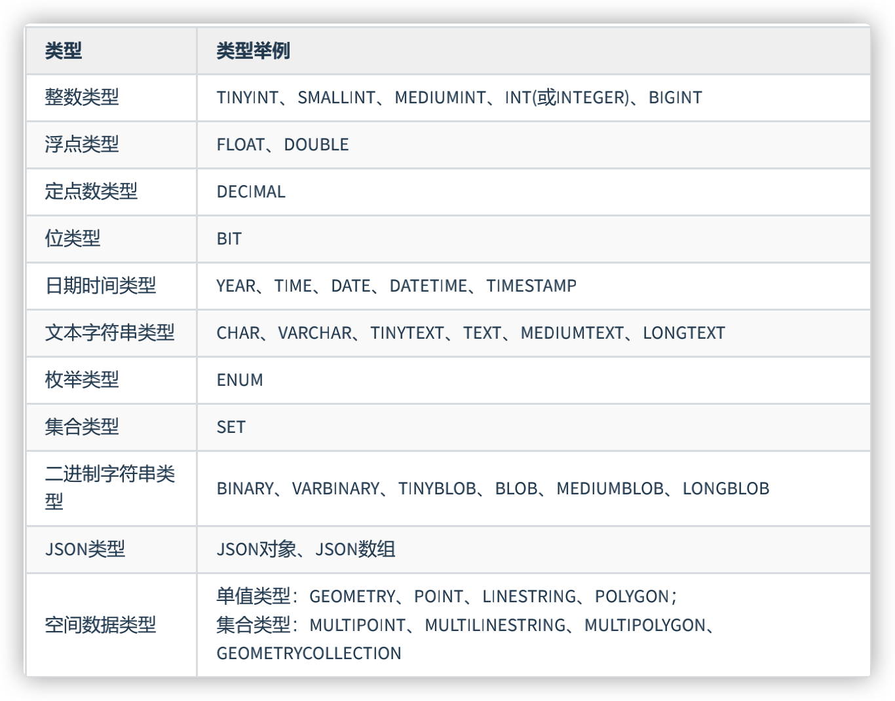
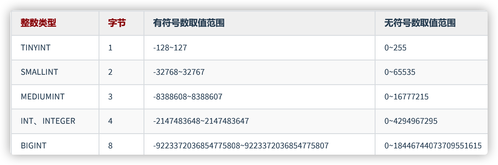

# MySQL数据类型




## character set

```sql
#1.关于属性：character set name
SHOW VARIABLES LIKE 'character_%';

#创建数据库时指名字符集
-- 一般就光写这个，之后表、字段就不用制定字符集
-- 创建数据库时没有指名字符集的话，根据系统默认的字符集走
CREATE DATABASE IF NOT EXISTS dbtest12 CHARACTER SET 'utf8';

SHOW CREATE DATABASE dbtest12;

#创建表的时候，指名表的字符集
CREATE TABLE temp(
id INT
) CHARACTER SET 'utf8';

SHOW CREATE TABLE temp;

#创建表，指名表中的字段时，可以指定字段的字符集
CREATE TABLE temp1(
id INT,
NAME VARCHAR(15) CHARACTER SET 'gbk'

);
SHOW CREATE TABLE temp1;
```


## 整数类型



```sql
#2.整型数据类型
USE dbtest12;

CREATE TABLE test_int1(
f1 TINYINT,
f2 SMALLINT,
f3 MEDIUMINT,
f4 INTEGER,
f5 BIGINT
);

DESC test_int1;

INSERT INTO test_int1(f1)
VALUES(12),(-12),(-128),(127);

SELECT * FROM test_int1;

#Out of range value for column 'f1' at row 1
INSERT INTO test_int1(f1)
VALUES(128);
```

### 可选属性

####  M


**一般情况用int**


用空间换取可靠性 


日期加上单引号


年份写四位的