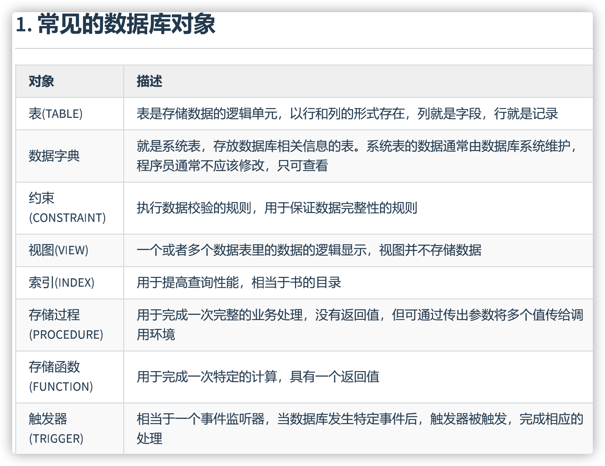
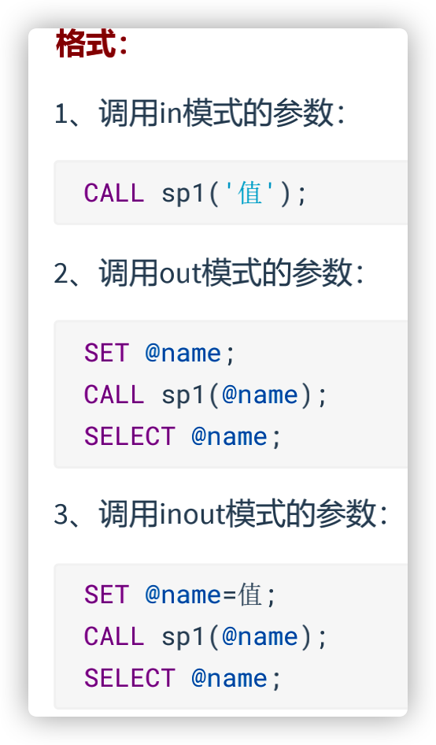

# 约束_2

## FOREIGN KEY约束

- 限定某个表的某个字段的引用完整性。比如：员工表的员工所在部门的选择，必须在部门表能找到对应的部分。

- 主表（父表）：被引用的表，被参考的表

  从表（子表）：引用别人的表，参考别人的表

  例如：员工表的员工所在部门这个字段的值要参考部门表：部门表是主表，员工表是从表。

- （1）从表的外键列，必须引用/参考主表的主键或唯一约束的列

  为什么？因为被依赖/被参考的值必须是唯一的

  （2）在创建外键约束时，如果不给外键约束命名，**默认名不是列名，而是自动产生一个外键名**（例如student_ibfk_1;），也可以指定外键约束名。

  （3）创建(CREATE)表时就指定外键约束的话，先创建主表，再创建从表

  （4）删表时，先删从表（或先删除外键约束），再删除主表

  （5）当主表的记录被从表参照时，主表的记录将不允许删除，如果要删除数据，需要先删除从表中依赖该记录的数据，然后才可以删除主表的数据

  （6）在“从表”中指定外键约束，并且一个表可以建立多个外键约束

  （7）从表的外键列与主表被参照的列名字可以不相同，但是数据类型必须一样，逻辑意义一致。如果类型不一样，创建子表时，就会出现错误“ERROR 1005 (HY000): Can't create table'database.tablename'(errno: 150)”。

  例如：都是表示部门编号，都是int类型。

  （8）**当创建外键约束时，系统默认会在所在的列上建立对应的普通索引**。但是索引名是外键的约束名。（根据外键查询效率很高）

  （9）删除外键约束后，必须 手动 删除对应的索引

```sql
-- 建表时
create table 主表名称(
 字段1 数据类型 primary key,
 字段2 数据类型 
);
create table 从表名称(
字段1 数据类型 primary key,
字段2 数据类型,
[CONSTRAINT <外键约束名称>] FOREIGN KEY（从表的某个字段) references 主表名(被参考字段)
);
#(从表的某个字段)的数据类型必须与主表名(被参考字段)的数据类型一致，逻辑意义也一样
#(从表的某个字段)的字段名可以与主表名(被参考字段)的字段名一样，也可以不一样
-- FOREIGN KEY: 在表级指定子表中的列
-- REFERENCES: 标示在父表中的列

-- 建表后
ALTER TABLE 从表名 
ADD [CONSTRAINT 约束名] FOREIGN KEY (从表的字段) REFERENCES 主表名(被引用 字段) [on update xx][on delete xx];
```

```sql
#7.foreign key (外键约束)
#7.1 在CREATE TABLE 时添加
#主表和从表；父表和子表
#①先创建主表
CREATE TABLE dept1(
dept_id INT,
dept_name VARCHAR(15)
);

#主表中的dept_id上一定要有主键约束或唯一性约束。
#③ 添加
ALTER TABLE dept1
ADD PRIMARY KEY (dept_id);

DESC dept1;

#④ 再创建从表
CREATE TABLE emp1(
emp_id INT PRIMARY KEY AUTO_INCREMENT,
emp_name VARCHAR(15),
department_id INT,

#表级约束
CONSTRAINT fk_emp1_dept_id FOREIGN KEY (department_id) REFERENCES dept1(dept_id)
);

DESC emp1;


SELECT * FROM information_schema.table_constraints 
WHERE table_name = 'emp1';
```

```sql
#7.3 在ALTER TABLE时添加外键约束
CREATE TABLE dept2(
dept_id INT PRIMARY KEY,
dept_name VARCHAR(15)
);

CREATE TABLE emp2(
emp_id INT PRIMARY KEY AUTO_INCREMENT,
emp_name VARCHAR(15),
department_id INT
);

ALTER TABLE emp2
ADD CONSTRAINT fk_emp2_dept_id FOREIGN KEY(department_id) REFERENCES dept2(dept_id);

SELECT * FROM information_schema.table_constraints 
WHERE table_name = 'emp2';
```

- 约束关系是针对双方的

  添加了外键约束后，主表的修改和删除数据受约束

  添加了外键约束后，从表的添加和修改数据受约束

  在从表上建立外键，要求主表必须存在

  删除主表时，要求从表从表先删除，或将从表中外键引用该主表的关系先删除

### 约束等级

- Cascade方式 ：在父表上update/delete记录时，同步update/delete掉子表的匹配记录

  Set null方式 ：在父表上update/delete记录时，将子表上匹配记录的列设为null，但是要注意子表的外键列不能为not null 

  No action方式 ：如果子表中有匹配的记录，则不允许对父表对应候选键进行update/delete操作

  Restrict方式 ：同no action， 都是立即检查外键约束

  Set default方式 （在可视化工具SQLyog中可能显示空白）：父表有变更时，子表将外键列设置成一个默认的值，但Innodb不能识

- 如果没有指定等级，就相当于Restrict方式。

- 对于外键约束，最好是采用: ON UPDATE CASCADE ON DELETE RESTRICT 的方式。

```sql
#演示：
# on update cascade on delete set null
CREATE TABLE dept(
    did INT PRIMARY KEY,		#部门编号
    dname VARCHAR(50)			#部门名称
);

CREATE TABLE emp(
    eid INT PRIMARY KEY,  #员工编号
    ename VARCHAR(5),     #员工姓名
    deptid INT,		  #员工所在的部门
    FOREIGN KEY (deptid) REFERENCES dept(did)  ON UPDATE CASCADE ON DELETE SET NULL
    #把修改操作设置为级联修改等级，把删除操作设置为set null等级
);

INSERT INTO dept VALUES(1001,'教学部');
INSERT INTO dept VALUES(1002, '财务部');
INSERT INTO dept VALUES(1003, '咨询部');

INSERT INTO emp VALUES(1,'张三',1001); #在添加这条记录时，要求部门表有1001部门
INSERT INTO emp VALUES(2,'李四',1001);
INSERT INTO emp VALUES(3,'王五',1002);

UPDATE dept
SET did = 1004
WHERE did = 1002;

DELETE FROM dept
WHERE did = 1004;

DELETE FROM dept WHERE did = 1001;

SELECT * FROM dept;
SELECT * FROM emp;
#结论：对于外键约束，最好是采用: `ON UPDATE CASCADE ON DELETE RESTRICT` 的方式。
```

### 删除外键约束

```sql
(1)第一步先查看约束名和删除外键约束 
SELECT * FROM information_schema.table_constraints 
WHERE table_name = '表名称';
#查看某个表的约束名 

ALTER TABLE 从表名 
DROP FOREIGN KEY 外键约束名;

（2）第二步查看索引名和删除索引。（注意，只能手动删除）
SHOW INDEX FROM 表名称;
#查看某个表的索引名 
ALTER TABLE 从表名 
DROP INDEX 索引名;
```

```sql
#7.5 删除外键约束
#一个表中可以声明有多个外键约束
USE dbtest13;

SELECT * FROM information_schema.table_constraints 
WHERE table_name = 'emp1';

#删除外键约束
ALTER TABLE emp1
DROP FOREIGN KEY fk_emp1_dept_id;

#再手动的删除外键约束对应的普通索引
SHOW INDEX FROM emp1;

ALTER TABLE emp1
DROP INDEX fk_emp1_dept_id;
```

### 开发规范

>在 MySQL 里，外键约束是有成本的，需要消耗系统资源。对于大并发的 SQL 操作，有可能会不适合。比如大型网站的中央数据库，可能会 因为外键约束的系统开销而变得非常慢 。所以， MySQL 允许你不使用系统自带的外键约束，在 应用层面 完成检查数据一致性的逻辑。也就是说，即使你不用外键约束，也要想办法通过应用层面的附加逻辑，来实现外键约束的功能，确保数据的一致性。

**阿里开发规范** 

- 【 强制 】不得使用外键与级联，一切外键概念必须在应用层解决。
- 说明：（概念解释）学生表中的 student_id 是主键，那么成绩表中的 student_id 则为外键。如果更新学生表中的 student_id，同时触发成绩表中的 student_id 更新，即为级联更新。外键与级联更新适用于 单 机低并发 ，不适合 分布式 、 高并发集群 ；级联更新是强阻塞，存在数据库 更新风暴 的风险；外键影响数据库的 插入速度 。 

## CHECK约束

- 检查某个字段的值是否符号xx要求，一般指的是值的范围
- MySQL5.7 可以使用check约束，但check约束对数据验证没有任何作用。添加数据时，没有任何错误或警告。但是MySQL 8.0**中可以使用**check**约束了**。

```sql
#8. check 约束
# MySQL5.7 不支持CHECK约束，MySQL8.0支持CHECK约束。
CREATE TABLE test10(
id INT,
last_name VARCHAR(15),
salary DECIMAL(10,2) CHECK(salary > 2000)
-- gender char check ('男' or '女')
);

INSERT INTO test10
VALUES(1,'Tom',2500);

#添加失败
INSERT INTO test10
VALUES(2,'Tom1',1500);

SELECT * FROM test10;

-- 建表后添加约束
ALTER TABLE test110
MODIFY salary DECIMAL(10,2) CHECK(salary > 2000);
```

## DEFAULT约束

- 给某个字段/某列指定默认值，一旦设置默认值，在插入数据时，如果此字段没有显式赋值，则赋值为默认值。

```sql
-- 建表时
create table 表名称(
字段名 数据类型 primary key,
字段名 数据类型 unique key not null, 
字段名 数据类型 unique key, 
字段名 数据类型 not null default 默认值
);
-- 说明：默认值约束一般不在唯一键和主键列上加

-- 建表后
alter table 表名称
modify 字段名 数据类型 default 默认值;
#如果这个字段原来有非空约束，你还保留非空约束，那么在加默认值约束时，还得保留非空约束，否则非空约束就被删除了 
#同理，在给某个字段加非空约束也一样，如果这个字段原来有默认值约束，你想保留，也要在modify语句中保留默认值约束，否则就删除了
alter table 表名称
modify 字段名 数据类型 default 默认值 not null;
```

```sql
#9.DEFAULT约束
#9.1 在CREATE TABLE添加约束
CREATE TABLE test11(
id INT,
last_name VARCHAR(15),
salary DECIMAL(10,2) DEFAULT 2000
);

DESC test11;

INSERT INTO test11(id,last_name,salary)
VALUES(1,'Tom',3000);

INSERT INTO test11(id,last_name)
VALUES(2,'Tom1');

SELECT * 
FROM test11;
```

```sql
#9.2 在ALTER TABLE添加约束
CREATE TABLE test12(
id INT,
last_name VARCHAR(15),
salary DECIMAL(10,2)
);

DESC test12;

ALTER TABLE test12
MODIFY salary DECIMAL(8,2) DEFAULT 2500;
```

### 删除默认值约束

```sql
alter table 表名称
modify 字段名 数据类型 ;
#删除默认值约束，如果有非空约束，也一并删除

alter table 表名称
modify 字段名 数据类型 not null;
#删除默认值约束，保留非空约束
```


## 我的总结

### 总结删除约束

- 非空约束 自增约束 默认值约束类似 

```sql
alter table 表名称 
modify 字段名 数据类型;
```

- 删除唯一性约束：删除索引；删除外键约束：删除约束+手动删述索引

### 约束的命名

- 不支持命名的约束（只能声明在列级约束）：默认约束、非空约束、自增列、check约束；主键约束不用命名

  外键约束命名：`fk_表名_主表参考字段` 

  

  唯一性约束命名：`uk_表名_字段名`

- 建表后添加约束:

```sql
alter table 表名称
modify 字段名 数据类型 添加的约束;

-- 添加主键特殊
alter table 表名称
add primary key(字段列表);

-- 添加外键特殊
```

- 一个字段添加多个约束:

```sql
-- 注意顺序
ALTER TABLE books
MODIFY id INT PRIMARY KEY AUTO_INCREMENT;
```

# 视图

- 更新数据等操作同表



- ① 视图，可以看做是一个虚拟表，本身是不存储数据的。
    视图的本质，就可以看做是存储起来的SELECT语句

  ② 视图中SELECT语句中涉及到的表，称为基表

  ③ 针对视图做DML操作，会影响到对应的基表中的数据。反之亦然。

  ④ 视图本身的删除，不会导致基表中数据的删除。

  ⑤ 视图的应用场景：针对于小型项目，不推荐使用视图。针对于大型项目，可以考虑使用视图。

  ⑥ 视图的优点：简化查询; 控制数据的访问

## 创建视图

- **在** CREATE VIEW **语句中嵌入子查询**

```sql
CREATE [OR REPLACE]
[ALGORITHM = {UNDEFINED | MERGE | TEMPTABLE}] 
VIEW 视图名称 [(字段列表)] 
AS 查询语句
[WITH [CASCADED|LOCAL] CHECK OPTION];

-- 精简版
CREATE VIEW 视图名称 
AS 查询语句
```

### 创建单表视图

- 在创建视图时，没有在视图名后面指定字段列表，则视图中字段列表默认和SELECT语句中的字段列表一致。如果SELECT语句中给字段取了别名，那么视图中的字段名和别名相同。

```sql
#准备工作
CREATE DATABASE dbtest14;

USE dbtest14;

CREATE TABLE emps
AS
SELECT *
FROM atguigudb.`employees`;
-- 将已有表的数据存储在新的表，会损失约束

CREATE TABLE depts
AS
SELECT *
FROM atguigudb.`departments`;

SELECT * FROM emps;

SELECT * FROM depts;

DESC emps;

DESC atguigudb.employees;
```

```sql
#2.1 针对于单表
#情况1：视图中的字段与基表的字段有对应关系
CREATE VIEW vu_emp1
AS
SELECT employee_id,last_name,salary
FROM emps;

SELECT * FROM vu_emp1;

#确定视图中字段名的方式1：
CREATE VIEW vu_emp2
AS
SELECT employee_id emp_id,last_name lname,salary 
#查询语句中字段的别名会作为视图中字段的名称出现
FROM emps
WHERE salary > 8000;

#确定视图中字段名的方式2：
CREATE VIEW vu_emp3(emp_id,NAME,monthly_sal) 
#小括号内字段个数与SELECT中字段个数相同
AS
SELECT employee_id,last_name,salary 
FROM emps
WHERE salary > 8000;

SELECT * FROM vu_emp3;

#情况2：视图中的字段在基表中可能没有对应的字段
CREATE VIEW vu_emp_sal
AS
SELECT department_id,AVG(salary) avg_sal
FROM emps
WHERE department_id IS NOT NULL
GROUP BY department_id;

SELECT * FROM vu_emp_sal;
```

### 创建多表联合视图

```sql
#2.2 针对于多表
CREATE VIEW vu_emp_dept
AS
SELECT e.employee_id,e.department_id,d.department_name
FROM emps e JOIN depts d
ON e.`department_id` = d.`department_id`;

SELECT * FROM vu_emp_dept;
```

### 利用视图对数据进行格式化

- 我们经常需要输出某个格式的内容，比如我们想输出员工姓名和对应的部门名，对应格式为emp_name(department_name)，就可以使用视图来完成数据格式化的操作：

```sql
#利用视图对数据进行格式化
CREATE VIEW vu_emp_dept1
AS
SELECT CONCAT(e.last_name,'(',d.department_name,')') emp_info
FROM emps e JOIN depts d
ON e.`department_id` = d.`department_id`;

SELECT * FROM vu_emp_dept1;
```

### 基于视图创建视图

- 当我们创建好一张视图之后，还可以在它的基础上继续创建视图。

```sql
#2.3 基于视图创建视图
CREATE VIEW vu_emp4
AS
SELECT employee_id,last_name
FROM vu_emp1;

SELECT * FROM vu_emp4; 
```

## 查看视图

```sql
#3. 查看视图
# 语法1：查看数据库的表对象、视图对象
SHOW TABLES;

#语法2：查看视图的结构
DESCRIBE vu_emp1;
DESC vu_emp1;

#语法3：查看视图的属性信息
SHOW TABLE STATUS LIKE 'vu_emp1';

#语法4：查看视图的详细定义信息
-- 包括SQL语句
SHOW CREATE VIEW vu_emp1;
```

## 更新视图的数据

### 一般情况

- MySQL支持使用INSERT、UPDATE和DELETE语句对视图中的数据进行插入、更新和删除操作。当视图中的数据发生变化时，数据表中的数据也会发生变化，反之亦然。

```sql
#4."更新"视图中的数据
#4.1 一般情况，可以更新视图的数据
SELECT * FROM vu_emp1;

SELECT employee_id,last_name,salary
FROM emps;
#更新视图的数据，会导致基表中数据的修改
UPDATE vu_emp1
SET salary = 20000
WHERE employee_id = 101;

#同理，更新表中的数据，也会导致视图中的数据的修改
UPDATE emps
SET salary = 10000
WHERE employee_id = 101;

#删除视图中的数据，也会导致表中的数据的删除
DELETE FROM vu_emp1
WHERE employee_id = 101;

SELECT employee_id,last_name,salary
FROM emps
WHERE employee_id = 101;
```

### 不可更新的视图

>虽然可以更新视图数据，但总的来说，视图作为 虚拟表 ，主要用于 方便查询 ，不建议更新视图的数据。**对视图数据的更改，都是通过对实际数据表里数据的操作来完成的。**

- 要使视图可更新，视图中的行和底层基本表中的行之间必须存在 **一对一** 的关系。另外当视图定义出现如下情况时，视图**不支持**更新操作：

  - 在定义视图的时候指定了“ALGORITHM = TEMPTABLE”，视图将不支持INSERT和DELETE操作；
  - 视图中不包含基表中所有被定义为非空又未指定默认值的列，视图将不支持INSERT操作；
  - 在定义视图的SELECT语句中使用了 JOIN联合查询 ，视图将不支持INSERT和DELETE操作；
  - 在定义视图的SELECT语句后的字段列表中使用了 数学表达式 或 子查询 ，视图将不支持INSERT，也不支持UPDATE使用了数学表达式、子查询的字段值；
  - 在定义视图的SELECT语句后的字段列表中使用 DISTINCT 、 聚合函数 、 GROUP BY 、 HAVING 、 UNION 等，视图将不支持INSERT、UPDATE、DELETE；
  - 在定义视图的SELECT语句中包含了子查询，而子查询中引用了FROM后面的表，视图将不支持 INSERT、UPDATE、DELETE；
  - 视图定义基于一个 不可更新视图 ；
  - 常量视图。

  ```sql
  #更新失败
  UPDATE vu_emp_sal
  SET avg_sal = 5000
  WHERE department_id = 30;
  
  #删除失败
  -- 表中无法对应一条记录
  DELETE FROM vu_emp_sal
  WHERE department_id = 30;
  ```

## 修改视图

```sql
#5. 修改视图
DESC vu_emp1;

#方式1
CREATE OR REPLACE VIEW vu_emp1
AS
SELECT employee_id,last_name,salary,email
FROM emps
WHERE salary > 7000;

#方式2
ALTER VIEW vu_emp1
AS 
SELECT employee_id,last_name,salary,email,hire_date
FROM emps;
```

## 删除视图

- 删除视图只是删除视图的定义，并不会删除基表的数据。
- 基于视图a、b创建了新的视图c（看作a,b select语句的叠加），如果将视图a或者视图b删除，会导致视图c的查询失败。这样的视图c需要手动删除或修改，否则影响使用。

```sql
#6. 删除视图
SHOW TABLES;

DROP VIEW vu_emp4;

DROP VIEW IF EXISTS vu_emp2,vu_emp3;
```

## 视图优缺点

### 优点

1. **操作简单**

   将经常使用的查询操作定义为视图，可以使开发人员不需要关心视图对应的数据表的结构、表与表之间的关联关系，也不需要关心数据表之间的业务逻辑和查询条件，而只需要简单地操作视图即可，极大简化了开发人员对数据库的操作。

2. **减少数据冗余**

   视图跟实际数据表不一样，它存储的是查询语句。所以，在使用的时候，我们要通过定义视图的查询语句来获取结果集。而视图本身不存储数据，不占用数据存储的资源，减少了数据冗余。

3. **数据安全**

   MySQL将用户对数据的 访问限制 在某些数据的结果集上，而这些数据的结果集可以使用视图来实现。用户不必直接查询或操作数据表。这也可以理解为视图具有 隔离性 。视图相当于在用户和实际的数据表之间加了一层虚拟表。同时，MySQL可以根据权限将用户对数据的访问限制在某些视图上，**用户不需要查询数据表，可以直接****通过视图获取数据表中的信息**。这在一定程度上保障了数据表中数据的安全性。

4. **适应灵活多变的需求** 

   当业务系统的需求发生变化后，如果需要改动数据表的结构，则工作量相对较大，可以使用视图来减少改动的工作量。这种方式在实际工作中使用得比较多。

5. **能够分解复杂的查询逻辑** 

   数据库中如果存在复杂的查询逻辑，则可以将问题进行分解，创建多个视图获取数据，再将创建的多个视图结合起来，完成复杂的查询逻辑。

### 缺点

如果我们在实际数据表的基础上创建了视图，那么，**如果实际数据表的结构变更了，我们就需要及时对相关的视图进行相应的维护**。特别是嵌套的视图（就是在视图的基础上创建视图），维护会变得比较复杂， 可读性不好 ，容易变成系统的潜在隐患。因为创建视图的 SQL 查询可能会对字段重命名，也可能包含复杂的逻辑，这些都会增加维护的成本。实际项目中，如果视图过多，会导致数据库维护成本的问题。

所以，在创建视图的时候，你要结合实际项目需求，综合考虑视图的优点和不足，这样才能正确使用视图，使系统整体达到最优。

# 存储过程与函数

- 存储过程和函数能够将复杂的SQL逻辑封装在一起，应用程序无须关注存储过程和函数内部复杂的SQL逻辑，而只需要简单地调用存储过程和函数即可。

## 存储过程概述

### 理解

- 就是一组经过 预先编译 的 SQL 语句的封装。

- 存储过程预先存储在 MySQL 服务器上，需要执行的时候，客户端只需要向服务器端发出调用存储过程的命令，服务器端就可以把预先存储好的这一系列 SQL 语句全部执行。

- **存储过程没有返回值。**

- **好处**：

  - 1、简化操作，提高了sql语句的重用性，减少了开发程序员的压力

    2、减少操作过程中的失误，提高效率

    3、减少网络传输量（客户端不需要把所有的 SQL 语句通过网络发给服务器） 

    4、减少了 SQL 语句暴露在网上的风险，也提高了数据查询的安全性

- **和视图的对比**：

  - 它和视图有着同样的优点，清晰、安全，还可以减少网络传输量。不过它和视图不同，视图是 虚拟表 ，通常不对底层数据表直接操作，而存储过程是程序化的 SQL，可以 直接操作底层数据表 ，相比于面向集合的操作方式，能够实现一些更复杂的数据处理。

### 分类

- 存储过程的参数类型可以是IN、OUT和INOUT。根据这点分类如下：

  1、没有参数（无参数无返回） 

  2、仅仅带 IN 类型（有参数无返回） 

  3、仅仅带 OUT 类型（无参数有返回） 

  4、既带 IN 又带 OUT（有参数有返回） 

  5、带 INOUT（有参数有返回）

- 注意：IN、OUT、INOUT 都可以在一个存储过程中带多个。

- 存储过程相当于外面传进去IN OUT变量，生命周期跟随外界定义的变量

## 创建存储过程

```sql
CREATE PROCEDURE 存储过程名(IN|OUT|INOUT 参数名 参数类型,...)
[characteristics ...] 
BEGIN
	存储过程体
END
```

1、参数前面的符号的意思

- IN ：当前参数为输入参数，也就是表示入参；

  存储过程只是读取这个参数的值。如果没有定义参数种类， 默认就是 IN ，表示输入参数。

- OUT ：当前参数为输出参数，也就是表示出参；

  执行完成之后，调用这个存储过程的客户端或者应用程序就可以读取这个参数返回的值了。

- INOUT ：当前参数既可以为输入参数，也可以为输出参数。

2、形参类型可以是 MySQL数据库中的任意类型。

3、 characteristics 表示创建存储过程时指定的对存储过程的约束条件，其取值信息如下：

```sql
LANGUAGE SQL
| [NOT] DETERMINISTIC | { CONTAINS SQL | NO SQL | READS SQL DATA | MODIFIES SQL DATA }
| SQL SECURITY { DEFINER | INVOKER }
| COMMENT 'string'
```

- LANGUAGE SQL ：说明存储过程执行体是由SQL语句组成的，当前系统支持的语言为SQL。 

- [NOT] DETERMINISTIC ：指明存储过程执行的结果是否确定。

  DETERMINISTIC表示结果是确定的。每次执行存储过程时，相同的输入会得到相同的输出。

  NOT DETERMINISTIC表示结果是不确定的，相同的输入可能得到不同的输出。如果没有指定任意一个值，默认为NOT DETERMINISTIC。 

- { CONTAINS SQL | NO SQL | READS SQL DATA | MODIFIES SQL DATA } ：指明子程序使用SQL语句的限制。

  CONTAINS SQL表示当前存储过程的子程序包含SQL语句，但是并不包含读写数据的SQL语句；

  NO SQL表示当前存储过程的子程序中不包含任何SQL语句；

  READS SQL DATA表示当前存储过程的子程序中包含读数据的SQL语句；

  MODIFIES SQL DATA表示当前存储过程的子程序中包含写数据的SQL语句。

  默认情况下，系统会指定为CONTAINS SQL。 

- SQL SECURITY { DEFINER | INVOKER } ：执行当前存储过程的权限，即指明哪些用户能够执行当前存储过程。

  DEFINER 表示只有当前存储过程的创建者或者定义者才能执行当前存储过程；

  INVOKER 表示拥有当前存储过程的访问权限的用户能够执行当前存储过程。

  如果没有设置相关的值，则MySQL默认指定值为DEFINER。COMMENT 'string' ：注释信息，可以用来描述存储过程。

- COMMENT 'string' ：注释信息，可以用来描述存储过程。

4、存储过程体中可以有多条 SQL 语句，如果仅仅一条SQL 语句，则可以省略 BEGIN 和 END编写存储过程并不是一件简单的事情，可能存储过程中需要复杂的 SQL 语句。

```sql
1. BEGIN…END：BEGIN…END 中间包含了多个语句，每个语句都以（;）号为结束符。 
2. DECLARE：DECLARE 用来声明变量，使用的位置在于 BEGIN…END 语句中间，而且需要在其他语句使用之前进 行变量的声明。 
3. SET：赋值语句，用于对变量进行赋值。 
4. SELECT… INTO：把从数据表中查询的结果存放到变量中，也就是为变量赋值。
```

5、需要设置新的结束标记

`DELIMITER 新的结束标记`

- 因为MySQL默认的语句结束符号为分号‘;’。为了避免与存储过程中SQL语句结束符相冲突，需要使用DELIMITER改变存储过程的结束符。
- 比如：“DELIMITER //”语句的作用是将MySQL的结束符设置为//，并以“END //”结束存储过程。存储过程定义完毕之后再使用“DELIMITER ;”恢复默认结束符。DELIMITER也可以指定其他符号作为结束符。
- 当使用DELIMITER命令时，应该避免使用反斜杠（‘\’）字符，因为反斜线是MySQL的转义字符。

```sql
DELIMITER $
CREATE PROCEDURE 存储过程名(IN|OUT|INOUT 参数名 参数类型,...)
[characteristics ...]
BEGIN
sql语句1;
sql语句2; 
END $
DELIMITER ;
```

## 调用存储过程

- 存储过程必须使用**CALL**语句调用，并且存储过程和数据库相关，如果要执行其他数据库中的存储过程，需要指定数据库名称，例如CALL dbname.procname。 `CALL 存储过程名(实参列表)`



```sql
#1. 创建存储过程
#类型1：无参数无返回值
#举例1：创建存储过程select_all_data()，查看 employees 表的所有数据
DELIMITER $

CREATE PROCEDURE select_all_data()
BEGIN
	SELECT * FROM employees;
END $

DELIMITER ;

#2. 存储过程的调用
CALL select_all_data();
```

```sql
#类型2：带 OUT
#举例4：创建存储过程show_min_salary()，查看“emps”表的最低薪资值。并将最低薪资
#通过OUT参数“ms”输出
DELIMITER //

CREATE PROCEDURE show_min_salary(OUT ms DOUBLE)
BEGIN
	SELECT MIN(salary) INTO ms
	FROM employees;
END //

DELIMITER ;

#调用
CALL show_min_salary(@ms);
#查看变量值
SELECT @ms;
```

```sql
#举例5：创建存储过程show_someone_salary()，查看“emps”表的某个员工的薪资，
#并用IN参数empname输入员工姓名。
DELIMITER //

CREATE PROCEDURE show_someone_salary(IN empname VARCHAR(20))
BEGIN
	SELECT salary FROM employees
	WHERE last_name = empname;
END //

DELIMITER ;

#调用方式1
CALL show_someone_salary('Abel');
#调用方式2
SET @empname := 'Abel';
CALL show_someone_salary(@empname);
```

```sql
#类型4：带 IN 和 OUT
#举例6：创建存储过程show_someone_salary2()，查看“emps”表的某个员工的薪资，
#并用IN参数empname输入员工姓名，用OUT参数empsalary输出员工薪资。
DELIMITER //

CREATE PROCEDURE show_someone_salary2(IN empname VARCHAR(20),OUT empsalary DECIMAL(10,2))
BEGIN
	SELECT salary INTO empsalary
	FROM employees
	WHERE last_name = empname;
END //

DELIMITER ;

#调用
SET @empname = 'Abel';
CALL show_someone_salary2(@empname,@empsalary);

SELECT @empsalary;
```

```sql
#类型5：带 INOUT
#举例7：创建存储过程show_mgr_name()，查询某个员工领导的姓名，并用INOUT参数“empname”输入员工姓名，
#输出领导的姓名。
DELIMITER $

CREATE PROCEDURE show_mgr_name(INOUT empname VARCHAR(25))
BEGIN

	SELECT last_name INTO empname
	FROM employees
	WHERE employee_id = (
				SELECT manager_id
				FROM employees
				WHERE last_name = empname
				);
END $

DELIMITER ;

#调用
SET @empname := 'Abel';
CALL show_mgr_name(@empname);

SELECT @empname;
```

## 存储函数的使用


变量初始化问题？

局部变量可以不加默认值


